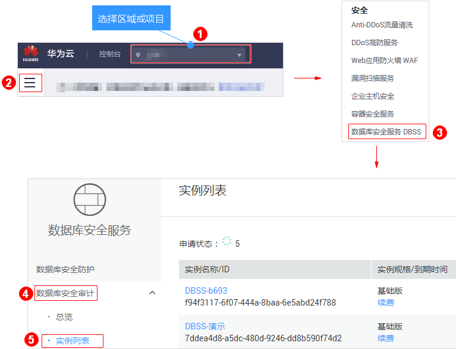
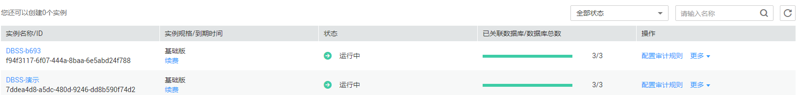

# 管理数据库安全审计实例

成功购买数据库安全审计实例后，您可以查看实例信息，开启、重启或关闭实例。

## 前提条件

-   重启实例和关闭实例前，请确认实例的状态为“运行中“。
-   开启实例前，请确认实例的状态为“已关闭“。

## 查看实例信息

1.  [登录管理控制台](https://console.huaweicloud.com/?locale=zh-cn)。
2.  进入实例列表入口，如[图1](#fig10560192191214)所示。

    **图 1**  进入实例列表入口  
    

3.  查看数据库安全审计实例信息，如[图2](#fig89170817589)所示，相关参数说明如[表1](#table1025994517211)所示。

    **图 2**  查看数据库安全审计实例信息  
    

    > **说明：** 
    >-   单击实例名称，可以查看该实例的概览信息。
    >-   在列表右上方“全部状态“下拉列表框中选择实例的状态，或输入实例名称的关键字，可以搜索指定的实例。

    **表 1**  实例信息参数说明

    
    <table><thead align="left"><tr id="row1626074517217"><th class="cellrowborder" valign="top" width="24.79%" id="mcps1.2.3.1.1">
参数名称

    </th>
    <th class="cellrowborder" valign="top" width="75.21%" id="mcps1.2.3.1.2">
说明

    </th>
    </tr>
    </thead>
    <tbody><tr id="row18260134511215"><td class="cellrowborder" valign="top" width="24.79%" headers="mcps1.2.3.1.1 ">
实例名称/ID

    </td>
    <td class="cellrowborder" valign="top" width="75.21%" headers="mcps1.2.3.1.2 ">
实例的名称和ID。实例ID由系统自动生成。

    </td>
    </tr>
    <tr id="row326014459212"><td class="cellrowborder" valign="top" width="24.79%" headers="mcps1.2.3.1.1 ">
实例规格/到期时间

    </td>
    <td class="cellrowborder" valign="top" width="75.21%" headers="mcps1.2.3.1.2 ">
实例的规格和实例距离到期的天数。

    </td>
    </tr>
    <tr id="row11260124513215"><td class="cellrowborder" valign="top" width="24.79%" headers="mcps1.2.3.1.1 ">
状态

    </td>
    <td class="cellrowborder" valign="top" width="75.21%" headers="mcps1.2.3.1.2 ">
实例当前的运行状态，包括：

    <ul id="ul108156241253"><li>运行中</li><li>创建中</li><li>故障</li><li>已关闭</li><li>已冻结</li><li>公安冻结</li><li>违规冻结</li><li>未实名认证冻结</li><li>合作伙伴冻结</li><li>创建失败</li></ul>
    </td>
    </tr>
    <tr id="row17586193614411"><td class="cellrowborder" valign="top" width="24.79%" headers="mcps1.2.3.1.1 ">
已关联数据库/数据库总数

    </td>
    <td class="cellrowborder" valign="top" width="75.21%" headers="mcps1.2.3.1.2 ">
实例的已关联的数据库和实例可以支持关联的数据库总数。

    </td>
    </tr>
    </tbody>
    </table>

    > **说明：** 
    >根据需要，您还可以对实例执行以下操作：
    >-   重启
    >    在需要重启的实例所在行的“操作“列，选择“更多  \>  重启“，在弹出的对话框中，单击“确定“，可以重启该实例。
    >-   开启
    >    在需要开启的实例所在行的“操作“列，选择“更多  \>  开启“，在弹出的对话框中，单击“确定“，可以开启该实例。
    >-   关闭
    >    在需要关闭的实例所在行的“操作“列，选择“更多  \>  关闭“，在弹出的对话框中，单击“确定“，关闭该实例。关闭实例后，系统将停止对该实例上的数据库进行安全审计。
    >-   查看详情
    >    在需要删除创建实例失败所在行的“操作“列，选择“更多  \>  查看详情“，在弹出的对话框中，单击删除，删除创建失败的实例。实例删除后，实例列表不在显示该条实例。

