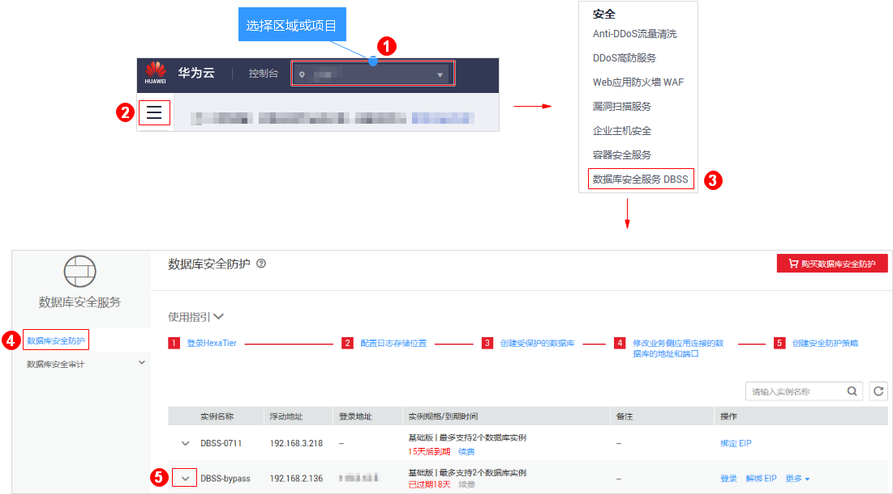
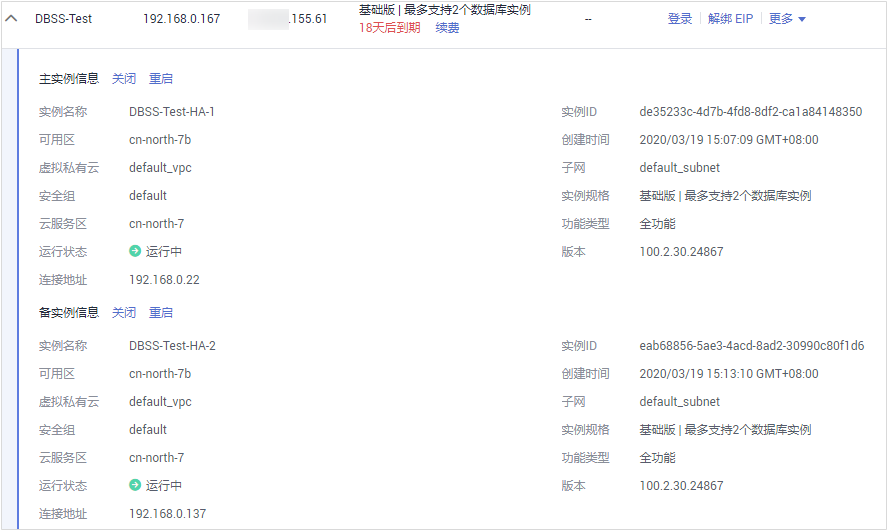
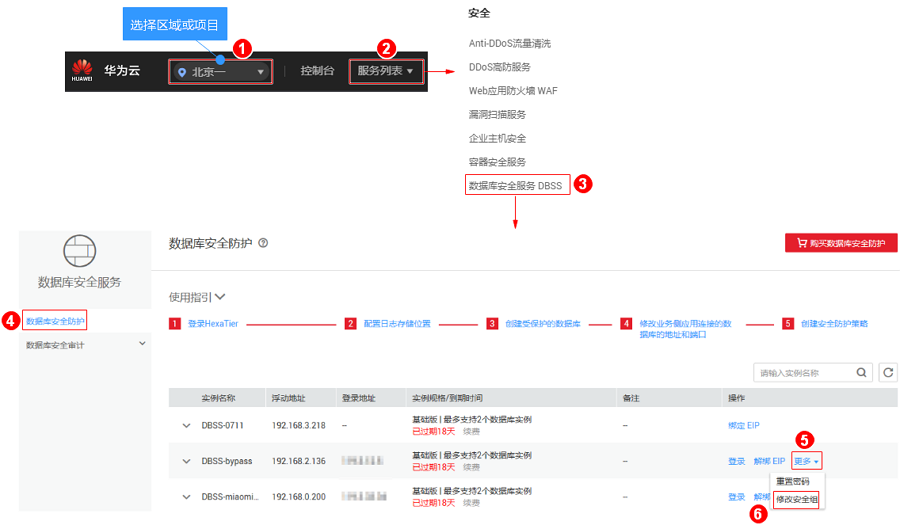

# 管理数据库安全防护实例

用户成功购买数据库安全防护后，可以查看实例信息，重启、开启或关闭实例。

## 前提条件

-   已成功购买数据库安全防护实例。
-   重启实例和关闭实例前，请确认实例的“运行状态“为“运行中“。
-   开启实例前，请确认实例的“运行状态“为“已关闭“。

## 查看实例信息

1.  [登录管理控制台](https://console.huaweicloud.com/?locale=zh-cn)。
2.  进入数据库安全防护实例列表入口，如[图1](#fig194871126194810)所示。

    **图 1**  进入数据库安全防护实例列表入口  
    

3.  查看实例的信息，如[图2](#fig1325745611915)所示，相关参数说明如[表1](#table129988164532)所示。

    > **说明：** 
    >在实例列表中，单击实例前面的，可以查看该实例的详细信息。

    **图 2**  查看数据库安全防护实例信息  
    

    **表 1**  实例信息参数说明

    
    <table><thead align="left"><tr id="row1099815167531"><th class="cellrowborder" valign="top" width="17%" id="mcps1.2.3.1.1">
参数名称

    </th>
    <th class="cellrowborder" valign="top" width="83%" id="mcps1.2.3.1.2">
说明

    </th>
    </tr>
    </thead>
    <tbody><tr id="row2099861610536"><td class="cellrowborder" valign="top" width="17%" headers="mcps1.2.3.1.1 ">
实例名称

    </td>
    <td class="cellrowborder" valign="top" width="83%" headers="mcps1.2.3.1.2 ">
实例的名称。

    </td>
    </tr>
    <tr id="row19961314185412"><td class="cellrowborder" valign="top" width="17%" headers="mcps1.2.3.1.1 ">
浮动地址

    </td>
    <td class="cellrowborder" valign="top" width="83%" headers="mcps1.2.3.1.2 ">
应用连接实例的私有IP地址。

    </td>
    </tr>
    <tr id="row799911695318"><td class="cellrowborder" valign="top" width="17%" headers="mcps1.2.3.1.1 ">
登录地址

    </td>
    <td class="cellrowborder" valign="top" width="83%" headers="mcps1.2.3.1.2 ">
登录实例防护管理控制台的地址。

    </td>
    </tr>
    <tr id="row1399941665310"><td class="cellrowborder" valign="top" width="17%" headers="mcps1.2.3.1.1 ">
实例规格/到期时间

    </td>
    <td class="cellrowborder" valign="top" width="83%" headers="mcps1.2.3.1.2 ">
当前实例规格以及实例到期的天数。

    </td>
    </tr>
    </tbody>
    </table>

    > **说明：** 
    >根据需要，您还可以对实例执行以下操作：
    >-   重启
    >    单击“重启“，可以重启实例。
    >-   开启
    >    单击“开启“，可以开启实例。
    >    成功购买数据库安全防护实例后，实例自动开启。开启实例后，用户可以登录HexaTier对实例进行配置管理，实现对数据库的安全防护。
    >-   关闭
    >    单击“关闭“，可以关闭实例。关闭实例后，将不能登录HexaTier对实例进行配置管理。
    >-   查看详情
    >    当实例创建失败后，在需要删除的实例所在行的“操作“列，单击“查看详情“，可以删除实例。删除时需要同时删除主备实例。

## 修改安全组

您可以根据需要，修改实例所属的安全组。

1.  [登录管理控制台](https://console.huaweicloud.com/?locale=zh-cn)。
2.  进入修改安全组入口，如[图3](#fig176115854613)所示。

    **图 3**  进入修改安全组入口  
    

3.  在弹出的对话框中，选择“安全组“，如[图4](#fig205589411505)所示。

    **图 4**  修改安全组  
    

4.  单击“确定“。

