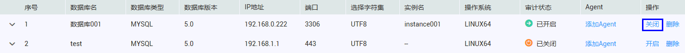
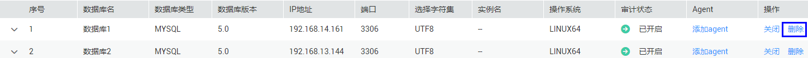
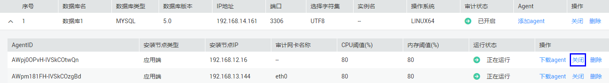
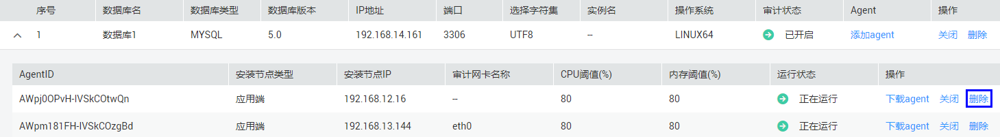

# 管理添加的数据库

成功添加数据库后，您可以查看数据库信息、关闭、删除数据库，或关闭、删除Agent。

## 前提条件

-   已获取管理控制台的登录账号与密码。
-   已成功购买数据库安全审计实例，且实例的状态为“运行中“。
-   关闭数据库前，请确认数据库的“审计状态“为“已开启“。

## 关闭数据库

关闭数据库后，数据库安全审计将停止对该数据库进行安全审计。

1.  登录管理控制台。
2.  单击管理控制台左上角的，选择区域或项目。
3.  单击管理控制台上方的“服务列表“，选择“安全  \>  数据库安全服务 DBSS“，进入数据库安全防护实例列表界面。
4.  在左侧导航树中，选择“数据库安全服务  \>  数据库安全审计“，进入数据库安全审计实例列表界面。
5.  在数据库安全审计实例列表中，单击需要关闭数据库的实例名称，如[图1](#fig99553501795)所示。

    **图 1**  数据库安全审计实例列表  
    

6.  在“实例详情“界面，选择“维护  \>  数据库管理“，进入数据库列表页面。
7.  在需要关闭的数据库所在行的“操作“列，单击“关闭“，如[图2](#fig87761146998)所示。

    **图 2**  关闭数据库  
    

8.  在弹出的对话框中，单击“确定“。

    成功关闭数据库，数据库的“审计状态“为“已关闭“。

## 删除数据库

删除数据库后，如果需要对该数据库进行安全审计，请重新添加该数据库。

1.  登录管理控制台。
2.  单击管理控制台左上角的，选择区域或项目。
3.  单击管理控制台上方的“服务列表“，选择“安全  \>  数据库安全服务 DBSS“，进入数据库安全防护实例列表界面。
4.  在左侧导航树中，选择“数据库安全服务  \>  数据库安全审计“，进入数据库安全审计实例列表界面。
5.  在数据库安全审计实例列表中，单击需要删除数据库的实例名称，如[图3](#fig156311482179)所示。

    **图 3**  数据库安全审计实例列表  
    

6.  在“实例详情“界面，选择“维护  \>  数据库管理“，进入数据库列表页面。
7.  在需要删除的数据库所在行的“操作“列，单击“删除“，如[图4](#fig9636248111715)所示。

    **图 4**  删除数据库  
    

8.  在弹出的对话框中，单击“确定“。

## 查看数据库信息

1.  登录管理控制台。
2.  单击管理控制台左上角的，选择区域或项目。
3.  单击管理控制台上方的“服务列表“，选择“安全  \>  数据库安全服务 DBSS“，进入数据库安全防护实例列表界面。
4.  在左侧导航树中，选择“数据库安全服务  \>  数据库安全审计“，进入数据库安全审计实例列表界面。
5.  在数据库安全审计实例列表中，单击需要查看数据库信息的实例名称，如[图5](#fig614863518248)所示。

    **图 5**  数据库安全审计实例列表  
    

6.  在“实例详情“界面，选择“维护  \>  数据库管理“，进入数据库列表页面。
7.  查看数据库信息，如[图6](#fig315603514243)所示，相关参数说明如[表1](#table4295843716304)所示。

    **图 6**  查看数据库信息  
    

    > **说明：**   
    >输入数据库的关键字，单击或按“Enter“，可以搜索指定的数据库。  

    **表 1**  数据库信息参数说明

    
    <table><thead align="left"><tr id="row4338993216304"><th class="cellrowborder" valign="top" width="21%" id="mcps1.2.4.1.1">
参数名称

    </th>
    <th class="cellrowborder" valign="top" width="61%" id="mcps1.2.4.1.2">
说明

    </th>
    <th class="cellrowborder" valign="top" width="18%" id="mcps1.2.4.1.3">
取值样例

    </th>
    </tr>
    </thead>
    <tbody><tr id="row8736194992614"><td class="cellrowborder" valign="top" width="21%" headers="mcps1.2.4.1.1 ">
数据库名

    </td>
    <td class="cellrowborder" valign="top" width="61%" headers="mcps1.2.4.1.2 ">
数据库的名称。

    </td>
    <td class="cellrowborder" valign="top" width="18%" headers="mcps1.2.4.1.3 ">
mysql

    </td>
    </tr>
    <tr id="row3896937416304"><td class="cellrowborder" valign="top" width="21%" headers="mcps1.2.4.1.1 ">
数据库类型

    </td>
    <td class="cellrowborder" valign="top" width="61%" headers="mcps1.2.4.1.2 ">
数据库的类型。

    </td>
    <td class="cellrowborder" valign="top" width="18%" headers="mcps1.2.4.1.3 ">
MYSQL

    </td>
    </tr>
    <tr id="row38169719100"><td class="cellrowborder" valign="top" width="21%" headers="mcps1.2.4.1.1 ">
数据库版本

    </td>
    <td class="cellrowborder" valign="top" width="61%" headers="mcps1.2.4.1.2 ">
数据库的版本。

    </td>
    <td class="cellrowborder" valign="top" width="18%" headers="mcps1.2.4.1.3 ">
5.6

    </td>
    </tr>
    <tr id="row121453182104"><td class="cellrowborder" valign="top" width="21%" headers="mcps1.2.4.1.1 ">
IP地址

    </td>
    <td class="cellrowborder" valign="top" width="61%" headers="mcps1.2.4.1.2 ">
数据库的IP地址。

    </td>
    <td class="cellrowborder" valign="top" width="18%" headers="mcps1.2.4.1.3 ">
192.168.0.0

    </td>
    </tr>
    <tr id="row1675442617106"><td class="cellrowborder" valign="top" width="21%" headers="mcps1.2.4.1.1 ">
端口

    </td>
    <td class="cellrowborder" valign="top" width="61%" headers="mcps1.2.4.1.2 ">
数据库的端口。

    </td>
    <td class="cellrowborder" valign="top" width="18%" headers="mcps1.2.4.1.3 ">
3306

    </td>
    </tr>
    <tr id="row1332204111319"><td class="cellrowborder" valign="top" width="21%" headers="mcps1.2.4.1.1 ">
选择字符集

    </td>
    <td class="cellrowborder" valign="top" width="61%" headers="mcps1.2.4.1.2 ">
数据库的编码字符集。

    </td>
    <td class="cellrowborder" valign="top" width="18%" headers="mcps1.2.4.1.3 ">
UTF-8

    </td>
    </tr>
    <tr id="row0860165713317"><td class="cellrowborder" valign="top" width="21%" headers="mcps1.2.4.1.1 ">
实例名

    </td>
    <td class="cellrowborder" valign="top" width="61%" headers="mcps1.2.4.1.2 ">
数据库的实例名称。

    </td>
    <td class="cellrowborder" valign="top" width="18%" headers="mcps1.2.4.1.3 ">
test

    </td>
    </tr>
    <tr id="row1319658616304"><td class="cellrowborder" valign="top" width="21%" headers="mcps1.2.4.1.1 ">
操作系统

    </td>
    <td class="cellrowborder" valign="top" width="61%" headers="mcps1.2.4.1.2 ">
数据库运行的操作系统。

    </td>
    <td class="cellrowborder" valign="top" width="18%" headers="mcps1.2.4.1.3 ">
LINUX64

    </td>
    </tr>
    <tr id="row091816547102"><td class="cellrowborder" valign="top" width="21%" headers="mcps1.2.4.1.1 ">
审计状态

    </td>
    <td class="cellrowborder" valign="top" width="61%" headers="mcps1.2.4.1.2 ">
数据库的审计状态，包括：

    <ul id="ul3352161171210"><li>已开启</li><li>已关闭</li></ul>
    </td>
    <td class="cellrowborder" valign="top" width="18%" headers="mcps1.2.4.1.3 ">
已开启

    </td>
    </tr>
    <tr id="row1085198131115"><td class="cellrowborder" valign="top" width="21%" headers="mcps1.2.4.1.1 ">
Agent

    </td>
    <td class="cellrowborder" valign="top" width="61%" headers="mcps1.2.4.1.2 ">
单击“添加agent”，可以为数据库添加Agent。

    </td>
    <td class="cellrowborder" valign="top" width="18%" headers="mcps1.2.4.1.3 ">
-

    </td>
    </tr>
    </tbody>
    </table>

## 关闭Agent

关闭Agent后，数据库安全审计将停止对该应用端或数据库端进行安全审计。

1.  登录管理控制台。
2.  单击管理控制台左上角的，选择区域或项目。
3.  单击管理控制台上方的“服务列表“，选择“安全  \>  数据库安全服务 DBSS“，进入数据库安全防护实例列表界面。
4.  在左侧导航树中，选择“数据库安全服务  \>  数据库安全审计“，进入数据库安全审计实例列表界面。
5.  在数据库安全审计实例列表中，单击需要关闭Agent的实例名称，如[图7](#fig1881814202814)所示。

    **图 7**  数据库安全审计实例列表  
    

6.  在“实例详情“界面，选择“维护  \>  数据库管理“，进入数据库列表页面。
7.  单击展开需要关闭Agent的数据库，在需要关闭的Agent所在行的“操作“列，单击“关闭“，如[图8](#fig88182201810)所示。

    **图 8**  关闭Agent  
    

8.  在弹出的对话框中，单击“确定“。

## 删除Agent

删除Agent后，如果需要对该应用端或数据库端进行安全审计，请重新添加该Agent。

1.  登录管理控制台。
2.  单击管理控制台左上角的，选择区域或项目。
3.  单击管理控制台上方的“服务列表“，选择“安全  \>  数据库安全服务 DBSS“，进入数据库安全防护实例列表界面。
4.  在左侧导航树中，选择“数据库安全服务  \>  数据库安全审计“，进入数据库安全审计实例列表界面。
5.  在数据库安全审计实例列表中，单击需要删除Agent的实例名称，如[图9](#fig967152401614)所示。

    **图 9**  数据库安全审计实例列表  
    

6.  在“实例详情“界面，选择“维护  \>  数据库管理“，进入数据库列表页面。
7.  单击展开需要删除Agent的数据库，在需要删除的Agent所在行的“操作“列，单击“删除“，如[图10](#fig96817248161)所示。

    **图 10**  删除Agent  
    

8.  在弹出的对话框中，单击“确定“。

