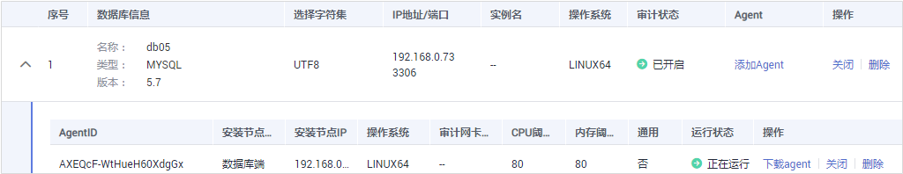

# 管理添加的数据库和Agent

成功添加数据库后，您可以查看数据库信息、关闭、删除数据库。如果数据库添加了Agent，您还可以查看Agent信息、关闭或删除Agent。

## 前提条件

-   已成功购买数据库安全审计实例，且实例的状态为“运行中“。
-   已成功添加数据库。
-   关闭数据库前，请确认数据库的“审计状态“为“已开启“。

## 查看数据库信息

1.  [登录管理控制台](https://console.huaweicloud.com/?locale=zh-cn)。
2.  进入数据库列表入口，如[图1](#dbss_01_0322_zh-cn_topic_0144723368_fig4155162273613)所示。

    **图 1**  进入数据库列表入口  
    

3.  在“选择实例“下拉列表框中，选择查看的数据库所属的实例。
4.  查看数据库信息，如[图2](#fig315603514243)所示，相关参数说明如[表1](#table4295843716304)所示。

    **图 2**  查看数据库和Agent信息  
    

    > **说明：** 
    >在列表右上方“全部审计状态“下拉列表框中选择数据库的审计状态，或输入数据库的关键字，可以搜索指定的数据库。

    **表 1**  数据库信息参数说明

    
    <table><thead align="left"><tr id="row4338993216304"><th class="cellrowborder" valign="top" width="21%" id="mcps1.2.4.1.1">
参数名称

    </th>
    <th class="cellrowborder" valign="top" width="61%" id="mcps1.2.4.1.2">
说明

    </th>
    <th class="cellrowborder" valign="top" width="18%" id="mcps1.2.4.1.3">
取值样例

    </th>
    </tr>
    </thead>
    <tbody><tr id="row8736194992614"><td class="cellrowborder" valign="top" width="21%" headers="mcps1.2.4.1.1 ">
数据库信息

    </td>
    <td class="cellrowborder" valign="top" width="61%" headers="mcps1.2.4.1.2 ">
数据库的名称、类型以及版本信息。

    </td>
    <td class="cellrowborder" valign="top" width="18%" headers="mcps1.2.4.1.3 ">
-

    </td>
    </tr>
    <tr id="row8267640105117"><td class="cellrowborder" valign="top" width="21%" headers="mcps1.2.4.1.1 ">
选择字符集

    </td>
    <td class="cellrowborder" valign="top" width="61%" headers="mcps1.2.4.1.2 ">
数据库的编码字符集。

    </td>
    <td class="cellrowborder" valign="top" width="18%" headers="mcps1.2.4.1.3 ">
UTF8

    </td>
    </tr>
    <tr id="row121453182104"><td class="cellrowborder" valign="top" width="21%" headers="mcps1.2.4.1.1 ">
IP地址/端口

    </td>
    <td class="cellrowborder" valign="top" width="61%" headers="mcps1.2.4.1.2 ">
数据库的IP地址。

    </td>
    <td class="cellrowborder" valign="top" width="18%" headers="mcps1.2.4.1.3 ">
192.168.0.0

    
3306

    </td>
    </tr>
    <tr id="row0860165713317"><td class="cellrowborder" valign="top" width="21%" headers="mcps1.2.4.1.1 ">
实例名

    </td>
    <td class="cellrowborder" valign="top" width="61%" headers="mcps1.2.4.1.2 ">
数据库的实例名称。

    </td>
    <td class="cellrowborder" valign="top" width="18%" headers="mcps1.2.4.1.3 ">
test

    </td>
    </tr>
    <tr id="row1319658616304"><td class="cellrowborder" valign="top" width="21%" headers="mcps1.2.4.1.1 ">
操作系统

    </td>
    <td class="cellrowborder" valign="top" width="61%" headers="mcps1.2.4.1.2 ">
数据库运行的操作系统。

    </td>
    <td class="cellrowborder" valign="top" width="18%" headers="mcps1.2.4.1.3 ">
LINUX64

    </td>
    </tr>
    <tr id="row091816547102"><td class="cellrowborder" valign="top" width="21%" headers="mcps1.2.4.1.1 ">
审计状态

    </td>
    <td class="cellrowborder" valign="top" width="61%" headers="mcps1.2.4.1.2 ">
数据库的审计状态，包括：

    <ul id="ul3352161171210"><li>已开启</li><li>已关闭</li></ul>
    </td>
    <td class="cellrowborder" valign="top" width="18%" headers="mcps1.2.4.1.3 ">
已开启

    </td>
    </tr>
    <tr id="row1085198131115"><td class="cellrowborder" valign="top" width="21%" headers="mcps1.2.4.1.1 ">
Agent

    </td>
    <td class="cellrowborder" valign="top" width="61%" headers="mcps1.2.4.1.2 ">
单击“添加Agent”，可以为数据库添加Agent。

    </td>
    <td class="cellrowborder" valign="top" width="18%" headers="mcps1.2.4.1.3 ">
-

    </td>
    </tr>
    </tbody>
    </table>

    > **说明：** 
    >您可以根据使用需求，对添加的数据库执行以下操作：
    >-   关闭
    >    -   在需要关闭的数据库所在行的“操作“列，单击“关闭“后，在弹出的提示框中，单击“确定“，数据库的“审计状态“为“已关闭“。
    >    -   关闭数据库后，数据库安全审计将停止对该数据库进行安全审计。
    >-   删除
    >    -   在需要删除的数据库所在行的“操作“列，单击“删除“后，在弹出的提示框中，单击“确定“，删除该数据库。
    >    -   删除数据库后，如果需要对该数据库进行安全审计，请重新添加该数据库。

## 查看Agent信息

1.  [登录管理控制台](https://console.huaweicloud.com/?locale=zh-cn)。
2.  进入数据库列表入口，如[图3](#dbss_01_0322_zh-cn_topic_0144723368_fig4155162273613_1)所示。

    **图 3**  进入数据库列表入口  
    

3.  单击数据库左侧的展开Agent的详细信息，如[图4](#fig1280134145116)所示，相关参数说明如[表2](#table146922503232)所示。

    **图 4**  查看数据库和Agent信息  
    

    **表 2**  Agent参数说明

    
    <table><thead align="left"><tr id="row369365019232"><th class="cellrowborder" valign="top" width="25.61%" id="mcps1.2.3.1.1">
参数名称

    </th>
    <th class="cellrowborder" valign="top" width="74.39%" id="mcps1.2.3.1.2">
说明

    </th>
    </tr>
    </thead>
    <tbody><tr id="row6693115010235"><td class="cellrowborder" valign="top" width="25.61%" headers="mcps1.2.3.1.1 ">
Agent ID

    </td>
    <td class="cellrowborder" valign="top" width="74.39%" headers="mcps1.2.3.1.2 ">
Agent的ID，由系统自动生成。

    </td>
    </tr>
    <tr id="row12694175032314"><td class="cellrowborder" valign="top" width="25.61%" headers="mcps1.2.3.1.1 ">
安装节点类型

    </td>
    <td class="cellrowborder" valign="top" width="74.39%" headers="mcps1.2.3.1.2 ">
安装节点的类型，包括“数据库端”或“应用端”。

    </td>
    </tr>
    <tr id="row14693142715371"><td class="cellrowborder" valign="top" width="25.61%" headers="mcps1.2.3.1.1 ">
安装节点IP

    </td>
    <td class="cellrowborder" valign="top" width="74.39%" headers="mcps1.2.3.1.2 ">
安装Agent的节点的IP地址。

    </td>
    </tr>
    <tr id="row364194913598"><td class="cellrowborder" valign="top" width="25.61%" headers="mcps1.2.3.1.1 ">
操作系统

    </td>
    <td class="cellrowborder" valign="top" width="74.39%" headers="mcps1.2.3.1.2 ">
安装Agent运行的操作系统。

    </td>
    </tr>
    <tr id="row06233118374"><td class="cellrowborder" valign="top" width="25.61%" headers="mcps1.2.3.1.1 ">
审计网卡名称

    </td>
    <td class="cellrowborder" valign="top" width="74.39%" headers="mcps1.2.3.1.2 ">
安装节点的网卡名称。

    </td>
    </tr>
    <tr id="row246482404017"><td class="cellrowborder" valign="top" width="25.61%" headers="mcps1.2.3.1.1 ">
CPU阈值(%)

    </td>
    <td class="cellrowborder" valign="top" width="74.39%" headers="mcps1.2.3.1.2 ">
安装节点的CPU阈值，缺省值为“80”。

    </td>
    </tr>
    <tr id="row14911327164010"><td class="cellrowborder" valign="top" width="25.61%" headers="mcps1.2.3.1.1 ">
内存阈值(%)

    </td>
    <td class="cellrowborder" valign="top" width="74.39%" headers="mcps1.2.3.1.2 ">
安装节点的内存阈值，缺省值为“80”。

    </td>
    </tr>
    <tr id="row19965942805"><td class="cellrowborder" valign="top" width="25.61%" headers="mcps1.2.3.1.1 ">
通用

    </td>
    <td class="cellrowborder" valign="top" width="74.39%" headers="mcps1.2.3.1.2 ">
Agent是否为通用Agent。

    
否：需要用户下载Agent，并在“数据库端”或“应用端”安装Agent。

    
是：不需要用户手动进行安装Agent。

    </td>
    </tr>
    <tr id="row116912045932"><td class="cellrowborder" valign="top" width="25.61%" headers="mcps1.2.3.1.1 ">
运行状态

    </td>
    <td class="cellrowborder" valign="top" width="74.39%" headers="mcps1.2.3.1.2 ">
安装节点的运行状态。

    </td>
    </tr>
    </tbody>
    </table>

    > **说明：** 
    >您可以根据使用需求，对添加的Agent执行以下操作：
    >-   关闭
    >    -   在需要关闭的Agent所在行的“操作“列，单击“关闭“后，在弹出的提示框中，单击“确定“，Agent状态为“关闭“。
    >    -   关闭Agent后，数据库安全审计将停止对连接该Agent的数据库进行安全审计。
    >-   删除
    >    -   在需要删除的Agent所在行的“操作“列，单击“删除“后，在弹出的提示框中，单击“确定“，删除该Agent。
    >    -   删除Agent后，如果需要对连接该Agent的数据库进行安全审计，请重新添加Agent。

