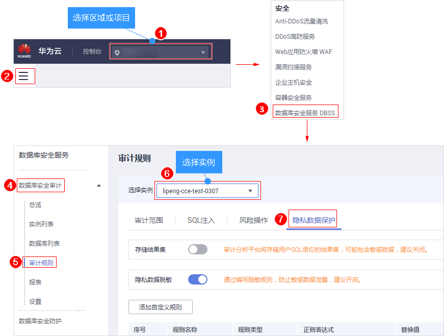
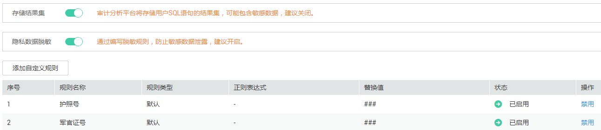

# 管理隐私数据保护规则

您可以查看隐私数据保护规则，启用、编辑、禁用或删除脱敏规则。

## 前提条件

已成功购买数据库安全审计实例，且实例的状态为“运行中“。

## 查看隐私数据保护规则信息

1.  [登录管理控制台](https://console.huaweicloud.com/?locale=zh-cn)。
2.  进入隐私数据保护入口，如[图1](#dbss_01_0266_fig61991836131419)所示。

    **图 1**  进入隐私数据保护入口  
    

3.  查看规则信息，如[图2](#fig8811324492)所示，相关参数说明如[表1](#table881122114911)所示。

    > **说明：**   
    >-   存储结果集+  
    >    建议关闭。关闭后，数据库安全审计分析平台将不会存储用户SQL语句的结果集。  
    >-   隐私数据脱敏  
    >    建议开启。开启后，您可以通过配置隐私数据脱敏规则，防止数据库敏感信息泄露。  

    **图 2**  查看脱敏规则信息  
    

    **表 1**  脱敏规则信息参数说明

    
    <table><thead align="left"><tr id="row281120244916"><th class="cellrowborder" valign="top" width="17%" id="mcps1.2.3.1.1">
参数名称

    </th>
    <th class="cellrowborder" valign="top" width="83%" id="mcps1.2.3.1.2">
说明

    </th>
    </tr>
    </thead>
    <tbody><tr id="row28112274916"><td class="cellrowborder" valign="top" width="17%" headers="mcps1.2.3.1.1 ">
规则名称

    </td>
    <td class="cellrowborder" valign="top" width="83%" headers="mcps1.2.3.1.2 ">
该规则的名称。

    </td>
    </tr>
    <tr id="row128119216496"><td class="cellrowborder" valign="top" width="17%" headers="mcps1.2.3.1.1 ">
规则类型

    </td>
    <td class="cellrowborder" valign="top" width="83%" headers="mcps1.2.3.1.2 ">
该规则的类型。

    </td>
    </tr>
    <tr id="row12812112194911"><td class="cellrowborder" valign="top" width="17%" headers="mcps1.2.3.1.1 ">
正则表达式

    </td>
    <td class="cellrowborder" valign="top" width="83%" headers="mcps1.2.3.1.2 ">
该规则的正则表达式。

    </td>
    </tr>
    <tr id="row71581246155218"><td class="cellrowborder" valign="top" width="17%" headers="mcps1.2.3.1.1 ">
替换值

    </td>
    <td class="cellrowborder" valign="top" width="83%" headers="mcps1.2.3.1.2 ">
正则表达式脱敏后对应的替换值。

    </td>
    </tr>
    <tr id="row178151322494"><td class="cellrowborder" valign="top" width="17%" headers="mcps1.2.3.1.1 ">
状态

    </td>
    <td class="cellrowborder" valign="top" width="83%" headers="mcps1.2.3.1.2 ">
该规则的启用状态，包括：

    <ul id="ul15815127491"><li>已启用</li><li>已禁用</li></ul>
    </td>
    </tr>
    </tbody>
    </table>

    > **说明：**   
    >根据需要，您还可以对规则执行以下操作：  
    >-   禁用  
    >    在需要禁用的规则所在行的“操作“列，单击“禁用“，可以禁用该规则。禁用该规则后，系统将不能使用该数据脱敏规则。  
    >-   编辑  
    >    在需要修改信息的规则所在行的“操作“列，单击“编辑“，在弹出的对话框中，修改规则信息。  
    >-   删除  
    >    在需要删除的规则所在行的“操作“列，单击“删除“，在弹出的提示框中，单击“确定“，删除该规则。  

