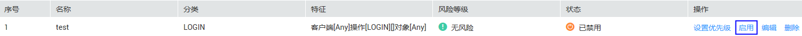
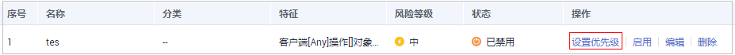
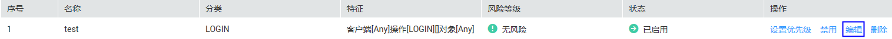
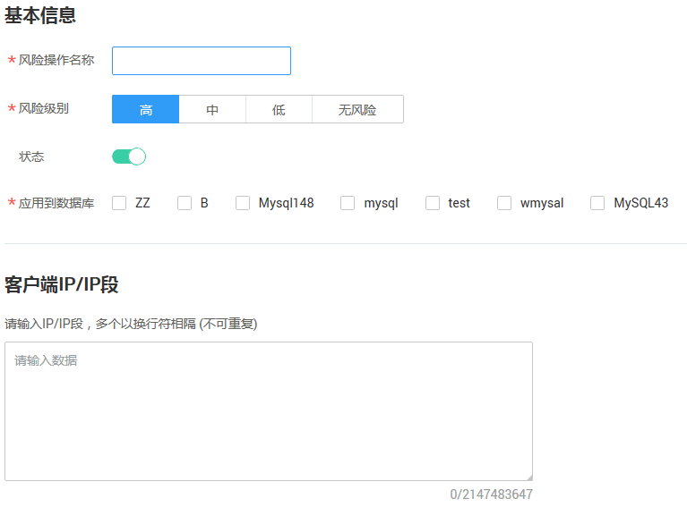
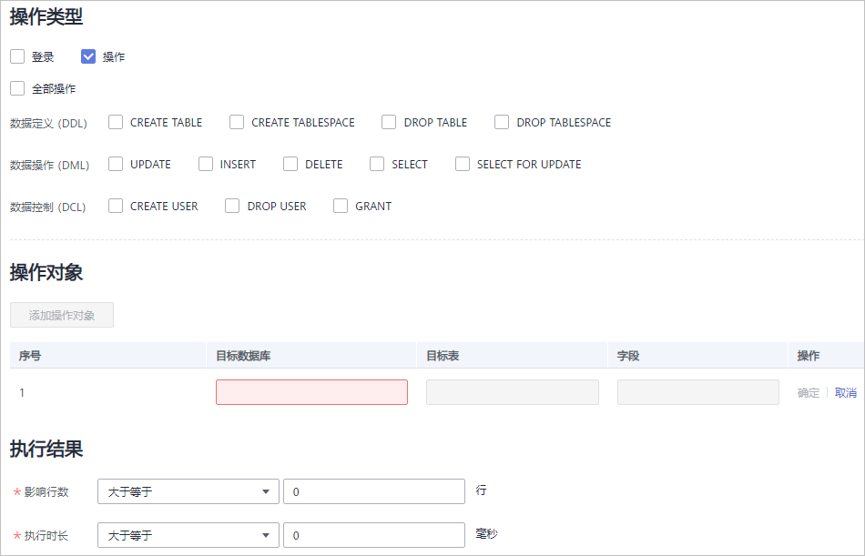
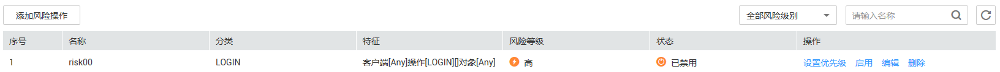

# 管理风险操作

成功添加风险操作后，您可以查看风险操作信息，启用、编辑、禁用、删除风险操作，或设置风险操作的优先级。

## 前提条件

-   已获取管理控制台的登录账号与密码。
-   已成功购买数据库安全审计实例，且实例的状态为“运行中“。
-   已成功添加风险操作。
-   启用风险操作前，请确认风险操作的状态为“已禁用“。
-   禁用风险操作前，请确认风险操作的状态为“已启用“。

## 启用风险操作

1.  登录管理控制台。
2.  单击管理控制台左上角的，选择区域或项目。
3.  单击页面上方的“服务列表“，选择“安全  \>  数据库安全服务 DBSS“。
4.  在左侧导航树中，选择“数据库安全服务  \>  数据库安全审计“，进入数据库安全审计实例列表界面。
5.  在数据库安全审计实例列表中，单击需要启用风险操作的实例名称，如[图1](#fig99553501795)所示。

    **图 1**  数据库安全审计实例列表  
    

6.  在“实例详情“界面，选择“规则  \>  风险操作“，进入风险操作列表页面。
7.  在需要启用的风险操作所在行的“操作“列，单击“启用“，如[图2](#fig5689154912135)所示。

    **图 2**  启用风险操作  
    

    成功启用风险操作后，风险操作的状态为“已启用“。

## 设置优先级

1.  登录管理控制台。
2.  单击管理控制台左上角的，选择区域或项目。
3.  单击页面上方的“服务列表“，选择“安全  \>  数据库安全服务 DBSS“。
4.  在左侧导航树中，选择“数据库安全服务  \>  数据库安全审计“，进入数据库安全审计实例列表界面。
5.  在数据库安全审计实例列表中，单击需要设置风险操作优先级的实例名称，如[图3](#fig0508648175317)所示。

    **图 3**  数据库安全审计实例列表  
    

6.  在“实例详情“界面，选择“规则  \>  风险操作“，进入风险操作列表页面。
7.  在需要设置优先级的风险操作所在行的“操作“列，单击“设置优先级“，如[图4](#fig1952634845310)所示。

    **图 4**  设置风险操作的优先级  
    

8.  在弹出的对话框中，选择“优先级“后，单击“确定“。

## 编辑风险操作

1.  登录管理控制台。
2.  单击管理控制台左上角的，选择区域或项目。
3.  单击页面上方的“服务列表“，选择“安全  \>  数据库安全服务 DBSS“。
4.  在左侧导航树中，选择“数据库安全服务  \>  数据库安全审计“，进入数据库安全审计实例列表界面。
5.  在数据库安全审计实例列表中，单击需要编辑风险操作的实例名称，如[图5](#fig1316811545161)所示。

    **图 5**  数据库安全审计实例列表  
    

6.  在“实例详情“界面，选择“规则  \>  风险操作“，进入风险操作列表页面。
7.  在需要编辑的风险操作所在行的“操作“列，单击“编辑“，如[图6](#fig13182165451613)所示。

    **图 6**  编辑风险操作  
    

8.  在“编辑风险操作“界面，设置基本信息和客户端IP地址，如[图7](#fig161016109141)所示，相关参数说明如[表1](#table4295843716304)所示。

    **图 7**  设置基本信息和客户端IP地址  
    

    **表 1**  风险操作参数说明

    
    <table><thead align="left"><tr id="zh-cn_topic_0145057226_row4338993216304"><th class="cellrowborder" valign="top" width="21%" id="mcps1.2.4.1.1">
参数名称

    </th>
    <th class="cellrowborder" valign="top" width="61%" id="mcps1.2.4.1.2">
说明

    </th>
    <th class="cellrowborder" valign="top" width="18%" id="mcps1.2.4.1.3">
取值样例

    </th>
    </tr>
    </thead>
    <tbody><tr id="zh-cn_topic_0145057226_row8736194992614"><td class="cellrowborder" valign="top" width="21%" headers="mcps1.2.4.1.1 ">
风险操作名称

    </td>
    <td class="cellrowborder" valign="top" width="61%" headers="mcps1.2.4.1.2 ">
您可以自定义风险操作的名称。

    </td>
    <td class="cellrowborder" valign="top" width="18%" headers="mcps1.2.4.1.3 ">
test

    </td>
    </tr>
    <tr id="zh-cn_topic_0145057226_row3896937416304"><td class="cellrowborder" valign="top" width="21%" headers="mcps1.2.4.1.1 ">
风险级别

    </td>
    <td class="cellrowborder" valign="top" width="61%" headers="mcps1.2.4.1.2 ">
选择风险操作的级别，可以选择以下级别：

    <ul id="zh-cn_topic_0145057226_ul155751241152314"><li>高</li><li>中</li><li>低</li><li>无风险</li></ul>
    </td>
    <td class="cellrowborder" valign="top" width="18%" headers="mcps1.2.4.1.3 ">
高

    </td>
    </tr>
    <tr id="zh-cn_topic_0145057226_row1332204111319"><td class="cellrowborder" valign="top" width="21%" headers="mcps1.2.4.1.1 ">
状态

    </td>
    <td class="cellrowborder" valign="top" width="61%" headers="mcps1.2.4.1.2 ">
开启或关闭风险操作。

    <ul id="zh-cn_topic_0145057226_ul934875119443"><li>：开启。</li><li>：关闭。</li></ul>
    </td>
    <td class="cellrowborder" valign="top" width="18%" headers="mcps1.2.4.1.3 ">

    </td>
    </tr>
    <tr id="zh-cn_topic_0145057226_row0860165713317"><td class="cellrowborder" valign="top" width="21%" headers="mcps1.2.4.1.1 ">
应用到数据库

    </td>
    <td class="cellrowborder" valign="top" width="61%" headers="mcps1.2.4.1.2 ">
选择应用该风险操作的数据库。

    </td>
    <td class="cellrowborder" valign="top" width="18%" headers="mcps1.2.4.1.3 ">
-

    </td>
    </tr>
    <tr id="zh-cn_topic_0145057226_row1319658616304"><td class="cellrowborder" valign="top" width="21%" headers="mcps1.2.4.1.1 ">
客户端IP/IP段

    </td>
    <td class="cellrowborder" valign="top" width="61%" headers="mcps1.2.4.1.2 ">
输入客户端的IP地址或IP地址段。

    </td>
    <td class="cellrowborder" valign="top" width="18%" headers="mcps1.2.4.1.3 ">
192.168.0.0

    </td>
    </tr>
    </tbody>
    </table>

9.  设置操作类型、操作对象、执行结果，如[图8](#zh-cn_topic_0145057226_fig18318125817371)所示，相关参数说明如[表2](#zh-cn_topic_0145057226_table1588718356449)所示。

    **图 8**  设置操作类型、操作对象和执行结果  
    

    **表 2**  参数说明

    
    <table><thead align="left"><tr id="zh-cn_topic_0145057226_row689253515446"><th class="cellrowborder" valign="top" width="21%" id="mcps1.2.4.1.1">
参数名称

    </th>
    <th class="cellrowborder" valign="top" width="61%" id="mcps1.2.4.1.2">
说明

    </th>
    <th class="cellrowborder" valign="top" width="18%" id="mcps1.2.4.1.3">
取值样例

    </th>
    </tr>
    </thead>
    <tbody><tr id="zh-cn_topic_0145057226_row48961135134415"><td class="cellrowborder" valign="top" width="21%" headers="mcps1.2.4.1.1 ">
操作类型

    </td>
    <td class="cellrowborder" valign="top" width="61%" headers="mcps1.2.4.1.2 ">
风险操作的类型，包括“登录”和“操作”。

    
当选择“操作”时，可以选择“数据定义”、“数据操作”和“数据控制”的操作。

    </td>
    <td class="cellrowborder" valign="top" width="18%" headers="mcps1.2.4.1.3 ">
登录

    </td>
    </tr>
    <tr id="zh-cn_topic_0145057226_row11901133564410"><td class="cellrowborder" valign="top" width="21%" headers="mcps1.2.4.1.1 ">
操作对象

    </td>
    <td class="cellrowborder" valign="top" width="61%" headers="mcps1.2.4.1.2 ">
单击“添加操作对象”后，输入schema、目标表和字段信息。单击“确定”，添加操作对象。

    </td>
    <td class="cellrowborder" valign="top" width="18%" headers="mcps1.2.4.1.3 ">
-

    </td>
    </tr>
    <tr id="zh-cn_topic_0145057226_row791153564413"><td class="cellrowborder" valign="top" width="21%" headers="mcps1.2.4.1.1 ">
执行结果

    </td>
    <td class="cellrowborder" valign="top" width="61%" headers="mcps1.2.4.1.2 ">
设置“影响行数”和“执行时长”的执行条件后，输入行数和时长值，执行条件包括：

    <ul id="zh-cn_topic_0145057226_ul1891243517447"><li>大于</li><li>小于</li><li>等于</li><li>大于等于</li><li>小于等于</li></ul>
    </td>
    <td class="cellrowborder" valign="top" width="18%" headers="mcps1.2.4.1.3 ">
-

    </td>
    </tr>
    </tbody>
    </table>

10. 单击“保存“。

## 禁用风险操作

禁用风险操作后，该风险操作规则将不在审计中执行。

1.  登录管理控制台。
2.  单击管理控制台左上角的，选择区域或项目。
3.  单击页面上方的“服务列表“，选择“安全  \>  数据库安全服务 DBSS“。
4.  在左侧导航树中，选择“数据库安全服务  \>  数据库安全审计“，进入数据库安全审计实例列表界面。
5.  在数据库安全审计实例列表中，单击需要禁用风险操作的实例名称，如[图9](#fig5601152435819)所示。

    **图 9**  数据库安全审计实例列表  
    

6.  在“实例详情“界面，选择“规则  \>  风险操作“，进入风险操作列表页面。
7.  在需要禁用的风险操作所在行的“操作“列，单击“禁用“，如[图10](#fig7609124155819)所示。

    **图 10**  禁用风险操作  
    

8.  在弹出的对话框中，单击“确定“。

    成功禁用风险操作后，风险操作的状态为“已禁用“。

## 删除风险操作

删除风险操作后，如果需要对该风险操作的规则进行安全审计，请重新添加该风险操作。

1.  登录管理控制台。
2.  单击管理控制台左上角的，选择区域或项目。
3.  单击页面上方的“服务列表“，选择“安全  \>  数据库安全服务 DBSS“。
4.  在左侧导航树中，选择“数据库安全服务  \>  数据库安全审计“，进入数据库安全审计实例列表界面。
5.  在数据库安全审计实例列表中，单击需要删除风险操作的实例名称，如[图11](#fig95651514172218)所示。

    **图 11**  数据库安全审计实例列表  
    

6.  在“实例详情“界面，选择“规则  \>  风险操作“，进入风险操作列表页面。
7.  在需要删除的风险操作所在行的“操作“列，单击“删除“，如[图12](#fig757821415226)所示。

    **图 12**  删除风险操作  
    

8.  在弹出的对话框中，单击“确定“。

## 查看风险操作信息

1.  登录管理控制台。
2.  单击管理控制台左上角的，选择区域或项目。
3.  单击页面上方的“服务列表“，选择“安全  \>  数据库安全服务 DBSS“。
4.  在左侧导航树中，选择“数据库安全服务  \>  数据库安全审计“，进入数据库安全审计实例列表界面。
5.  在数据库安全审计实例列表中，单击需要查看风险操作的实例名称，如[图13](#fig9310153622611)所示。

    **图 13**  数据库安全审计实例列表  
    

6.  在“实例详情“界面，选择“规则  \>  风险操作“，进入风险操作列表页面。
7.  查看风险操作信息，如[图14](#fig17324536122612)所示，相关参数说明如[表3](#table964761214306)所示。

    **图 14**  查看风险操作信息  
    

    > **说明：**   
    >-   选择风险操作的风险级别，列表将显示该级别的风险操作。  
    >-   输入风险操作的关键字，单击或按“Enter“，可以搜索指定的风险操作。  

    **表 3**  风险操作信息参数说明

    
    <table><thead align="left"><tr id="row1365581213011"><th class="cellrowborder" valign="top" width="25.629999999999995%" id="mcps1.2.3.1.1">
参数名称

    </th>
    <th class="cellrowborder" valign="top" width="74.37%" id="mcps1.2.3.1.2">
说明

    </th>
    </tr>
    </thead>
    <tbody><tr id="row1528102263112"><td class="cellrowborder" valign="top" width="25.629999999999995%" headers="mcps1.2.3.1.1 ">
序号

    </td>
    <td class="cellrowborder" valign="top" width="74.37%" headers="mcps1.2.3.1.2 ">
风险操作的编号。

    </td>
    </tr>
    <tr id="row7664312163018"><td class="cellrowborder" valign="top" width="25.629999999999995%" headers="mcps1.2.3.1.1 ">
名称

    </td>
    <td class="cellrowborder" valign="top" width="74.37%" headers="mcps1.2.3.1.2 ">
风险操作的名称。

    </td>
    </tr>
    <tr id="row18114121410321"><td class="cellrowborder" valign="top" width="25.629999999999995%" headers="mcps1.2.3.1.1 ">
分类

    </td>
    <td class="cellrowborder" valign="top" width="74.37%" headers="mcps1.2.3.1.2 ">
风险操作的类别。

    </td>
    </tr>
    <tr id="row17352133015322"><td class="cellrowborder" valign="top" width="25.629999999999995%" headers="mcps1.2.3.1.1 ">
特征

    </td>
    <td class="cellrowborder" valign="top" width="74.37%" headers="mcps1.2.3.1.2 ">
风险操作的特征。

    </td>
    </tr>
    <tr id="row1167216126301"><td class="cellrowborder" valign="top" width="25.629999999999995%" headers="mcps1.2.3.1.1 ">
风险等级

    </td>
    <td class="cellrowborder" valign="top" width="74.37%" headers="mcps1.2.3.1.2 ">
风险操作的风险级别，包括：

    <ul id="ul886213243541"><li>高</li><li>中</li><li>低</li><li>无风险</li></ul>
    </td>
    </tr>
    <tr id="row19685121213016"><td class="cellrowborder" valign="top" width="25.629999999999995%" headers="mcps1.2.3.1.1 ">
状态

    </td>
    <td class="cellrowborder" valign="top" width="74.37%" headers="mcps1.2.3.1.2 ">
风险操作的状态，包括：

    <ul id="ul118072149340"><li>已启用</li><li>已禁用</li></ul>
    </td>
    </tr>
    </tbody>
    </table>

