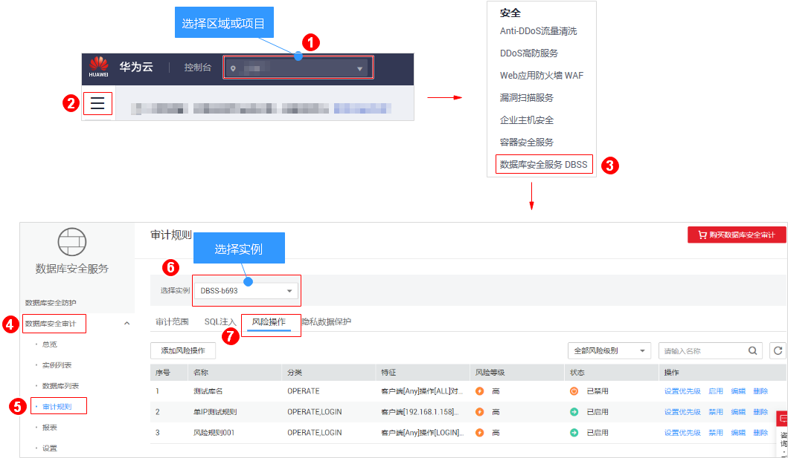

# 管理风险操作

成功添加风险操作后，您可以查看风险操作信息，启用、编辑、禁用、删除风险操作，或设置风险操作优先级。

## 前提条件

-   已成功购买数据库安全审计实例，且实例的状态为“运行中“。
-   已成功添加风险操作。
-   启用风险操作前，请确认风险操作的状态为“已禁用“。
-   禁用风险操作前，请确认风险操作的状态为“已启用“。

## 设置优先级

1.  [登录管理控制台](https://console.huaweicloud.com/)。
2.  进入风险操作列表入口，如[图1](#zh-cn_topic_0146120516_fig23515138413)所示。

    **图 1**  进入风险操作列表入口  
    

3.  在需要设置优先级的风险操作所在行的“操作“列，单击“设置优先级“，如[图2](#fig1952634845310)所示。

    **图 2**  设置风险操作的优先级  
    

4.  在弹出的对话框中，选择“优先级“后，单击“确定“。

## 查看风险操作信息

1.  [登录管理控制台](https://console.huaweicloud.com/)。
2.  进入风险操作列表入口，如[图3](#fig23515138413)所示。

    **图 3**  进入风险操作列表入口  
    

3.  查看风险操作信息，如[图4](#fig17324536122612)所示，相关参数说明如[表1](#table964761214306)所示。

    **图 4**  查看风险操作信息  
    

    > **说明：**   
    >在列表右上方“全部风险等级“下拉列表框中选择风险操作的等级，或输入风险操作名称的关键字，或按“Enter“，可以搜索指定的风险操作。  

    **表 1**  风险操作信息参数说明

    
    <table><thead align="left"><tr id="row1365581213011"><th class="cellrowborder" valign="top" width="25.629999999999995%" id="mcps1.2.3.1.1">
参数名称

    </th>
    <th class="cellrowborder" valign="top" width="74.37%" id="mcps1.2.3.1.2">
说明

    </th>
    </tr>
    </thead>
    <tbody><tr id="row7664312163018"><td class="cellrowborder" valign="top" width="25.629999999999995%" headers="mcps1.2.3.1.1 ">
名称

    </td>
    <td class="cellrowborder" valign="top" width="74.37%" headers="mcps1.2.3.1.2 ">
风险操作的名称。

    </td>
    </tr>
    <tr id="row18114121410321"><td class="cellrowborder" valign="top" width="25.629999999999995%" headers="mcps1.2.3.1.1 ">
分类

    </td>
    <td class="cellrowborder" valign="top" width="74.37%" headers="mcps1.2.3.1.2 ">
风险操作的类别。

    </td>
    </tr>
    <tr id="row17352133015322"><td class="cellrowborder" valign="top" width="25.629999999999995%" headers="mcps1.2.3.1.1 ">
特征

    </td>
    <td class="cellrowborder" valign="top" width="74.37%" headers="mcps1.2.3.1.2 ">
风险操作的特征。

    </td>
    </tr>
    <tr id="row1167216126301"><td class="cellrowborder" valign="top" width="25.629999999999995%" headers="mcps1.2.3.1.1 ">
风险等级

    </td>
    <td class="cellrowborder" valign="top" width="74.37%" headers="mcps1.2.3.1.2 ">
风险操作的风险级别，包括：

    <ul id="ul886213243541"><li>高</li><li>中</li><li>低</li><li>无风险</li></ul>
    </td>
    </tr>
    <tr id="row19685121213016"><td class="cellrowborder" valign="top" width="25.629999999999995%" headers="mcps1.2.3.1.1 ">
状态

    </td>
    <td class="cellrowborder" valign="top" width="74.37%" headers="mcps1.2.3.1.2 ">
风险操作的状态，包括：

    <ul id="ul118072149340"><li>已启用</li><li>已禁用</li></ul>
    </td>
    </tr>
    </tbody>
    </table>

    > **说明：**   
    >根据需要，您还可以对风险操作执行以下操作：  
    >-   启用  
    >    在需要启用的风险操作所在行的“操作“列，单击“启用“，数据库安全审计将对该风险操作进行审计。  
    >-   编辑  
    >    在需要编辑的风险操作所在行的“操作“列，单击“编辑“，在风险操作界面，您可以修改风险操作。  
    >-   禁用  
    >    在需要禁用的风险操作所在行的“操作“列，单击“禁用“，在弹出的对话框中，单击“确定“，可以禁用该风险操作。禁用风险操作后，该风险操作规则将不在审计中执行。  
    >-   删除  
    >    在需要删除的风险操作所在行的“操作“列，单击“删除“，在弹出的对话框中，单击“确定“，可以删除该风险操作。删除风险操作后，如果需要对该风险操作的规则进行安全审计，请重新添加该风险操作。  

