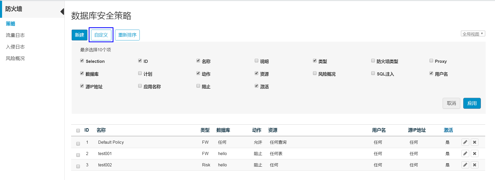
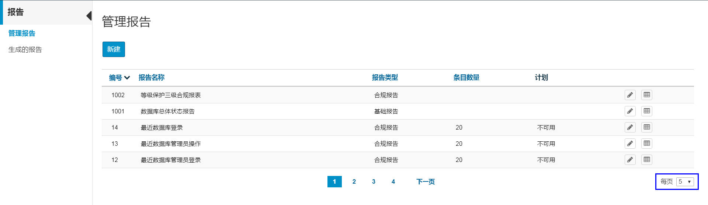

# 自定义视图

在部分界面（日志、报告等）中，用户可以自定义在工作区列表中显示哪些列和每页显示多少项。

## 配置哪些列在工作区中显示

1.  在命令栏上，单击“自定义“。
2.  勾选需要显示项左侧的复选框。

    列表中最多可以显示10列。

3.  单击“应用“。

    工作区会根据所选项显示列表。

    **图 1**  自定义视图  
    

## 配置每页列出多少项

1.  在工作区的右下角，在“每页“选项中选择一个所需的数字。

    **图 2**  页面列表限制值  
    

