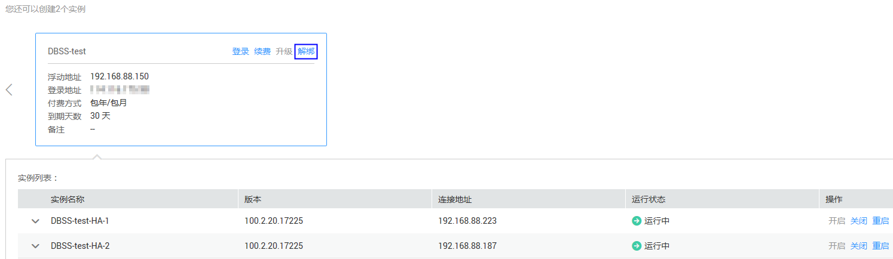

# 解绑弹性IP

当DBSS实例需要重新绑定弹性IP或释放弹性IP时，需要为该实例解绑弹性IP。

## 前提条件

-   已获取管理控制台的登录帐号与密码。
-   已成功购买DBSS实例，且2个实例的“运行状态“都为“运行中“。
-   实例已绑定弹性IP。

## 操作步骤

1.  登录管理控制台。
2.  单击页面上方的“服务列表“，选择“安全“  \>  “数据库安全服务 DBSS“，进入数据库安全服务界面。
3.  在需要解绑弹性IP的DBSS实例页面框中，单击“解绑“，如[图1](#fig47310583537)所示。

    **图 1**  解绑定弹性IP  
    

4.  在弹出的对话框中，单击“确定“。

