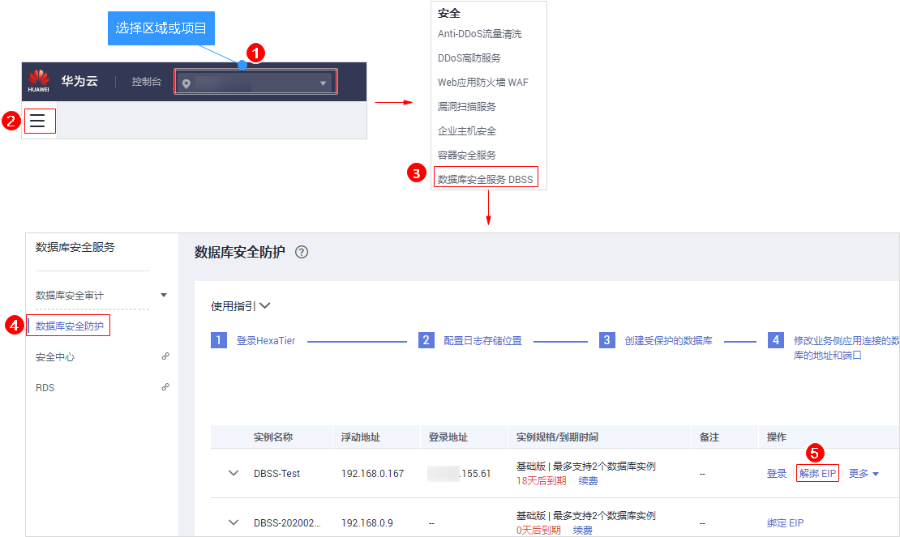

# 解绑弹性IP

当实例需要重新绑定弹性IP或释放弹性IP时，需要为该实例解绑弹性IP。

## 前提条件

-   已成功购买数据库安全防护实例，且2个实例的“运行状态“都为“运行中“。
-   实例已绑定弹性IP。

## 操作步骤

1.  [登录管理控制台](https://console.huaweicloud.com/?locale=zh-cn)。
2.  进入解绑定弹性IP入口，如[图1](#zh-cn_topic_0111166372_fig4989100164918)所示。

    **图 1**  进入解绑定弹性IP入口  
    

3.  在弹出的提示框中，单击“确定“。

