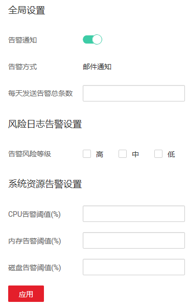

# 设置告警和邮件通知

通过设置告警和邮件通知，当数据库设置的告警事件发生时，您可以收到告警的通知邮件。

## 前提条件

-   已获取管理控制台的登录账号与密码。
-   已成功购买数据库安全审计实例，且实例的状态为“运行中“。

## 设置告警通知

您可以设置全局、风险日志以及系统资源告警通知。

1.  登录管理控制台。
2.  单击管理控制台左上角的，选择区域或项目。
3.  单击页面上方的“服务列表“，选择“安全  \>  数据库安全服务 DBSS“。
4.  在左侧导航树中，选择“数据库安全服务  \>  数据库安全审计“，进入数据库安全审计实例列表界面。
5.  在数据库安全审计实例列表中，单击需要设置告警通知的实例名称，如[图1](#fig8936852123614)所示。

    **图 1**  数据库安全审计实例列表  
    

6.  在“实例详情“界面，选择“维护  \>  告警通知“，进入告警通知页面。
7.  设置告警通知，如[图2](#fig139441652133611)所示，相关参数说明如[表1](#table29461252153613)所示。

    **图 2**  设置告警通知  
    

    **表 1**  告警通知参数说明

    
    <table><thead align="left"><tr id="row7948205203612"><th class="cellrowborder" valign="top" width="21%" id="mcps1.2.4.1.1">
参数名称

    </th>
    <th class="cellrowborder" valign="top" width="61%" id="mcps1.2.4.1.2">
说明

    </th>
    <th class="cellrowborder" valign="top" width="18%" id="mcps1.2.4.1.3">
取值样例

    </th>
    </tr>
    </thead>
    <tbody><tr id="row73171717462"><td class="cellrowborder" valign="top" width="21%" headers="mcps1.2.4.1.1 ">
告警通知

    </td>
    <td class="cellrowborder" valign="top" width="61%" headers="mcps1.2.4.1.2 ">
开启或关闭告警通知。

    <ul id="ul29616502620"><li>：开启</li><li>：关闭</li></ul>
    </td>
    <td class="cellrowborder" valign="top" width="18%" headers="mcps1.2.4.1.3 ">

    </td>
    </tr>
    <tr id="row5897125461117"><td class="cellrowborder" valign="top" width="21%" headers="mcps1.2.4.1.1 ">
告警方式

    </td>
    <td class="cellrowborder" valign="top" width="61%" headers="mcps1.2.4.1.2 ">
当前支持邮件通知的告警方式。

    </td>
    <td class="cellrowborder" valign="top" width="18%" headers="mcps1.2.4.1.3 ">
邮件通知

    </td>
    </tr>
    <tr id="row1495265210362"><td class="cellrowborder" valign="top" width="21%" headers="mcps1.2.4.1.1 ">
每天发送告警总条数

    </td>
    <td class="cellrowborder" valign="top" width="61%" headers="mcps1.2.4.1.2 ">
每天允许发送的告警总条数。

    
 注意： 

如果每天的告警数超出该参数值，超出部分的告警信息将不会发送通知。

    

    </td>
    <td class="cellrowborder" valign="top" width="18%" headers="mcps1.2.4.1.3 ">
10

    </td>
    </tr>
    <tr id="row995917529362"><td class="cellrowborder" valign="top" width="21%" headers="mcps1.2.4.1.1 ">
告警风险等级

    </td>
    <td class="cellrowborder" valign="top" width="61%" headers="mcps1.2.4.1.2 ">
选择发出告警通知的风险日志告警风险等级，可以选择：

    <ul id="ul11951164818432"><li>高</li><li>中</li><li>低</li></ul>
    </td>
    <td class="cellrowborder" valign="top" width="18%" headers="mcps1.2.4.1.3 ">
高

    </td>
    </tr>
    <tr id="row3960852133616"><td class="cellrowborder" valign="top" width="21%" headers="mcps1.2.4.1.1 ">
CPU告警阈值(%)

    </td>
    <td class="cellrowborder" valign="top" width="61%" headers="mcps1.2.4.1.2 ">
设置系统CPU告警的阈值。当超过该阈值时，产生告警通知。

    </td>
    <td class="cellrowborder" valign="top" width="18%" headers="mcps1.2.4.1.3 ">
80

    </td>
    </tr>
    <tr id="row19470200440"><td class="cellrowborder" valign="top" width="21%" headers="mcps1.2.4.1.1 ">
内存告警阈值(%)

    </td>
    <td class="cellrowborder" valign="top" width="61%" headers="mcps1.2.4.1.2 ">
设置系统内存告警的阈值。当超过该阈值时，产生告警通知。

    </td>
    <td class="cellrowborder" valign="top" width="18%" headers="mcps1.2.4.1.3 ">
80

    </td>
    </tr>
    <tr id="row1743917410440"><td class="cellrowborder" valign="top" width="21%" headers="mcps1.2.4.1.1 ">
磁盘告警阈值(%)

    </td>
    <td class="cellrowborder" valign="top" width="61%" headers="mcps1.2.4.1.2 ">
设置系统磁盘告警的阈值。当超过该阈值时，产生告警通知。

    </td>
    <td class="cellrowborder" valign="top" width="18%" headers="mcps1.2.4.1.3 ">
80

    </td>
    </tr>
    </tbody>
    </table>

8.  单击“应用“。

## 设置邮件通知

开启邮件通知后，当数据库有告警发生时，您将收到邮件通知。

1.  登录管理控制台。
2.  单击管理控制台左上角的，选择区域或项目。
3.  单击页面上方的“服务列表“，选择“安全  \>  数据库安全服务 DBSS“。
4.  在左侧导航树中，选择“数据库安全服务  \>  数据库安全审计“，进入数据库安全审计实例列表界面。
5.  在数据库安全审计实例列表中，单击需要设置邮件通知的实例名称，如[图3](#fig99553501795)所示。

    **图 3**  数据库安全审计实例列表  
    

6.  在“实例详情“界面，选择“维护  \>  邮件设置“，进入邮件设置页面。
7.  设置邮件通知，如[图4](#fig45721822818)所示，相关参数说明如[表2](#table4295843716304)所示。

    **图 4**  设置邮件通知  
    

    **表 2**  邮件通知参数说明

    
    <table><thead align="left"><tr id="row4338993216304"><th class="cellrowborder" valign="top" width="21%" id="mcps1.2.4.1.1">
参数名称

    </th>
    <th class="cellrowborder" valign="top" width="61%" id="mcps1.2.4.1.2">
说明

    </th>
    <th class="cellrowborder" valign="top" width="18%" id="mcps1.2.4.1.3">
取值样例

    </th>
    </tr>
    </thead>
    <tbody><tr id="row1332204111319"><td class="cellrowborder" valign="top" width="21%" headers="mcps1.2.4.1.1 ">
邮件通知

    </td>
    <td class="cellrowborder" valign="top" width="61%" headers="mcps1.2.4.1.2 ">
开启或关闭邮件通知。

    <ul id="ul934875119443"><li>：开启</li><li>：关闭</li></ul>
    </td>
    <td class="cellrowborder" valign="top" width="18%" headers="mcps1.2.4.1.3 ">

    </td>
    </tr>
    <tr id="row177601257112915"><td class="cellrowborder" valign="top" width="21%" headers="mcps1.2.4.1.1 ">
收件人

    </td>
    <td class="cellrowborder" valign="top" width="61%" headers="mcps1.2.4.1.2 ">
输入收件人的邮箱地址。

    </td>
    <td class="cellrowborder" valign="top" width="18%" headers="mcps1.2.4.1.3 ">
abcde@huawei.com

    </td>
    </tr>
    <tr id="row0860165713317"><td class="cellrowborder" valign="top" width="21%" headers="mcps1.2.4.1.1 ">
抄送人

    </td>
    <td class="cellrowborder" valign="top" width="61%" headers="mcps1.2.4.1.2 ">
可选参数。输入抄送人的邮箱地址。

    </td>
    <td class="cellrowborder" valign="top" width="18%" headers="mcps1.2.4.1.3 ">
-

    </td>
    </tr>
    </tbody>
    </table>

8.  单击“应用“。

