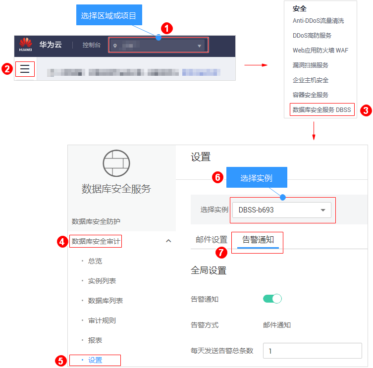

# 设置告警通知

通过设置告警通知，当数据库发生设置的告警事件时，您可以收到DBSS发送的告警通知，及时了解数据库的安全风险。否则，无论是否有危险，您都只能登录管理控制台自行查看，无法收到告警信息。

-   告警通知信息可能会被误拦截，若您未收到相关告警信息，请在信息拦截中查看。
-   数据库安全审计告警基础功能免费，触发产生的告警消息由消息通知服务发送，消息通知服务为付费服务，价格详情请参见[SMN价格详情](https://www.huaweicloud.com/pricing.html?tab=detail#/smn)。

## 前提条件

已成功购买数据库安全审计实例，且实例的状态为“运行中“。

## 操作步骤

1.  [登录管理控制台](https://console.huaweicloud.com/?locale=zh-cn)。
2.  进入告警通知入口，如[图1](#fig61991836131419)所示。

    **图 1**  进入告警通知入口  
    

3.  设置告警通知，如[图2](#fig139441652133611)所示，相关参数说明如[表1](#table29461252153613)所示。

    **图 2**  设置告警通知  
    

    **表 1**  告警通知参数说明

    
    <table><thead align="left"><tr id="row7948205203612"><th class="cellrowborder" valign="top" width="20.979999999999997%" id="mcps1.2.4.1.1">
参数名称

    </th>
    <th class="cellrowborder" valign="top" width="61.019999999999996%" id="mcps1.2.4.1.2">
说明

    </th>
    <th class="cellrowborder" valign="top" width="18%" id="mcps1.2.4.1.3">
取值样例

    </th>
    </tr>
    </thead>
    <tbody><tr id="row4309191713252"><td class="cellrowborder" valign="top" width="20.979999999999997%" headers="mcps1.2.4.1.1 ">
消息通知

    </td>
    <td class="cellrowborder" valign="top" width="61.019999999999996%" headers="mcps1.2.4.1.2 ">
开启或关闭消息通知。数据库安全审计的告警基础功能免费，触发产生的告警消息由消息通知发送，可能会产生少量费用，具体的收费详情，请参见<a href="https://www.huaweicloud.com/pricing.html?tab=detail#/smn" target="_blank" rel="noopener noreferrer">SMN价格详情</a>。

    <ul id="ul3491131152213"><li>：开启</li><li>：关闭</li></ul>
    </td>
    <td class="cellrowborder" valign="top" width="18%" headers="mcps1.2.4.1.3 ">

    </td>
    </tr>
    <tr id="row17829124216241"><td class="cellrowborder" valign="top" width="20.979999999999997%" headers="mcps1.2.4.1.1 ">
消息通知主题

    </td>
    <td class="cellrowborder" valign="top" width="61.019999999999996%" headers="mcps1.2.4.1.2 "><ul id="ul87280392273"><li>通过下拉框选择已有的主题，或者单击“查看消息通知主题”创建新的主题，具体操作请参见<a href="https://support.huaweicloud.com/usermanual-smn/zh-cn_topic_0043961401.html" target="_blank" rel="noopener noreferrer">创建主题</a>。</li><li>每个消息通知主题可添加多个订阅，并可选择多种订阅终端（例如短信、邮件等），详细订阅说明请参见<a href="https://support.huaweicloud.com/usermanual-smn/smn_ug_0008.html" target="_blank" rel="noopener noreferrer">添加订阅</a>。</li></ul>
    
 说明： 

在选择主题前，请确保您主题中订阅状态为“已确认”，即当前订阅终端可用，否则可能不能收到告警通知。

    

    
更多关于主题和订阅的信息，请参见《消息通知服务用户指南》。

    </td>
    <td class="cellrowborder" valign="top" width="18%" headers="mcps1.2.4.1.3 ">
-

    </td>
    </tr>
    <tr id="row1495265210362"><td class="cellrowborder" valign="top" width="20.979999999999997%" headers="mcps1.2.4.1.1 ">
每天发送告警总条数

    </td>
    <td class="cellrowborder" valign="top" width="61.019999999999996%" headers="mcps1.2.4.1.2 ">
每天允许发送的告警总条数。

    
 须知： 

如果每天的告警数超出该参数值，超出部分的告警信息将不会发送通知。

    

    </td>
    <td class="cellrowborder" valign="top" width="18%" headers="mcps1.2.4.1.3 ">
30

    </td>
    </tr>
    <tr id="row995917529362"><td class="cellrowborder" valign="top" width="20.979999999999997%" headers="mcps1.2.4.1.1 ">
告警风险等级

    </td>
    <td class="cellrowborder" valign="top" width="61.019999999999996%" headers="mcps1.2.4.1.2 ">
选择产生告警通知的风险日志告警风险等级，可以选择：

    <ul id="ul11951164818432"><li>高</li><li>中</li><li>低</li></ul>
    </td>
    <td class="cellrowborder" valign="top" width="18%" headers="mcps1.2.4.1.3 ">
高

    </td>
    </tr>
    <tr id="row3960852133616"><td class="cellrowborder" valign="top" width="20.979999999999997%" headers="mcps1.2.4.1.1 ">
CPU告警阈值(%)

    </td>
    <td class="cellrowborder" valign="top" width="61.019999999999996%" headers="mcps1.2.4.1.2 ">
设置审计实例系统资源CPU告警的阈值。当超过该阈值时，产生告警通知。

    </td>
    <td class="cellrowborder" valign="top" width="18%" headers="mcps1.2.4.1.3 ">
80

    </td>
    </tr>
    <tr id="row19470200440"><td class="cellrowborder" valign="top" width="20.979999999999997%" headers="mcps1.2.4.1.1 ">
内存告警阈值(%)

    </td>
    <td class="cellrowborder" valign="top" width="61.019999999999996%" headers="mcps1.2.4.1.2 ">
设置审计实例系统资源内存告警的阈值。当超过该阈值时，产生告警通知。

    </td>
    <td class="cellrowborder" valign="top" width="18%" headers="mcps1.2.4.1.3 ">
80

    </td>
    </tr>
    <tr id="row1743917410440"><td class="cellrowborder" valign="top" width="20.979999999999997%" headers="mcps1.2.4.1.1 ">
磁盘告警阈值(%)

    </td>
    <td class="cellrowborder" valign="top" width="61.019999999999996%" headers="mcps1.2.4.1.2 ">
设置审计实例系统资源磁盘告警的阈值。当超过该阈值时，产生告警通知。

    </td>
    <td class="cellrowborder" valign="top" width="18%" headers="mcps1.2.4.1.3 ">
80

    </td>
    </tr>
    </tbody>
    </table>

4.  单击“应用“。

