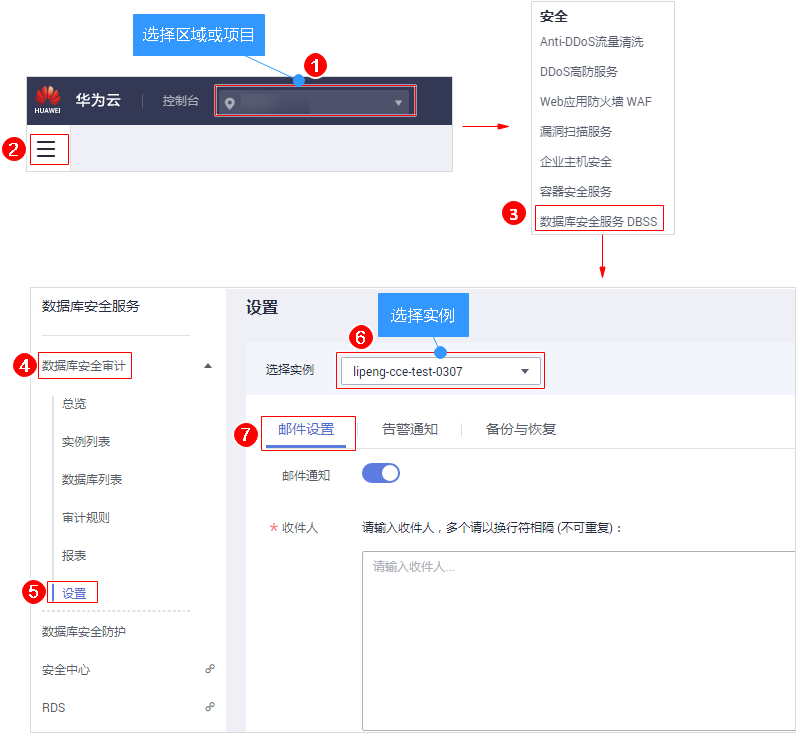

# 设置邮件通知

开启邮件通知后，当数据库设置的告警事件发生或生成报表时，您可以收到告警或报表生成的通知邮件。

## 前提条件

已成功购买数据库安全审计实例，且实例的状态为“运行中“。

## 操作步骤

1.  [登录管理控制台](https://console.huaweicloud.com/)。
2.  进入邮件设置入口，如[图1](#fig61991836131419)所示。

    **图 1**  进入邮件设置入口  
    

3.  设置邮件通知，如[图2](#fig45721822818)所示，相关参数说明如[表1](#table4295843716304)所示。

    **图 2**  设置邮件通知  
    

    **表 1**  邮件通知参数说明

    
    <table><thead align="left"><tr id="row4338993216304"><th class="cellrowborder" valign="top" width="21%" id="mcps1.2.4.1.1">
参数名称

    </th>
    <th class="cellrowborder" valign="top" width="61%" id="mcps1.2.4.1.2">
说明

    </th>
    <th class="cellrowborder" valign="top" width="18%" id="mcps1.2.4.1.3">
取值样例

    </th>
    </tr>
    </thead>
    <tbody><tr id="row1332204111319"><td class="cellrowborder" valign="top" width="21%" headers="mcps1.2.4.1.1 ">
邮件通知

    </td>
    <td class="cellrowborder" valign="top" width="61%" headers="mcps1.2.4.1.2 ">
开启或关闭邮件通知。数据库安全审计默认开启邮件通知，当数据库发生设置的告警事件或生成报表时，数据库安全审计将发送通知邮件。

    <ul id="ul934875119443"><li>：开启</li><li>：关闭</li></ul>
    </td>
    <td class="cellrowborder" valign="top" width="18%" headers="mcps1.2.4.1.3 ">

    </td>
    </tr>
    <tr id="row177601257112915"><td class="cellrowborder" valign="top" width="21%" headers="mcps1.2.4.1.1 ">
收件人

    </td>
    <td class="cellrowborder" valign="top" width="61%" headers="mcps1.2.4.1.2 ">
输入收件人的邮箱地址。

    </td>
    <td class="cellrowborder" valign="top" width="18%" headers="mcps1.2.4.1.3 ">
-

    </td>
    </tr>
    <tr id="row0860165713317"><td class="cellrowborder" valign="top" width="21%" headers="mcps1.2.4.1.1 ">
抄送人

    </td>
    <td class="cellrowborder" valign="top" width="61%" headers="mcps1.2.4.1.2 ">
可选参数。输入抄送人的邮箱地址。

    </td>
    <td class="cellrowborder" valign="top" width="18%" headers="mcps1.2.4.1.3 ">
-

    </td>
    </tr>
    </tbody>
    </table>

4.  单击“应用“。

## 相关操作

有关开启报表邮件通知的详细操作，请参见[设置报表的执行任务](查看审计报表.md#section93781444126)。

