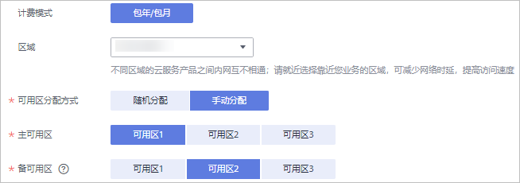
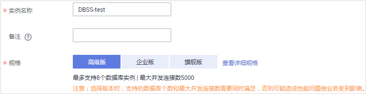
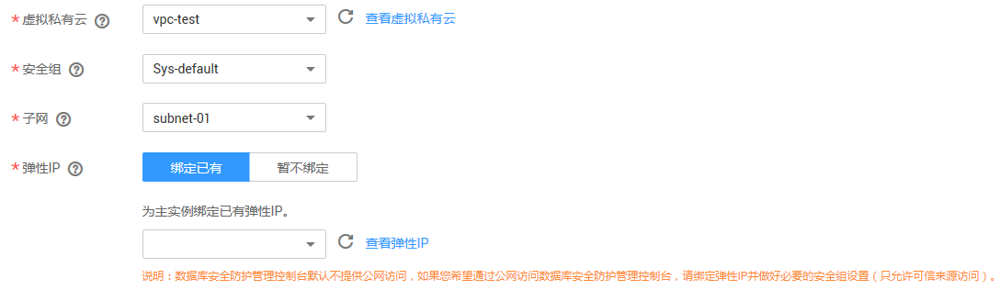
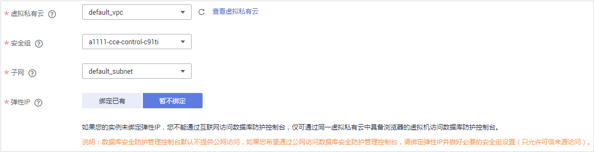
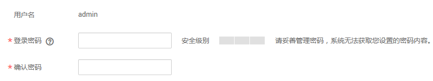
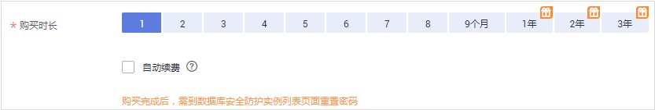
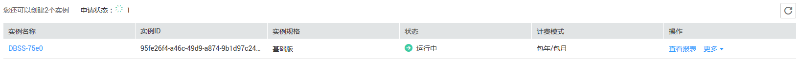
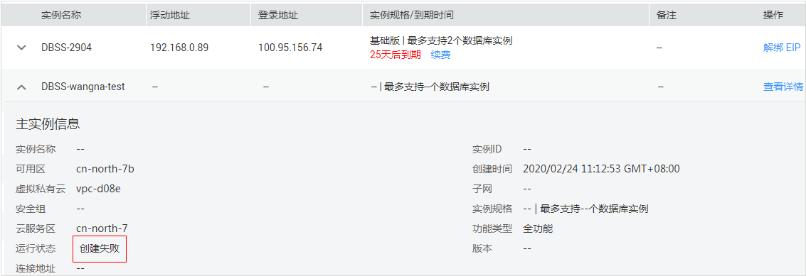

# 购买数据库安全防护

成功购买数据库安全防护后，系统自动创建一主一备2个实例，并为2个实例配置高可用模式。

## 价格体系

数据库安全服务提供包年/包月计费方式。详细的服务资费和费率标准，请参见[产品价格详情](https://www.huaweicloud.com/pricing.html#/dbss)。

在购买数据库安全服务时，如果使用了弹性云服务器的弹性IP，那么弹性IP需要单独计费。

## 前提条件

> **须知：**   
>请确认购买实例的账号具有“DBSS System Administrator“、“VPC Admin“和“BSS Administrator“策略。  
>-   VPC Admin：对虚拟私有云的所有执行权限。项目级策略，在同项目中勾选。  
>-   BSS Administrator：对账号中心、费用中心、资源中心中的所有菜单项执行任意操作。项目级策略，在同项目中勾选。  

## 操作步骤

1.  [登录管理控制台](https://console.huaweicloud.com/)。
2.  进入[数据库安全防护购买页面](https://console.huaweicloud.com/scc/#/sccPurchaseDBF)。
3.  选择“区域“、“主可用区“和“备可用区“，如[图1](#zh-cn_topic_0110855920_fig112801643153116)所示。

    为了提高应用的高可用性，在同一区域，您需要将数据库安全防护创建在主可用区和备可用区上。当主可用区发生故障时，系统自动触发主备倒换，由备可用区提供数据库安全防护。

    **图 1**  选择区域和可用区  
    

4.  填写规格信息，如[图2](#zh-cn_topic_0110855920_fig169551652195111)所示，相关参数说明如[表1](#zh-cn_topic_0110855920_table4295843716304)所示。

    **图 2**  设置规格信息  
    

    **表 1**  规格参数说明

    
    <table><thead align="left"><tr id="zh-cn_topic_0110855920_row4338993216304"><th class="cellrowborder" valign="top" width="21%" id="mcps1.2.4.1.1">
参数名称

    </th>
    <th class="cellrowborder" valign="top" width="61%" id="mcps1.2.4.1.2">
说明

    </th>
    <th class="cellrowborder" valign="top" width="18%" id="mcps1.2.4.1.3">
取值样例

    </th>
    </tr>
    </thead>
    <tbody><tr id="zh-cn_topic_0110855920_row3896937416304"><td class="cellrowborder" valign="top" width="21%" headers="mcps1.2.4.1.1 ">
主机名称

    </td>
    <td class="cellrowborder" valign="top" width="61%" headers="mcps1.2.4.1.2 ">
您可以自定义实例的名称。

    </td>
    <td class="cellrowborder" valign="top" width="18%" headers="mcps1.2.4.1.3 ">
DBSS-test

    </td>
    </tr>
    <tr id="zh-cn_topic_0110855920_row1319658616304"><td class="cellrowborder" valign="top" width="21%" headers="mcps1.2.4.1.1 ">
备注

    </td>
    <td class="cellrowborder" valign="top" width="61%" headers="mcps1.2.4.1.2 ">
可选参数。用于标注实例防护了哪些数据库。

    </td>
    <td class="cellrowborder" valign="top" width="18%" headers="mcps1.2.4.1.3 ">
-

    </td>
    </tr>
    <tr id="zh-cn_topic_0110855920_row1294143833910"><td class="cellrowborder" valign="top" width="21%" headers="mcps1.2.4.1.1 ">
功能类型

    </td>
    <td class="cellrowborder" valign="top" width="61%" headers="mcps1.2.4.1.2 ">
用户可以使用提供数据脱敏、数据库审计、敏感数据发现、数据库防拖库和防注入攻击等功能，保障云上数据库的安全。

    </td>
    <td class="cellrowborder" valign="top" width="18%" headers="mcps1.2.4.1.3 ">
全功能

    </td>
    </tr>
    <tr id="zh-cn_topic_0110855920_row2550998316304"><td class="cellrowborder" valign="top" width="21%" headers="mcps1.2.4.1.1 ">
规格

    </td>
    <td class="cellrowborder" valign="top" width="61%" headers="mcps1.2.4.1.2 ">
实例支持的数据库实例规格，可以选择以下3种规格：<ul id="zh-cn_topic_0110855920_ul10912041195710"><li>高级版：最多支持8个数据库实例、最大并发连接数5000</li><li>企业版：最多支持8个数据库实例、最大并发连接数10000</li><li>旗舰版：最多支持8个数据库实例、最大并发连接数20000</li></ul>
    

    
 须知： 

在选择版本时，请您确保购买的版本满足最大并发连接数限制，否则可能造成性能问题使业务受到影响。数据库的最大并发连接数通常与数据库的内存正相关，即数据库内存越大，支持的最大并发连接数越多，因此您可以根据需要防护的所有数据库内存总和来选择数据库安全防护的规格。<ul id="zh-cn_topic_0210086301_zh-cn_topic_0110855920_ul4736153905211"><li>数据库内存小于或等于32GB时：建议选择“高级版”。</li><li>数据库内存大于32GB且小于128GB时：建议选择“企业版”。</li><li>数据库内存大于或等于128GB时：建议选择“旗舰版”。</li></ul>
    

    

    </td>
    <td class="cellrowborder" valign="top" width="18%" headers="mcps1.2.4.1.3 ">
高级版

    </td>
    </tr>
    </tbody>
    </table>

5.  填写网络信息，如[图3](#zh-cn_topic_0110855920_fig25803184141631)和[图4](#zh-cn_topic_0110855920_fig18991133915250)所示，相关参数说明如[表2](#zh-cn_topic_0110855920_table21876528163143)所示。

    **图 3**  设置网络信息（绑定已有弹性IP）  
    

    **图 4**  设置网络信息（暂不绑定弹性IP）  
    

    **表 2**  网络参数说明

    
    <table><thead align="left"><tr id="zh-cn_topic_0110855920_row10250265163143"><th class="cellrowborder" valign="top" width="22.240000000000002%" id="mcps1.2.4.1.1">
参数名称

    </th>
    <th class="cellrowborder" valign="top" width="59.28000000000001%" id="mcps1.2.4.1.2">
说明

    </th>
    <th class="cellrowborder" valign="top" width="18.48%" id="mcps1.2.4.1.3">
取值样例

    </th>
    </tr>
    </thead>
    <tbody><tr id="zh-cn_topic_0110855920_row36159443163143"><td class="cellrowborder" valign="top" width="22.240000000000002%" headers="mcps1.2.4.1.1 ">
虚拟私有云

    </td>
    <td class="cellrowborder" valign="top" width="59.28000000000001%" headers="mcps1.2.4.1.2 ">
您可以选择使用区域中已有的虚拟私有云（Virtual Private Cloud，VPC）网络，或者单击“查看虚拟私有云”创建新的虚拟私有云。

    
更多有关虚拟私有云的信息，请参见《虚拟私有云用户指南》。

    </td>
    <td class="cellrowborder" valign="top" width="18.48%" headers="mcps1.2.4.1.3 ">
vpc-test

    </td>
    </tr>
    <tr id="zh-cn_topic_0110855920_row25003971163143"><td class="cellrowborder" valign="top" width="22.240000000000002%" headers="mcps1.2.4.1.1 ">
安全组

    </td>
    <td class="cellrowborder" valign="top" width="59.28000000000001%" headers="mcps1.2.4.1.2 ">
您可以选择区域中已有的安全组，或者在VPC管理控制台创建新的安全组。选择实例的安全组后，该实例将受到该安全组访问规则的保护。

    
更多有关安全组的信息，请参见《虚拟私有云用户指南》。

    </td>
    <td class="cellrowborder" valign="top" width="18.48%" headers="mcps1.2.4.1.3 ">
Sys-default

    </td>
    </tr>
    <tr id="zh-cn_topic_0110855920_row59184342163143"><td class="cellrowborder" valign="top" width="22.240000000000002%" headers="mcps1.2.4.1.1 ">
子网

    </td>
    <td class="cellrowborder" valign="top" width="59.28000000000001%" headers="mcps1.2.4.1.2 ">
您可以选择VPC中已配置的子网，或者在VPC管理控制台为VPC创建新的子网。

    
更多有关虚拟私有云的信息，请参见《虚拟私有云用户指南》。

    </td>
    <td class="cellrowborder" valign="top" width="18.48%" headers="mcps1.2.4.1.3 ">
subnet-01

    </td>
    </tr>
    <tr id="zh-cn_topic_0110855920_row11747299163143"><td class="cellrowborder" valign="top" width="22.240000000000002%" headers="mcps1.2.4.1.1 ">
弹性IP

    </td>
    <td class="cellrowborder" valign="top" width="59.28000000000001%" headers="mcps1.2.4.1.2 ">
是否为主实例绑定弹性IP。请根据实际情况选择是否绑定弹性IP。<ul id="zh-cn_topic_0110855920_ul3115141105713"><li>绑定已有
为主实例绑定区域中已有的弹性IP，或单击“查看弹性IP”，购买弹性公网IP。

    
 须知： 
<ul id="zh-cn_topic_0110855920_ul1491215562137"><li>弹性公网IP单独进行计费，且依赖弹性云服务器的配额，当弹性云服务器的配额不足时，在管理控制台选择“工单”进入工单管理页面。单击“新建工单”，申请扩大弹性IP的配额。扩大配额申请成功后，再进入数据库安全服务界面购买实例。</li><li>数据库安全防护管理控制台（即HexaTier）默认不提供公网访问，如果您希望通过公网访问HexaTier，请绑定弹性IP并配置安全组（只允许可信来源访问）。</li></ul>
    

    </li><li>暂不绑定
未绑定弹性IP的实例，不能通过实例的“登录”入口访问数据库防护控制台。

    
 说明： 

对于未绑定弹性IP的实例，可以在成功购买实例后，为该实例绑定弹性IP。

    

    </li></ul>
    

    
更多有关弹性IP的信息，请参见《弹性云服务器用户指南》。

    </td>
    <td class="cellrowborder" valign="top" width="18.48%" headers="mcps1.2.4.1.3 ">
绑定已有

    </td>
    </tr>
    </tbody>
    </table>

6.  设置登录实例的数据库防护控制台（即HexaTier）的**admin**用户的密码，如[图5](#zh-cn_topic_0110855920_fig1630717935313)所示。

    请记录该密码，登录HexaTier时需要使用该密码。

    **图 5**  设置登录信息  
    

7.  选择“购买时长“，如[图6](#zh-cn_topic_0110855920_fig125978334178)所示。

    **图 6**  选择购买时长  
    

    勾选“自动续费“后，当购买的数据库安全防护实例到期时，如果账号余额充足，DBSS将自动为该实例续费，您可以继续使用该实例。自动续费的周期说明如[表3](#zh-cn_topic_0110855920_table826301613614)所示。

    **表 3**  自动续费周期说明

    
    <table><thead align="left"><tr id="zh-cn_topic_0110855920_row826418166366"><th class="cellrowborder" valign="top" width="50%" id="mcps1.2.3.1.1">
购买时长

    </th>
    <th class="cellrowborder" valign="top" width="50%" id="mcps1.2.3.1.2">
自动续费周期

    </th>
    </tr>
    </thead>
    <tbody><tr id="zh-cn_topic_0110855920_row32642163361"><td class="cellrowborder" valign="top" width="50%" headers="mcps1.2.3.1.1 ">
1/2/3/4/5/6/7/8/9个月

    </td>
    <td class="cellrowborder" valign="top" width="50%" headers="mcps1.2.3.1.2 ">
1个月

    </td>
    </tr>
    <tr id="zh-cn_topic_0110855920_row6317519183615"><td class="cellrowborder" valign="top" width="50%" headers="mcps1.2.3.1.1 ">
1年

    </td>
    <td class="cellrowborder" valign="top" width="50%" headers="mcps1.2.3.1.2 ">
1年

    </td>
    </tr>
    </tbody>
    </table>

8.  确认当前配置无误后，单击“立即购买“。

    如果您对价格有疑问，可以单击“了解计费详情“，了解产品价格。

9.  在“详情“页面，单击“去支付“。
10. 在购买页面，请选择付款方式进行付款。
    -   余额支付

        您可以通过账户的余额进行支付，余额不足时，单击“充值“进行充值。

        1.  选择“余额支付“。
        2.  单击“确认付款“，完成购买操作。

    -   申请线上合同请款后支付
        1.  选择“申请线上合同请款后支付“，单击“生成合同“。
        2.  在页面中填写合同信息后，单击“创建正式合同“，完成购买操作。

11. 成功付款后，在数据库安全防护管理界面，可以查看数据库安全防护主备实例的创建情况。

## 后续管理

-   当2个实例的“运行状态“为“运行中“时，如[图7](#fig5815753115916)所示，表示实例购买成功。

    **图 7**  查看实例信息  
    

-   当2个实例的“运行状态“为“创建失败“时，如[图8](#fig230324717147)所示，表示实例创建失败。

    您可单击“操作“列的“查看详情“，在弹出的“创建失败实例“对话框中查看失败原因和删除失败实例，删除失败实例时需要同时删除主备实例。

    **图 8**  数据库安全防护实例创建失败  
    

