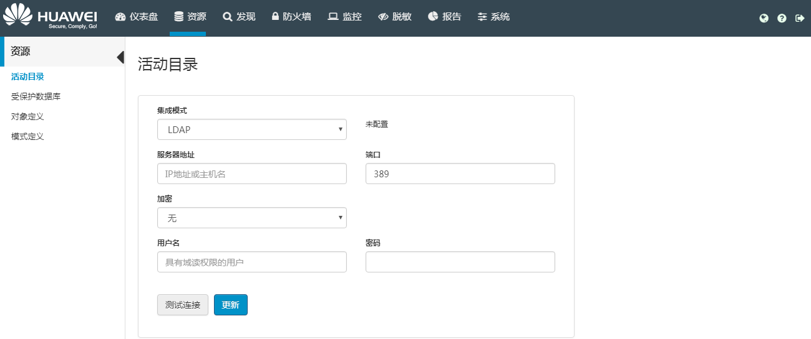

# 配置LDAP模式

配置LDAP集成模式表示HexaTier通过LDAP服务器进行身份验证。只有在系统中配置了LDAP集成模式之后才能添加活动目录用户。

## 操作场景

该任务指导用户配置LDAP集成模式。

> **说明：**   
>LDAP默认采用SSL连接。  

## 前提条件

必须禁用高可用性模式才能配置LDAP集成模式。

## 操作步骤

1.  在HexaTier主菜单上，单击“资源“。
2.  在导航树上，选择“活动目录“。
3.  在“集成模式“下拉框中选择“LDAP“。

    

4.  根据需要设置相关参数：

    **表 1**  配置LDAP模式参数

    
    <table><thead align="left"><tr id="zh-cn_topic_0110574973_r5c441d2cfdd044feb93080cd7045d1df"><th class="cellrowborder" valign="top" width="20.49%" id="mcps1.2.3.1.1">
参数名称

    </th>
    <th class="cellrowborder" valign="top" width="79.51%" id="mcps1.2.3.1.2">
说明

    </th>
    </tr>
    </thead>
    <tbody><tr id="zh-cn_topic_0110574973_rae593fa517c948b6bf02daf6b686c088"><td class="cellrowborder" valign="top" width="20.49%" headers="mcps1.2.3.1.1 ">
服务器地址

    </td>
    <td class="cellrowborder" valign="top" width="79.51%" headers="mcps1.2.3.1.2 ">
LDAP服务器地址。

    </td>
    </tr>
    <tr id="zh-cn_topic_0110574973_r6b99566863ae4fd1a14c9714a71d7373"><td class="cellrowborder" valign="top" width="20.49%" headers="mcps1.2.3.1.1 ">
端口

    </td>
    <td class="cellrowborder" valign="top" width="79.51%" headers="mcps1.2.3.1.2 ">
连接LDAP服务器的端口。

    </td>
    </tr>
    <tr id="zh-cn_topic_0110574973_r020eec6ea7ac40878a51bbbc09a2f4bd"><td class="cellrowborder" valign="top" width="20.49%" headers="mcps1.2.3.1.1 ">
加密

    </td>
    <td class="cellrowborder" valign="top" width="79.51%" headers="mcps1.2.3.1.2 ">
与LDAP服务器的连接加密方式，包含以下三种：

    <ul id="zh-cn_topic_0110574973_u21f4cf3d9cf94774836f63a26c54f309"><li>无</li><li>LDAPS：HexaTier通过使用SSL的LDAP进行身份验证。</li><li>STARTTLS：对纯文本通信协议的扩展，将不安全的连接升级为加密连接。</li></ul>
    </td>
    </tr>
    <tr id="zh-cn_topic_0110574973_r7ac236c9d6044c0daed9cf7298b55812"><td class="cellrowborder" valign="top" width="20.49%" headers="mcps1.2.3.1.1 ">
用户名

    </td>
    <td class="cellrowborder" valign="top" width="79.51%" headers="mcps1.2.3.1.2 ">
连接LDAP服务器的用户名。

    </td>
    </tr>
    <tr id="zh-cn_topic_0110574973_r68402b14500746e79570d3a2482da22f"><td class="cellrowborder" valign="top" width="20.49%" headers="mcps1.2.3.1.1 ">
密码

    </td>
    <td class="cellrowborder" valign="top" width="79.51%" headers="mcps1.2.3.1.2 ">
连接LDAP服务器的密码。

    </td>
    </tr>
    </tbody>
    </table>

5.  单击“测试连接“。

    显示状态消息，提示测试连接成功或失败。

6.  测试成功后，单击“更新“。

    更新会自动测试与用户设置的连接。出现状态消息，提示连接成功或失败。

