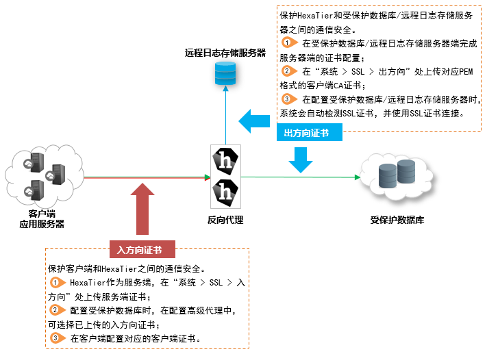

# 配置SSL安全

用户可以分别配置入方向（客户端到反向代理）和出方向（反向代理到受保护的数据库）通信的SSL安全性。保证数据通信的安全。

**图 1**  SSL证书配置  

SSL安全设置包括：

-   协议版本
    -   TLS 1.2
    -   TLS 1.1
    -   TLS 1.0
    -   SSL 3.0
    -   SSL 2.0

-   密码级别
    -   高：高级别的安全，而非向后兼容。
    -   中：中级安全和部分向后兼容。
    -   向后兼容：低级别的安全和向后兼容。

-   阻止未加密的连接：HexaTier将加密受保护数据库的所有通信，否则通信将中止。
-   在HexaTier中维护的证书包括下列格式：
    -   Standard PEM
    -   PFX/PKCS\#12
    -   DER/Binary

## 设置入方向SSL安全

1.  在HexaTier主菜单上，单击“系统“。
2.  在导航树上，选择“SSL \> 入方向 \> 安全等级“。
3.  在工作区中，根据需要设置参数，然后单击“更新“。

    **表 1**  SSL入方向安全参数

    
    <table><thead align="left"><tr id="zh-cn_topic_0180960226_rd90f436bd525408eb6f5c80a1db4cc85"><th class="cellrowborder" valign="top" width="25.369999999999997%" id="mcps1.2.3.1.1">
选项

    </th>
    <th class="cellrowborder" valign="top" width="74.63%" id="mcps1.2.3.1.2">
描述

    </th>
    </tr>
    </thead>
    <tbody><tr id="zh-cn_topic_0180960226_r3064f2b26c034921b4a179da21a2ddec"><td class="cellrowborder" valign="top" width="25.369999999999997%" headers="mcps1.2.3.1.1 ">
协议版本

    </td>
    <td class="cellrowborder" valign="top" width="74.63%" headers="mcps1.2.3.1.2 ">
要求的最低协议，包括：

    <ul id="zh-cn_topic_0180960226_u14549cdfb97f4f2db9598bebcebff36b"><li>TLS 1.2</li><li>TLS 1.1</li><li>TLS 1.0</li><li>SSL 3.0</li><li>SSL 2.0</li></ul>
    </td>
    </tr>
    <tr id="zh-cn_topic_0180960226_ra9b917a38d874b4ab91301bec3e8c36d"><td class="cellrowborder" valign="top" width="25.369999999999997%" headers="mcps1.2.3.1.1 ">
密码级别

    </td>
    <td class="cellrowborder" valign="top" width="74.63%" headers="mcps1.2.3.1.2 ">
要求的低加密算法套件。密码级别包括：

    <ul id="zh-cn_topic_0180960226_u5a81c4217c6446feb0c4b313a577c374"><li>高：高级别的安全，非向后兼容。</li><li>中：中级安全和部分向后兼容。</li><li>向后兼容：低级别的安全和向后兼容。</li></ul>
    </td>
    </tr>
    <tr id="zh-cn_topic_0180960226_r3e29b77ed1684684810bd02dd6ab0e61"><td class="cellrowborder" valign="top" width="25.369999999999997%" headers="mcps1.2.3.1.1 ">
阻止未加密的连接

    </td>
    <td class="cellrowborder" valign="top" width="74.63%" headers="mcps1.2.3.1.2 ">
通过勾选该参数，可以要求新的受保护数据库使用SSL。

    </td>
    </tr>
    </tbody>
    </table>

## 上传入方向证书

1.  在HexaTier主菜单上，单击“系统“。
2.  在导航树上，选择“SSL \> 入方向 \> 证书“。
3.  单击“添加“。

    工作区中显示“上传证书”页面。

4.  在“选择格式”下拉框选择格式，并执行以下操作：
    -   Standard PEM
        1.  粘贴“证书”。
        2.  粘贴“CA链”。
        3.  粘贴“私钥”。
        4.  输入“通行短语”。

    -   PFX/ PKCS＃12
        1.  单击“选择文件“，并选择所需的文件。
        2.  输入“通行短语”。

    -   DER/Binary
        1.  在“证书”项中，单击“选择文件“，并选择所需的证书文件。
        2.  在“CA链”项中，单击“选择文件“，选择CA链文件。
        3.  在“私钥”项中，单击“选择文件“，选择私钥文件。
        4.  输入“通行短语”。

5.  （可选）选择“检查证书强度”。
6.  单击“上传“完成证书上传。

    证书将出现在证书列表中。

## 出方向SSL安全加密设置

1.  在HexaTier主菜单上，单击“系统“。
2.  在导航树上，选择“SSL \> 出方向 \> 安全等级“。
3.  在“组件类型”所需的加密级别中，单击。

    显示组件类型SSL安全等级页面。

4.  在工作区中，根据需要设置下列参数，然后单击“更新“。

    **表 2**  出方向SSL安全加密参数

    
    <table><thead align="left"><tr id="zh-cn_topic_0180960243_r1ddcc0d1d4314eb6ac63c33de655c59f"><th class="cellrowborder" valign="top" width="23.87%" id="mcps1.2.3.1.1">
参数名称

    </th>
    <th class="cellrowborder" valign="top" width="76.13%" id="mcps1.2.3.1.2">
说明

    </th>
    </tr>
    </thead>
    <tbody><tr id="zh-cn_topic_0180960243_rcb9f36e9d3c343488d51da8e776ab6fa"><td class="cellrowborder" valign="top" width="23.87%" headers="mcps1.2.3.1.1 ">
协议版本

    </td>
    <td class="cellrowborder" valign="top" width="76.13%" headers="mcps1.2.3.1.2 ">
要求的最低协议，包括：

    <ul id="zh-cn_topic_0180960243_u155a0099b1b94b72bbbd4d1d89bf2212"><li>TLS 1.2</li><li>TLS 1.1</li><li>TLS 1.0</li><li>SSL 3.0</li><li>SSL 2.0</li></ul>
    </td>
    </tr>
    <tr id="zh-cn_topic_0180960243_rc05e7629da764ed4949b538519c3ccef"><td class="cellrowborder" valign="top" width="23.87%" headers="mcps1.2.3.1.1 ">
密码级别

    </td>
    <td class="cellrowborder" valign="top" width="76.13%" headers="mcps1.2.3.1.2 ">
要求的低加密算法套件。密码级别包括：

    <ul id="zh-cn_topic_0180960243_uc697bc29772e430d92e90e9cf016b462"><li>高：高级别的安全，非向后兼容。</li><li>中：中级安全和部分向后兼容。</li><li>向后兼容：低级别的安全和向后兼容。</li></ul>
    </td>
    </tr>
    <tr id="zh-cn_topic_0180960243_r47a98d6cbc434669916f7c64a315f240"><td class="cellrowborder" valign="top" width="23.87%" headers="mcps1.2.3.1.1 ">
阻止未加密的连接

    </td>
    <td class="cellrowborder" valign="top" width="76.13%" headers="mcps1.2.3.1.2 ">
通过勾选该参数，可以要求新的受保护数据库使用SSL。

    </td>
    </tr>
    </tbody>
    </table>

    > **说明：** 
    >-   TLS 1.0只是为了兼容MySQL，存在安全隐患，请谨慎使用。
    >-   由于DDM不支持SSL连接，因此，HexaTier与DDM之间的连接为非加密连接。

## 添加新证书

在受保护的数据库和HexaTier之间，通过添加SSL加密的受信任证书，来设置实例连接。

需要确保数据库服务器地址与证书名称相匹配，例如证书名称可设置为数据库服务器的名称或者IP地址，目前仅支持PEM格式证书。

1.  在HexaTier主菜单上，单击“系统“。
2.  在导航树上，选择“SSL \> 出方向 \> 证书“。
3.  单击“添加“。

    在工作区中显示“上传出方向SSL证书”面板。

4.  在“标准PEM格式”的“CA链”中，粘贴证书正文。
5.  单击“上传“。

    证书上传后将出现在证书列表中。

