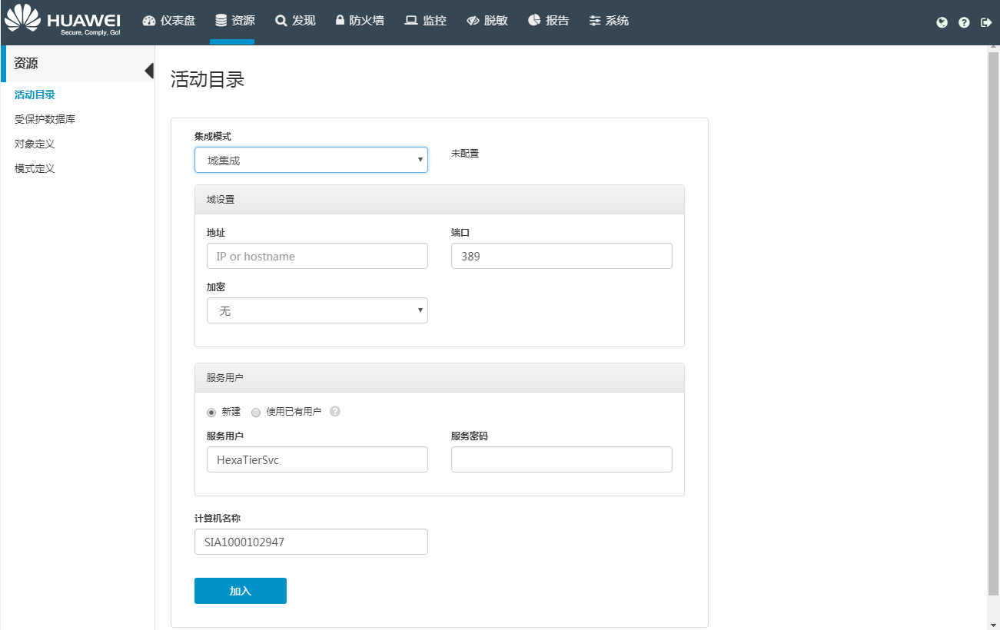

# 配置域集成模式

配置域集成模式后，HexaTier将作为域的一部分的计算机上运行，并能在HexaTier中添加活动目录用户。

## 操作场景

该任务指导用户将活动目录集成配置为域集成模式。

## 前提条件

必须禁用高可用才能配置域集成模式。

## 操作步骤

1.  在HexaTier主菜单上，单击“资源“。
2.  在导航树上，选择“活动目录“。
3.  在“集成模式“下拉框中选择“域集成“。

    

4.  根据需要设置相关参数：

    **表 1**  配置域集成模式参数

    
    <table><thead align="left"><tr id="zh-cn_topic_0110574937_r5cd1fdcdb4c748ad9afbe8823e853c3f"><th class="cellrowborder" valign="top" width="25%" id="mcps1.2.3.1.1">
参数名称

    </th>
    <th class="cellrowborder" valign="top" width="75%" id="mcps1.2.3.1.2">
说明

    </th>
    </tr>
    </thead>
    <tbody><tr id="zh-cn_topic_0110574937_r1cbf857b4e224371931a7821b1bcaf42"><td class="cellrowborder" colspan="2" valign="top" headers="mcps1.2.3.1.1 mcps1.2.3.1.2 ">
<strong id="zh-cn_topic_0110574937_a67a660fc58cd4b5faa0c6273fbe1979c">域设置</strong>

    </td>
    </tr>
    <tr id="zh-cn_topic_0110574937_r2629355dc3994c69821f154a4773afba"><td class="cellrowborder" valign="top" width="25%" headers="mcps1.2.3.1.1 ">
地址

    </td>
    <td class="cellrowborder" valign="top" width="75%" headers="mcps1.2.3.1.2 ">
LDAP服务器地址。

    </td>
    </tr>
    <tr id="zh-cn_topic_0110574937_r8edc0c5bcc1e4bb79c506d1cd4b50bd2"><td class="cellrowborder" valign="top" width="25%" headers="mcps1.2.3.1.1 ">
端口

    </td>
    <td class="cellrowborder" valign="top" width="75%" headers="mcps1.2.3.1.2 ">
连接LDAP服务器的端口。

    </td>
    </tr>
    <tr id="zh-cn_topic_0110574937_r0e4e4689f3d64216b8ec845ac957602f"><td class="cellrowborder" valign="top" width="25%" headers="mcps1.2.3.1.1 ">
加密

    </td>
    <td class="cellrowborder" valign="top" width="75%" headers="mcps1.2.3.1.2 ">
与LDAP服务器的连接加密方式，包含以下三种：

    <ul id="zh-cn_topic_0110574937_u19955d7aa7364ca9a7fcb2289c453cd6"><li>无</li><li>LDAPS：HexaTier通过使用SSL的LDAP进行身份验证。</li><li>STARTTLS：对纯文本通信协议的扩展，将不安全的连接升级到加密连接。</li></ul>
    </td>
    </tr>
    <tr id="zh-cn_topic_0110574937_r423ee1052b8c4a579c97160b8b118629"><td class="cellrowborder" colspan="2" valign="top" headers="mcps1.2.3.1.1 mcps1.2.3.1.2 ">
<strong id="zh-cn_topic_0110574937_a5620bcecc0134891a645ac266d350cfe">服务用户</strong>

    </td>
    </tr>
    <tr id="zh-cn_topic_0110574937_r2580d8eed7ce4c858b3fb6fe3718e441"><td class="cellrowborder" valign="top" width="25%" headers="mcps1.2.3.1.1 ">
新建

    </td>
    <td class="cellrowborder" valign="top" width="75%" headers="mcps1.2.3.1.2 ">
新建具有要求的角色和权限的用户。

    
 NOTE: 

此选项和<b>使用已有用户</b>只能选择一个。

    

    </td>
    </tr>
    <tr id="zh-cn_topic_0110574937_rbe4e71525b744fb181918d05cd2d178e"><td class="cellrowborder" valign="top" width="25%" headers="mcps1.2.3.1.1 ">
使用已有用户

    </td>
    <td class="cellrowborder" valign="top" width="75%" headers="mcps1.2.3.1.2 ">
用户必须存在于给定域，并具有以下角色和权限：<ul id="zh-cn_topic_0110574937_u9e36afcd2bcc4633a59e08a6fa4f1c68"><li>密码未到期</li><li>委派</li><li>SPN注册和注销</li><li>模拟</li></ul>
    

    
 NOTE: 

此选项和<b>新建</b>只能选择一个。

    

    </td>
    </tr>
    <tr id="zh-cn_topic_0110574937_ra990be2b59e64c82bd0fa7f46d896c09"><td class="cellrowborder" valign="top" width="25%" headers="mcps1.2.3.1.1 ">
服务用户

    </td>
    <td class="cellrowborder" valign="top" width="75%" headers="mcps1.2.3.1.2 ">
可使用以下任一格式输入服务用户：

    <ul id="zh-cn_topic_0110574937_u66a275a8f29147daaaf6c85573c711b2"><li>用户名</li><li>用户域\用户名</li><li>用户名@域</li></ul>
    
服务用户默认为“HexaTierSvc”。

    </td>
    </tr>
    <tr id="zh-cn_topic_0110574937_r9a673ede912d42e2bec5a29fa68b1d94"><td class="cellrowborder" valign="top" width="25%" headers="mcps1.2.3.1.1 ">
服务密码

    </td>
    <td class="cellrowborder" valign="top" width="75%" headers="mcps1.2.3.1.2 ">
定义的服务用户密码。

    </td>
    </tr>
    <tr id="zh-cn_topic_0110574937_r2e52ab64d6cd4d3dbee365a92d18afce"><td class="cellrowborder" colspan="2" valign="top" headers="mcps1.2.3.1.1 mcps1.2.3.1.2 ">
<strong id="zh-cn_topic_0110574937_a8fcba3343e8846578373b8c7e3176256">计算机名称</strong>

    </td>
    </tr>
    <tr id="zh-cn_topic_0110574937_r9f1a5c86746d4b94a3641adb0d1b757d"><td class="cellrowborder" valign="top" width="25%" headers="mcps1.2.3.1.1 ">
计算机名称

    </td>
    <td class="cellrowborder" valign="top" width="75%" headers="mcps1.2.3.1.2 ">
加入的计算机名称。

    </td>
    </tr>
    </tbody>
    </table>

5.  单击“加入“。

    HexaTier会验证设置，并显示管理员凭证提示。

6.  输入特权域用户和密码。

    显示成功或失败的提示消息。

7.  按提示重启服务。

    > **说明：**   
    >连接后HexaTier不会保存管理员凭证。  

