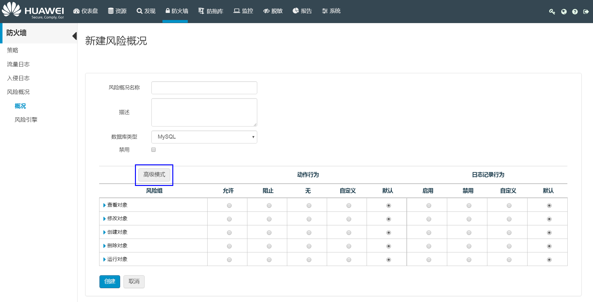

# 配置基于风险的IPS/IDS策略

用户可基于数据库实际风险，选择应用入侵防御系统（IPS）或入侵检测系统（IDS），并配置对应策略规则，确保用户数据库安全。

## 背景信息

要创建基于风险的IPS/IDS规则，用户可以先创建风险概况（请参见[配置风险概况](#section17892835369)），也可以根据需求来配置风险引擎的各项风险因素评分（请参见[配置风险引擎](#section1856692944012)）。

-   风险概况

    风险概况可根据风险组配置不同的动作行为和日志记录行为，对访问的指定命令或操作进行允许或阻止。基于风险概况，可创建基于风险的IPS/IDS规则。

    风险概况由动作组（风险组）组成，每个组都描述一个不同的风险动作。

    风险概况包括两种设置类型：

    -   动作行为：针对风险组所执行的动作。
    -   日志记录行为：针对风险组进行的日志设置。

    创建风险概况时，可以选择使用“基本模式“或“高级模式“：

    -   “基本模式“下，可以配置服务器、安全和数据库等对象的设置。
    -   “高级模式“下，可以通过单击表中的风险组名称，来查看并指定组里每个动作的行为。

-   风险引擎

    风险引擎定义了对SQL注入攻击的防护，用户可以通过调整每个风险因素的权重评分（1\~100），来配置HexaTier的风险引擎。

## 操作步骤

1.  在HexaTier主菜单上，单击“防火墙“。
2.  根据需要执行以下操作：
    -   创建新的安全规则

        在命令栏，单击“新建“。

    -   编辑已有的安全规则

        找到要编辑的规则，单击该行末尾的（编辑）。

3.  在“规则类型“中选择“基于风险的IPS/IDS“。
4.  选择应用该防火墙规则的“数据库“和“代理“。
5.  根据需求配置以下参数：

    **表 1**  基于风险的IPS/IDS参数

    
    <table><thead align="left"><tr id="zh-cn_topic_0180960114_rd22ba3e866cb48548a3254e83eee3a74"><th class="cellrowborder" valign="top" width="30.080000000000002%" id="mcps1.2.3.1.1">
参数名称

    </th>
    <th class="cellrowborder" valign="top" width="69.92%" id="mcps1.2.3.1.2">
说明

    </th>
    </tr>
    </thead>
    <tbody><tr id="zh-cn_topic_0180960114_row4187242911"><td class="cellrowborder" valign="top" width="30.080000000000002%" headers="mcps1.2.3.1.1 ">
名称

    </td>
    <td class="cellrowborder" valign="top" width="69.92%" headers="mcps1.2.3.1.2 ">
该安全策略的名称。

    </td>
    </tr>
    <tr id="zh-cn_topic_0180960114_r205a61f77169419ba97ead3660259fd9"><td class="cellrowborder" valign="top" width="30.080000000000002%" headers="mcps1.2.3.1.1 ">
源IP地址

    </td>
    <td class="cellrowborder" valign="top" width="69.92%" headers="mcps1.2.3.1.2 ">
应用该规则的源IP地址，用户可以单击“新建”来创建新的源IP地址。

    </td>
    </tr>
    <tr id="zh-cn_topic_0180960114_r5dd575b6956644a0bf479d96380e6d6a"><td class="cellrowborder" valign="top" width="30.080000000000002%" headers="mcps1.2.3.1.1 ">
数据库用户名

    </td>
    <td class="cellrowborder" valign="top" width="69.92%" headers="mcps1.2.3.1.2 ">
应用该规则的数据库用户，用户可以单击“新建”来创建新的数据库用户对象。

    </td>
    </tr>
    <tr id="zh-cn_topic_0180960114_row121151710192017"><td class="cellrowborder" valign="top" width="30.080000000000002%" headers="mcps1.2.3.1.1 ">
活动目录用户

    </td>
    <td class="cellrowborder" valign="top" width="69.92%" headers="mcps1.2.3.1.2 ">
应用该规则的活动目录用户，可以是特定活动目录用户，也可以是用户组。

    
 说明： 

只有配置了活动目录之后，该参数才会显示，配置活动目录的详细信息，请参见<a href="配置活动目录.md">配置活动目录</a>。

    

    </td>
    </tr>
    <tr id="zh-cn_topic_0180960114_r94e37828316a4ad9ad1a94160b9aa879"><td class="cellrowborder" valign="top" width="30.080000000000002%" headers="mcps1.2.3.1.1 ">
应用名称

    </td>
    <td class="cellrowborder" valign="top" width="69.92%" headers="mcps1.2.3.1.2 ">
应用该规则的应用名称。

    </td>
    </tr>
    <tr id="zh-cn_topic_0180960114_re7815b0d48f44fbea9ee3db4ae959645"><td class="cellrowborder" valign="top" width="30.080000000000002%" headers="mcps1.2.3.1.1 ">
计划

    </td>
    <td class="cellrowborder" valign="top" width="69.92%" headers="mcps1.2.3.1.2 ">
应用该规则的时间计划，用户可以单击“新建”来创建新的计划。

    </td>
    </tr>
    <tr id="zh-cn_topic_0180960114_r3b80820f3ec14a1ba51a3ab4a37908d9"><td class="cellrowborder" valign="top" width="30.080000000000002%" headers="mcps1.2.3.1.1 ">
模式

    </td>
    <td class="cellrowborder" valign="top" width="69.92%" headers="mcps1.2.3.1.2 ">
选择与SQL注入检测同时执行的任务：

    <ul id="zh-cn_topic_0180960114_ua0d3ad0971d840e2ae08bc302555102d"><li>主动防护-IPS：应用入侵防御系统，并阻止与已有风险概况相匹配的查询，或依据配置的风险引擎执行阻止或告警。</li><li>监控-IDS：应用入侵检测系统和已配置的风险概况、风险引擎，并监控查询。</li></ul>
    </td>
    </tr>
    <tr id="zh-cn_topic_0180960114_r551d606715a64625af171cf25a702f4c"><td class="cellrowborder" valign="top" width="30.080000000000002%" headers="mcps1.2.3.1.1 ">
风险概况

    </td>
    <td class="cellrowborder" valign="top" width="69.92%" headers="mcps1.2.3.1.2 ">
根据“模式”中的选择，用户可以选择配置了阻止或监控动作的风险概况。配置风险概况，请参见<a href="#section17892835369">配置风险概况</a>。

    </td>
    </tr>
    <tr id="zh-cn_topic_0180960114_r0239634953c44bf888b7b4e3ff563c7f"><td class="cellrowborder" valign="top" width="30.080000000000002%" headers="mcps1.2.3.1.1 ">
SQL Injection Detection

    </td>
    <td class="cellrowborder" valign="top" width="69.92%" headers="mcps1.2.3.1.2 "><ul id="zh-cn_topic_0180960114_u51416496b5b74614bad33edafd8afbe3"><li>如果在“模式”中选择了“主动防护-IPS”，勾选该选项可以阻止SQL注入。</li></ul>
    <ul id="zh-cn_topic_0180960114_u43a74faf9d834a6c9a5fe4604712544d"><li>如果在“模式”中选择了“监控-IDS”，勾选该选项可以监控SQL注入。</li></ul>
    
SQL注入检测以HexaTier内置检测系统（风险引擎）为基础。配置风险引擎，请参见<a href="#section1856692944012">配置风险引擎</a>。

    </td>
    </tr>
    <tr id="zh-cn_topic_0180960114_rf2cdf3561bb64592a644423310c58287"><td class="cellrowborder" valign="top" width="30.080000000000002%" headers="mcps1.2.3.1.1 ">
动作

    </td>
    <td class="cellrowborder" valign="top" width="69.92%" headers="mcps1.2.3.1.2 ">
该规则要采取的动作，该项不需要用户配置：

    <ul id="zh-cn_topic_0180960114_u06ee817fd32c44c1a0a6d639351a78dd"><li>如果在“模式”中选择了“主动防护-IPS”，则动作始终为阻止。</li><li>如果在“模式”中选择了“监控-IDS”，则动作始终为允许。</li></ul>
    </td>
    </tr>
    <tr id="zh-cn_topic_0180960114_r7a4b64b7ff974a4d899179eee9c4e6b2"><td class="cellrowborder" valign="top" width="30.080000000000002%" headers="mcps1.2.3.1.1 ">
阻止动作

    </td>
    <td class="cellrowborder" valign="top" width="69.92%" headers="mcps1.2.3.1.2 ">
如果在“模式”中选择了“主动防护-IPS”，则需要在“阻止动作”下拉框中选择以下选项之一：<ul id="zh-cn_topic_0180960114_ua758597668a34b8c82a07ea035839099"><li>返回空结果集</li><li>断开SQL连接</li><li>生成SQL错误</li></ul>
    

    </td>
    </tr>
    <tr id="zh-cn_topic_0180960114_rbf6d819f05034744bcf95b18c7a35177"><td class="cellrowborder" valign="top" width="30.080000000000002%" headers="mcps1.2.3.1.1 ">
日志记录

    </td>
    <td class="cellrowborder" valign="top" width="69.92%" headers="mcps1.2.3.1.2 ">
选择是否把阻止的查询写入入侵事件日志。

    </td>
    </tr>
    <tr id="zh-cn_topic_0180960114_reb8047df351a4f54ac65cf739438d489"><td class="cellrowborder" valign="top" width="30.080000000000002%" headers="mcps1.2.3.1.1 ">
同时生成(SMTP)告警

    </td>
    <td class="cellrowborder" valign="top" width="69.92%" headers="mcps1.2.3.1.2 ">
如果在日志记录中选择了“入侵事件”，用户可以勾选“同时生成（SMTP）告警”来启用告警功能。根据告警中定义的参数，当该规则被激活时都会发送告警。

    </td>
    </tr>
    <tr id="zh-cn_topic_0180960114_rd5fa267115f248078f6c21bba44a66ce"><td class="cellrowborder" valign="top" width="30.080000000000002%" headers="mcps1.2.3.1.1 ">
Syslog

    </td>
    <td class="cellrowborder" valign="top" width="69.92%" headers="mcps1.2.3.1.2 ">
如果在日志记录中选择了“入侵事件”，用户可以勾选“Syslog”来启用Syslog。每次激活规则时，会向Syslog服务器发送一条消息。要配置Syslog，请参见<a href="配置Syslog.md">配置Syslog</a>。

    </td>
    </tr>
    <tr id="zh-cn_topic_0180960114_r99d04af2b363425689aa653a652323a8"><td class="cellrowborder" valign="top" width="30.080000000000002%" headers="mcps1.2.3.1.1 ">
规则优先级

    </td>
    <td class="cellrowborder" valign="top" width="69.92%" headers="mcps1.2.3.1.2 ">
本功能用于设置新增策略的优先级。

    <ul id="zh-cn_topic_0180960114_ul18427224713"><li>高：优先应用该新增规则。</li><li>低：最后应用该新增规则。</li></ul>
    </td>
    </tr>
    <tr id="zh-cn_topic_0180960114_row15753128122411"><td class="cellrowborder" valign="top" width="30.080000000000002%" headers="mcps1.2.3.1.1 ">
说明

    </td>
    <td class="cellrowborder" valign="top" width="69.92%" headers="mcps1.2.3.1.2 ">
该安全规则的备注信息。

    </td>
    </tr>
    <tr id="zh-cn_topic_0180960114_r162729c1fc2e4ed9adca532d57aa04bb"><td class="cellrowborder" valign="top" width="30.080000000000002%" headers="mcps1.2.3.1.1 ">
禁用规则

    </td>
    <td class="cellrowborder" valign="top" width="69.92%" headers="mcps1.2.3.1.2 ">
勾选复选框可以禁用该规则。

    </td>
    </tr>
    </tbody>
    </table>

6.  单击“创建“或“更新“。

## 配置风险概况

1.  在HexaTier主菜单上，单击“防火墙“。
2.  在导航树上，选择“风险概况“。
3.  根据需要执行以下操作：
    -   创建新的风险概况

        在命令栏上，单击“新建“。

    -   编辑已有的风险概况

        找到要编辑的风险概况，然后单击行末尾的（编辑）。

4.  在工作区中，输入“风险概况名称“和“描述“。
5.  在“数据库类型“下拉框中选择数据库类型：
    -   MySQL
    -   MS-SQL

6.  工作区以“基本模式“显示，用户可以单击“高级模式“来显示高级命令。

    **图 1**  高级模式选择  
    

7.  在“动作行为“列中，为每个组选择下列动作行为：

    **表 2**  动作行为说明

    
    <table><thead align="left"><tr id="zh-cn_topic_0180960110_row93214497540"><th class="cellrowborder" valign="top" width="26.46%" id="mcps1.2.3.1.1">
动作行为名称

    </th>
    <th class="cellrowborder" valign="top" width="73.54%" id="mcps1.2.3.1.2">
说明

    </th>
    </tr>
    </thead>
    <tbody><tr id="zh-cn_topic_0180960110_row13321349105419"><td class="cellrowborder" valign="top" width="26.46%" headers="mcps1.2.3.1.1 ">
允许

    </td>
    <td class="cellrowborder" valign="top" width="73.54%" headers="mcps1.2.3.1.2 ">
允许该组的所有动作。

    </td>
    </tr>
    <tr id="zh-cn_topic_0180960110_row63294915414"><td class="cellrowborder" valign="top" width="26.46%" headers="mcps1.2.3.1.1 ">
阻止

    </td>
    <td class="cellrowborder" valign="top" width="73.54%" headers="mcps1.2.3.1.2 ">
阻止该组的所有动作。

    </td>
    </tr>
    <tr id="zh-cn_topic_0180960110_row93211496547"><td class="cellrowborder" valign="top" width="26.46%" headers="mcps1.2.3.1.1 ">
无

    </td>
    <td class="cellrowborder" valign="top" width="73.54%" headers="mcps1.2.3.1.2 ">
忽略该组的所有动作。此选项通过不处理查询来节省资源。

    </td>
    </tr>
    <tr id="zh-cn_topic_0180960110_row143224935412"><td class="cellrowborder" valign="top" width="26.46%" headers="mcps1.2.3.1.1 ">
自定义

    </td>
    <td class="cellrowborder" valign="top" width="73.54%" headers="mcps1.2.3.1.2 ">
在基本模式下，可以对组中的不同对象制定不同行为。

    
如果选择高级模式，则允许为组中的每个动作指定不同的行为。

    </td>
    </tr>
    <tr id="zh-cn_topic_0180960110_row1332194917540"><td class="cellrowborder" valign="top" width="26.46%" headers="mcps1.2.3.1.1 ">
默认

    </td>
    <td class="cellrowborder" valign="top" width="73.54%" headers="mcps1.2.3.1.2 ">
使用IPS或IDS策略中配置的默认动作。

    </td>
    </tr>
    </tbody>
    </table>

8.  在“日志记录行为“列中，为每个组选择下列日志记录行为：

    **表 3**  日志记录行为说明

    
    <table><thead align="left"><tr id="zh-cn_topic_0180960110_row3408204515515"><th class="cellrowborder" valign="top" width="26.83%" id="mcps1.2.3.1.1">
日志记录行为名称

    </th>
    <th class="cellrowborder" valign="top" width="73.17%" id="mcps1.2.3.1.2">
说明

    </th>
    </tr>
    </thead>
    <tbody><tr id="zh-cn_topic_0180960110_row6408174516559"><td class="cellrowborder" valign="top" width="26.83%" headers="mcps1.2.3.1.1 ">
启用

    </td>
    <td class="cellrowborder" valign="top" width="73.17%" headers="mcps1.2.3.1.2 ">
启用该组所有动作的日志记录。

    </td>
    </tr>
    <tr id="zh-cn_topic_0180960110_row164081345205514"><td class="cellrowborder" valign="top" width="26.83%" headers="mcps1.2.3.1.1 ">
禁用

    </td>
    <td class="cellrowborder" valign="top" width="73.17%" headers="mcps1.2.3.1.2 ">
禁用该组所有动作的日志记录。

    </td>
    </tr>
    <tr id="zh-cn_topic_0180960110_row94087456554"><td class="cellrowborder" valign="top" width="26.83%" headers="mcps1.2.3.1.1 ">
自定义

    </td>
    <td class="cellrowborder" valign="top" width="73.17%" headers="mcps1.2.3.1.2 ">
在基本模式下，可以对组中的不同对象制定不同的日志记录行为。

    
如果选择高级模式，则允许为组中的每个动作指定不同的日志记录行为。

    </td>
    </tr>
    <tr id="zh-cn_topic_0180960110_row740814595511"><td class="cellrowborder" valign="top" width="26.83%" headers="mcps1.2.3.1.1 ">
默认

    </td>
    <td class="cellrowborder" valign="top" width="73.17%" headers="mcps1.2.3.1.2 ">
使用IPS或IDS策略中配置的默认日志行为。

    </td>
    </tr>
    </tbody>
    </table>

9.  单击“创建“或“更新“。

## 配置风险引擎

1.  在HexaTier主菜单上，单击“防火墙“。
2.  在导航树上，选择“风险概况 \> 风险引擎“。
3.  根据需要，设置以下风险因素的权重评分（1\~100）：
    -   警告级别的风险评分
    -   阻止级别的风险评分
    -   查询语句中包含与SQL注释相关的风险因素评分。
    -   语句中包含“OR”相关的风险因素评分
    -   语句中包含“UNION”相关的风险因素评分
    -   语句中包含参数比较相关的风险因素评分。比如：1=1
    -   语句中包含恒成立语句的风险因素评分，比如：Select \* from XXX where 1
    -   语句中包含空密码的风险因素评分。比如：select \* from users where password=''，密码字段名需要为以下任一：pass/pwd/passwd/password
    -   语句被分号（;）分割为多个语句的风险因素评分
    -   暴力破解数据库内容的SQL命令的风险因素评分
    -   使用敏感函数、存储过程或表相关的风险因素评分

4.  在“禁用存储过程和函数的风险评估“中，选择是否禁用该项：
    -   否：启用该风险评估
    -   是：禁用该风险评估

5.  单击“保存“。

> **说明：** 
>若要恢复风险引擎各参数为原始设置，请单击“重置“。

