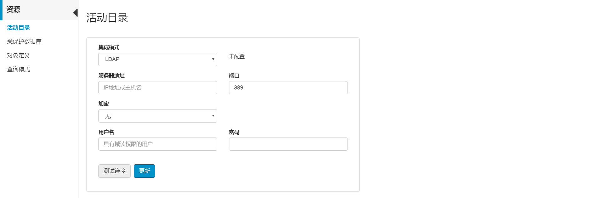
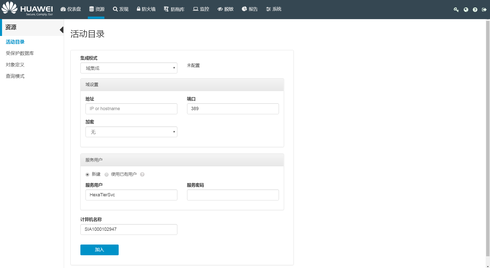
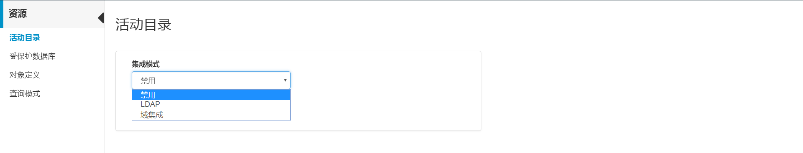

# 配置活动目录

HexaTier服务可以创建并使用活动目录用户。启用LDAP或域集成模式后，用户可以将HexaTier设置为鉴权代理。鉴权代理特性允许用户连接到远离活动目录网络的数据库实例，同时维护Windows域的鉴权机制。

用户可以通过以下三种集成模式中的一种来控制用户并维护凭证：

**表 1**  集成模式说明

<table><thead align="left"><tr id="zh-cn_topic_0180960107_r5815f6eed6494a3e84d9d03cd475f5bb"><th class="cellrowborder" valign="top" width="21.19%" id="mcps1.2.3.1.1">
集成模式名称

</th>
<th class="cellrowborder" valign="top" width="78.81%" id="mcps1.2.3.1.2">
说明

</th>
</tr>
</thead>
<tbody><tr id="zh-cn_topic_0180960107_r9c704ce6ccbe4ad1b53a85e1aff789cc"><td class="cellrowborder" valign="top" width="21.19%" headers="mcps1.2.3.1.1 ">
禁用

</td>
<td class="cellrowborder" valign="top" width="78.81%" headers="mcps1.2.3.1.2 ">
HexaTier服务作为网络的一部分来运行。

</td>
</tr>
<tr id="zh-cn_topic_0180960107_r62b8fcfa74534e4bbc5f141e1eca0ef2"><td class="cellrowborder" valign="top" width="21.19%" headers="mcps1.2.3.1.1 ">
LDAP

</td>
<td class="cellrowborder" valign="top" width="78.81%" headers="mcps1.2.3.1.2 ">
HexaTier服务通过LDAP服务器认证。

</td>
</tr>
<tr id="zh-cn_topic_0180960107_reb1e42b28cb54f649caebbe929f718e9"><td class="cellrowborder" valign="top" width="21.19%" headers="mcps1.2.3.1.1 ">
域集成

</td>
<td class="cellrowborder" valign="top" width="78.81%" headers="mcps1.2.3.1.2 ">
HexaTier在作为域的一部分的计算机上运行。

</td>
</tr>
</tbody>
</table>

用户也可以在集成模式之间切换。

> **说明：**   
>在使用第三方认证时，请注意口令复杂度校验、防暴力破解、防DOS攻击等安全机制。  

## 前提条件

在三种集成模式之间切换，现有策略可能会阻止切换，因此必须在切换模式之前更改策略。

下表列出了在切换模式之前需要禁用或删除的策略：

**表 2**  切换模式前需进行的操作

<table><thead align="left"><tr id="zh-cn_topic_0180960190_r805e882013764592bc10aac09437ad8c"><th class="cellrowborder" valign="top" width="14.35%" id="mcps1.2.4.1.1">
原模式

</th>
<th class="cellrowborder" valign="top" width="15.659999999999998%" id="mcps1.2.4.1.2">
目标模式

</th>
<th class="cellrowborder" valign="top" width="69.99%" id="mcps1.2.4.1.3">
切换模式之前禁用或删除的策略

</th>
</tr>
</thead>
<tbody><tr id="zh-cn_topic_0180960190_r8c68dfa98e3f4214bc33043d5ab181f6"><td class="cellrowborder" valign="top" width="14.35%" headers="mcps1.2.4.1.1 ">
禁用

</td>
<td class="cellrowborder" valign="top" width="15.659999999999998%" headers="mcps1.2.4.1.2 ">
LDAP

</td>
<td class="cellrowborder" valign="top" width="69.99%" headers="mcps1.2.4.1.3 ">
无

</td>
</tr>
<tr id="zh-cn_topic_0180960190_r99767aec2a3349078575115ae087b47c"><td class="cellrowborder" valign="top" width="14.35%" headers="mcps1.2.4.1.1 ">
禁用

</td>
<td class="cellrowborder" valign="top" width="15.659999999999998%" headers="mcps1.2.4.1.2 ">
域集成

</td>
<td class="cellrowborder" valign="top" width="69.99%" headers="mcps1.2.4.1.3 ">
无

</td>
</tr>
<tr id="zh-cn_topic_0180960190_r23a9c19e39b04bb29596f1fa9df67012"><td class="cellrowborder" valign="top" width="14.35%" headers="mcps1.2.4.1.1 ">
LDAP

</td>
<td class="cellrowborder" valign="top" width="15.659999999999998%" headers="mcps1.2.4.1.2 ">
域集成

</td>
<td class="cellrowborder" valign="top" width="69.99%" headers="mcps1.2.4.1.3 ">
无

</td>
</tr>
<tr id="zh-cn_topic_0180960190_re7a72a3dfc214140aaad005e50981738"><td class="cellrowborder" valign="top" width="14.35%" headers="mcps1.2.4.1.1 ">
LDAP

</td>
<td class="cellrowborder" valign="top" width="15.659999999999998%" headers="mcps1.2.4.1.2 ">
禁用

</td>
<td class="cellrowborder" valign="top" width="69.99%" headers="mcps1.2.4.1.3 "><ul id="zh-cn_topic_0180960190_u9694fd26434b42ec9d5785773b931f8e"><li>依赖</li><li>规则中的活动目录对象</li><li>鉴权终止</li></ul>
</td>
</tr>
<tr id="zh-cn_topic_0180960190_r5974016101be45c49ac0793fcab3249a"><td class="cellrowborder" valign="top" width="14.35%" headers="mcps1.2.4.1.1 ">
域集成

</td>
<td class="cellrowborder" valign="top" width="15.659999999999998%" headers="mcps1.2.4.1.2 ">
LDAP

</td>
<td class="cellrowborder" valign="top" width="69.99%" headers="mcps1.2.4.1.3 "><ul id="zh-cn_topic_0180960190_u8439bcf4e20b41aebc3f1a40f0feeb6b"><li>使用Windows鉴权的代理和实例</li><li>使用Windows鉴权的远程日志存储</li><li>鉴权终止</li><li>高可用模式</li></ul>
</td>
</tr>
<tr id="zh-cn_topic_0180960190_r5b4c19795d7547438816b981af09183e"><td class="cellrowborder" valign="top" width="14.35%" headers="mcps1.2.4.1.1 ">
域集成

</td>
<td class="cellrowborder" valign="top" width="15.659999999999998%" headers="mcps1.2.4.1.2 ">
禁用

</td>
<td class="cellrowborder" valign="top" width="69.99%" headers="mcps1.2.4.1.3 "><ul id="zh-cn_topic_0180960190_u4485e021f64f4537941e324e270bd5cb"><li>使用Windows鉴权的代理和实例</li><li>使用Windows鉴权的远程日志存储</li><li>规则中的活动目录对象</li><li>鉴权终止</li><li>高可用模式</li></ul>
</td>
</tr>
</tbody>
</table>

## 配置LDAP模式

1.  在HexaTier主菜单上，单击“资源“。
2.  在导航树上，选择“活动目录“。
3.  在“集成模式“下拉框中选择“LDAP“。

    **图 1**  配置LDAP模式  
    

4.  根据需要设置相关参数：

    **表 3**  配置LDAP模式参数

    
    <table><thead align="left"><tr id="zh-cn_topic_0180960098_r5c441d2cfdd044feb93080cd7045d1df"><th class="cellrowborder" valign="top" width="20.49%" id="mcps1.2.3.1.1">
参数名称

    </th>
    <th class="cellrowborder" valign="top" width="79.51%" id="mcps1.2.3.1.2">
说明

    </th>
    </tr>
    </thead>
    <tbody><tr id="zh-cn_topic_0180960098_rae593fa517c948b6bf02daf6b686c088"><td class="cellrowborder" valign="top" width="20.49%" headers="mcps1.2.3.1.1 ">
服务器地址

    </td>
    <td class="cellrowborder" valign="top" width="79.51%" headers="mcps1.2.3.1.2 ">
LDAP服务器地址。

    </td>
    </tr>
    <tr id="zh-cn_topic_0180960098_r6b99566863ae4fd1a14c9714a71d7373"><td class="cellrowborder" valign="top" width="20.49%" headers="mcps1.2.3.1.1 ">
端口

    </td>
    <td class="cellrowborder" valign="top" width="79.51%" headers="mcps1.2.3.1.2 ">
连接LDAP服务器的端口。

    </td>
    </tr>
    <tr id="zh-cn_topic_0180960098_r020eec6ea7ac40878a51bbbc09a2f4bd"><td class="cellrowborder" valign="top" width="20.49%" headers="mcps1.2.3.1.1 ">
加密

    </td>
    <td class="cellrowborder" valign="top" width="79.51%" headers="mcps1.2.3.1.2 ">
与LDAP服务器的连接加密方式，包含以下三种：

    <ul id="zh-cn_topic_0180960098_u21f4cf3d9cf94774836f63a26c54f309"><li>无</li><li>LDAPS：HexaTier通过使用SSL的LDAP进行身份验证。</li><li>STARTTLS：对纯文本通信协议的扩展，将不安全的连接升级为加密连接。</li></ul>
    </td>
    </tr>
    <tr id="zh-cn_topic_0180960098_r7ac236c9d6044c0daed9cf7298b55812"><td class="cellrowborder" valign="top" width="20.49%" headers="mcps1.2.3.1.1 ">
用户名

    </td>
    <td class="cellrowborder" valign="top" width="79.51%" headers="mcps1.2.3.1.2 ">
连接LDAP服务器的用户名。

    </td>
    </tr>
    <tr id="zh-cn_topic_0180960098_r68402b14500746e79570d3a2482da22f"><td class="cellrowborder" valign="top" width="20.49%" headers="mcps1.2.3.1.1 ">
密码

    </td>
    <td class="cellrowborder" valign="top" width="79.51%" headers="mcps1.2.3.1.2 ">
连接LDAP服务器的密码。

    </td>
    </tr>
    </tbody>
    </table>

5.  单击“测试连接“。

    显示状态消息，提示测试连接成功或失败。

6.  测试成功后，单击“更新“。

    更新会自动测试与用户设置的连接。出现状态消息，提示连接成功或失败。

## 配置域集成模式

1.  在HexaTier主菜单上，单击“资源“。
2.  在导航树上，选择“活动目录“。
3.  在“集成模式“下拉框中选择“域集成“。

    **图 2**  配置域集成模式  
    

4.  根据需要设置相关参数：

    **表 4**  配置域集成模式参数

    
    <table><thead align="left"><tr id="zh-cn_topic_0180960171_r5cd1fdcdb4c748ad9afbe8823e853c3f"><th class="cellrowborder" valign="top" width="25%" id="mcps1.2.3.1.1">
参数名称

    </th>
    <th class="cellrowborder" valign="top" width="75%" id="mcps1.2.3.1.2">
说明

    </th>
    </tr>
    </thead>
    <tbody><tr id="zh-cn_topic_0180960171_r1cbf857b4e224371931a7821b1bcaf42"><td class="cellrowborder" colspan="2" valign="top" headers="mcps1.2.3.1.1 mcps1.2.3.1.2 ">
<strong id="zh-cn_topic_0180960171_a67a660fc58cd4b5faa0c6273fbe1979c">域设置</strong>

    </td>
    </tr>
    <tr id="zh-cn_topic_0180960171_r2629355dc3994c69821f154a4773afba"><td class="cellrowborder" valign="top" width="25%" headers="mcps1.2.3.1.1 ">
地址

    </td>
    <td class="cellrowborder" valign="top" width="75%" headers="mcps1.2.3.1.2 ">
LDAP服务器地址。

    </td>
    </tr>
    <tr id="zh-cn_topic_0180960171_r8edc0c5bcc1e4bb79c506d1cd4b50bd2"><td class="cellrowborder" valign="top" width="25%" headers="mcps1.2.3.1.1 ">
端口

    </td>
    <td class="cellrowborder" valign="top" width="75%" headers="mcps1.2.3.1.2 ">
连接LDAP服务器的端口。

    </td>
    </tr>
    <tr id="zh-cn_topic_0180960171_r0e4e4689f3d64216b8ec845ac957602f"><td class="cellrowborder" valign="top" width="25%" headers="mcps1.2.3.1.1 ">
加密

    </td>
    <td class="cellrowborder" valign="top" width="75%" headers="mcps1.2.3.1.2 ">
与LDAP服务器的连接加密方式，包含以下三种：

    <ul id="zh-cn_topic_0180960171_u19955d7aa7364ca9a7fcb2289c453cd6"><li>无</li><li>LDAPS：HexaTier通过使用SSL的LDAP进行身份验证。</li><li>STARTTLS：对纯文本通信协议的扩展，将不安全的连接升级到加密连接。</li></ul>
    </td>
    </tr>
    <tr id="zh-cn_topic_0180960171_r423ee1052b8c4a579c97160b8b118629"><td class="cellrowborder" colspan="2" valign="top" headers="mcps1.2.3.1.1 mcps1.2.3.1.2 ">
<strong id="zh-cn_topic_0180960171_a5620bcecc0134891a645ac266d350cfe">服务用户</strong>

    </td>
    </tr>
    <tr id="zh-cn_topic_0180960171_r2580d8eed7ce4c858b3fb6fe3718e441"><td class="cellrowborder" valign="top" width="25%" headers="mcps1.2.3.1.1 ">
新建

    </td>
    <td class="cellrowborder" valign="top" width="75%" headers="mcps1.2.3.1.2 ">
新建具有要求的角色和权限的用户。

    
 说明： 

此选项和“使用已有用户”只能选择一个。

    

    </td>
    </tr>
    <tr id="zh-cn_topic_0180960171_rbe4e71525b744fb181918d05cd2d178e"><td class="cellrowborder" valign="top" width="25%" headers="mcps1.2.3.1.1 ">
使用已有用户

    </td>
    <td class="cellrowborder" valign="top" width="75%" headers="mcps1.2.3.1.2 ">
用户必须存在于给定域，并具有以下角色和权限：<ul id="zh-cn_topic_0180960171_u9e36afcd2bcc4633a59e08a6fa4f1c68"><li>密码未到期</li><li>委派</li><li>SPN注册和注销</li><li>模拟</li></ul>
    

    
 说明： 

此选项和“新建”只能选择一个。

    

    </td>
    </tr>
    <tr id="zh-cn_topic_0180960171_ra990be2b59e64c82bd0fa7f46d896c09"><td class="cellrowborder" valign="top" width="25%" headers="mcps1.2.3.1.1 ">
服务用户

    </td>
    <td class="cellrowborder" valign="top" width="75%" headers="mcps1.2.3.1.2 ">
可使用以下任一格式输入服务用户：

    <ul id="zh-cn_topic_0180960171_u66a275a8f29147daaaf6c85573c711b2"><li>用户名</li><li>用户域\用户名</li><li>用户名@域</li></ul>
    
服务用户默认为“HexaTierSvc”。

    </td>
    </tr>
    <tr id="zh-cn_topic_0180960171_r9a673ede912d42e2bec5a29fa68b1d94"><td class="cellrowborder" valign="top" width="25%" headers="mcps1.2.3.1.1 ">
服务密码

    </td>
    <td class="cellrowborder" valign="top" width="75%" headers="mcps1.2.3.1.2 ">
定义的服务用户密码。

    </td>
    </tr>
    <tr id="zh-cn_topic_0180960171_r2e52ab64d6cd4d3dbee365a92d18afce"><td class="cellrowborder" colspan="2" valign="top" headers="mcps1.2.3.1.1 mcps1.2.3.1.2 ">
<strong id="zh-cn_topic_0180960171_a8fcba3343e8846578373b8c7e3176256">计算机名称</strong>

    </td>
    </tr>
    <tr id="zh-cn_topic_0180960171_r9f1a5c86746d4b94a3641adb0d1b757d"><td class="cellrowborder" valign="top" width="25%" headers="mcps1.2.3.1.1 ">
计算机名称

    </td>
    <td class="cellrowborder" valign="top" width="75%" headers="mcps1.2.3.1.2 ">
加入的计算机名称。

    </td>
    </tr>
    </tbody>
    </table>

5.  单击“加入“。

    HexaTier会验证设置，并显示管理员凭证提示。

6.  输入特权域用户和密码。

    显示成功或失败的提示消息。

7.  按提示重启服务。

    > **说明：**   
    >连接后HexaTier不会保存管理员凭证。  

## 在集成模式之间切换

1.  在HexaTier主菜单上，单击“资源“。
2.  在导航树上，选择“活动目录“。
3.  在“集成模式“下拉框中选择：

    -   禁用
    -   LDAP
    -   域集成

    **图 3**  集成模式切换示意图  
    

    > **说明：**   
    >如果从域集成切换到LDAP，则必须重启HexaTier服务。  

