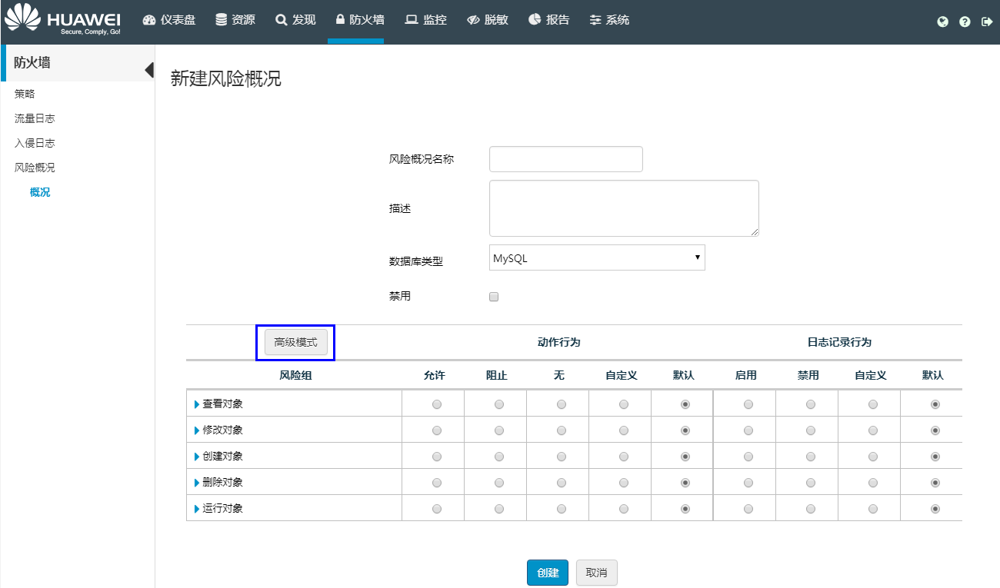

# 配置风险概况

风险概况可根据风险组配置不同的动作类型和日志记录行为，对访问的指定命令或操作进行允许或阻止。基于风险概况，可创建基于风险的IPS/IDS规则。

## 操作场景

该任务指导用户创建或编辑风险概况。

创建了风险概况之后，用户就可以在创建基于风险的IPS/IDS规则时，选择该风险概况，针对特定命令或操作进行允许或阻止。

> **注意：**   
>风险概况不支持PostgreSQL。  

风险概况由动作组（风险组）组成，每个组都描述一个不同的风险动作。

风险概况包括两种设置类型：

-   动作行为：针对风险组所执行的动作。
-   日志记录行为：针对风险组进行的日志设置。

创建风险概况时，可以选择使用“基本模式“或“高级模式“：

-   “基本模式“下，可以配置服务器、安全和数据库等对象的设置。
-   “高级模式“下，可以通过单击表中的风险组名称，来查看并指定组里每个动作的行为。

## 操作步骤

1.  在HexaTier主菜单上，单击“防火墙“。
2.  在导航树上，选择“风险概况“。
3.  根据需要执行以下操作：
    -   创建新的风险概况

        在命令栏上，单击“新建“。

    -   编辑已有的风险概况

        找到要编辑的风险概况，然后单击行末尾的（编辑）。

4.  在工作区中，输入“风险概况名称“和“描述“。
5.  在“数据库类型“下拉框中选择数据库类型：
    -   MySQL
    -   MS-SQL

6.  工作区以“基本模式“显示，用户可以单击“高级模式“来显示高级命令。

    

7.  在“动作行为“列中，为每个组选择下列动作行为：

    **表 1**  动作行为说明

    
    <table><thead align="left"><tr id="zh-cn_topic_0110575026_row93214497540"><th class="cellrowborder" valign="top" width="26.46%" id="mcps1.2.3.1.1">
动作行为名称

    </th>
    <th class="cellrowborder" valign="top" width="73.54%" id="mcps1.2.3.1.2">
说明

    </th>
    </tr>
    </thead>
    <tbody><tr id="zh-cn_topic_0110575026_row13321349105419"><td class="cellrowborder" valign="top" width="26.46%" headers="mcps1.2.3.1.1 ">
允许

    </td>
    <td class="cellrowborder" valign="top" width="73.54%" headers="mcps1.2.3.1.2 ">
允许该组的所有动作。

    </td>
    </tr>
    <tr id="zh-cn_topic_0110575026_row63294915414"><td class="cellrowborder" valign="top" width="26.46%" headers="mcps1.2.3.1.1 ">
阻止

    </td>
    <td class="cellrowborder" valign="top" width="73.54%" headers="mcps1.2.3.1.2 ">
阻止该组的所有动作。

    </td>
    </tr>
    <tr id="zh-cn_topic_0110575026_row93211496547"><td class="cellrowborder" valign="top" width="26.46%" headers="mcps1.2.3.1.1 ">
无

    </td>
    <td class="cellrowborder" valign="top" width="73.54%" headers="mcps1.2.3.1.2 ">
忽略该组的所有动作。此选项通过不处理查询来节省资源。

    </td>
    </tr>
    <tr id="zh-cn_topic_0110575026_row143224935412"><td class="cellrowborder" valign="top" width="26.46%" headers="mcps1.2.3.1.1 ">
自定义

    </td>
    <td class="cellrowborder" valign="top" width="73.54%" headers="mcps1.2.3.1.2 ">
在基本模式下，可以对组中的不同对象制定不同行为。

    
如果选择高级模式，则允许为组中的每个动作指定不同的行为。

    </td>
    </tr>
    <tr id="zh-cn_topic_0110575026_row1332194917540"><td class="cellrowborder" valign="top" width="26.46%" headers="mcps1.2.3.1.1 ">
默认

    </td>
    <td class="cellrowborder" valign="top" width="73.54%" headers="mcps1.2.3.1.2 ">
使用IPS或IDS策略中配置的默认动作。

    </td>
    </tr>
    </tbody>
    </table>

8.  在“日志记录行为“列中，为每个组选择下列日志记录行为：

    **表 2**  日志记录行为说明

    
    <table><thead align="left"><tr id="zh-cn_topic_0110575026_row3408204515515"><th class="cellrowborder" valign="top" width="26.83%" id="mcps1.2.3.1.1">
日志记录行为名称

    </th>
    <th class="cellrowborder" valign="top" width="73.17%" id="mcps1.2.3.1.2">
说明

    </th>
    </tr>
    </thead>
    <tbody><tr id="zh-cn_topic_0110575026_row6408174516559"><td class="cellrowborder" valign="top" width="26.83%" headers="mcps1.2.3.1.1 ">
启用

    </td>
    <td class="cellrowborder" valign="top" width="73.17%" headers="mcps1.2.3.1.2 ">
启用该组所有动作的日志记录。

    </td>
    </tr>
    <tr id="zh-cn_topic_0110575026_row164081345205514"><td class="cellrowborder" valign="top" width="26.83%" headers="mcps1.2.3.1.1 ">
禁用

    </td>
    <td class="cellrowborder" valign="top" width="73.17%" headers="mcps1.2.3.1.2 ">
禁用该组所有动作的日志记录。

    </td>
    </tr>
    <tr id="zh-cn_topic_0110575026_row94087456554"><td class="cellrowborder" valign="top" width="26.83%" headers="mcps1.2.3.1.1 ">
自定义

    </td>
    <td class="cellrowborder" valign="top" width="73.17%" headers="mcps1.2.3.1.2 ">
在基本模式下，可以对组中的不同对象制定不同的日志记录行为。

    
如果选择高级模式，则允许为组中的每个动作指定不同的日志记录行为。

    </td>
    </tr>
    <tr id="zh-cn_topic_0110575026_row740814595511"><td class="cellrowborder" valign="top" width="26.83%" headers="mcps1.2.3.1.1 ">
默认

    </td>
    <td class="cellrowborder" valign="top" width="73.17%" headers="mcps1.2.3.1.2 ">
使用IPS或IDS策略中配置的默认日志行为。

    </td>
    </tr>
    </tbody>
    </table>

9.  单击“创建“或“更新“。

## 删除风险概况

1.  在HexaTier主菜单上，单击“防火墙“。
2.  在导航树上，选择“风险概况“。
3.  找到要删除的风险概况，单击该行末尾的（删除）。

    > **说明：**   
    >如果要删除的风险概况已经关联了基于风险的IPS/IDS规则，则该风险概况不能删除，并向用户显示关联的规则，用户可以通过编辑该规则，将规则和风险概况分离，或者删除该规则，然后再删除风险概况。  

