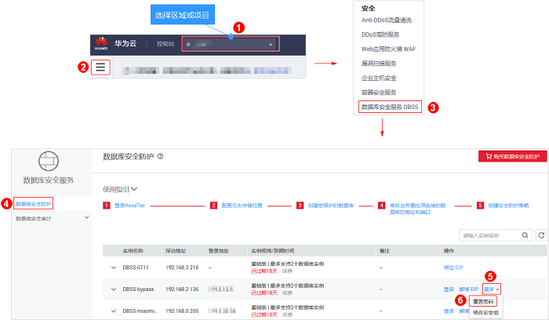
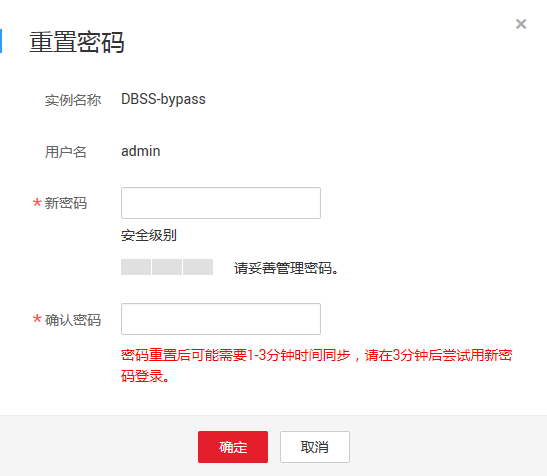

# 重置HexaTier登录密码

首次登录HexaTier，登录用户名为**admin**，默认密码为购买数据库安全防护时设置的HexaTier的登录密码。如果您忘记HexaTier登录密码，可以重置登录密码。

## 前提条件

已成功购买数据库安全防护实例，且2个实例的“运行状态“都为“运行中“。

## 注意事项

重置登录密码后，请等待1～3分钟，待重置的密码生效后，再重新登录HexaTier。

## 操作步骤

1.  [登录管理控制台](https://console.huaweicloud.com/?locale=zh-cn)。
2.  进入重置密码入口，如[图1](#zh-cn_topic_0111166372_fig4989100164918)所示。

    **图 1**  进入重置密码入口  
    

3.  在弹出的“重置密码“对话框中，输入设置的新密码，如[图2](#fig254142319571)所示。

    **图 2** “重置密码“对话框  
    

4.  单击“确定“，密码设置完成。

    请等待1～3分钟后，使用重置密码重新登录HexaTier。

