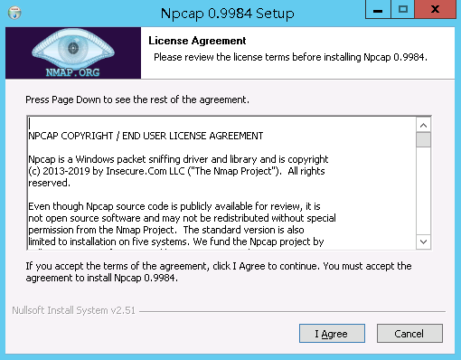
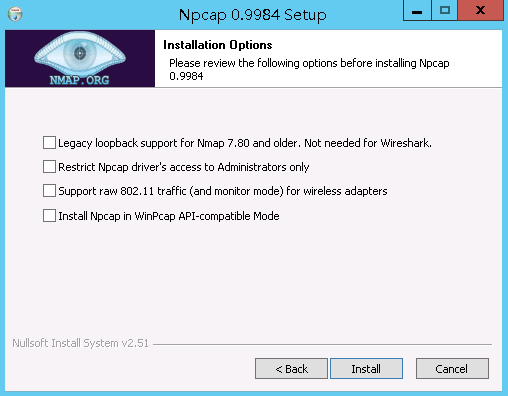
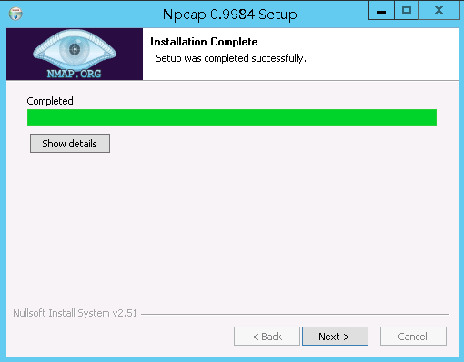
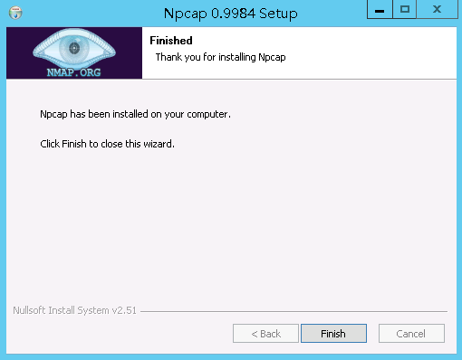

# Windows操作系统

Agent添加完成后，您还需要下载Agent，并根据Agent的添加方式在数据库端或应用端安装Agent，将添加的数据库连接到数据库安全审计实例，才能使用数据库安全审计功能。

## 前提条件

-   已成功购买数据库安全审计实例，且实例的状态为“运行中“。
-   数据库已成功添加Agent。
-   已获取Windows操作系统Agent安装包。
-   安装Agent节点的运行系统满足Windows系统版本要求。有关Windows系统版本的要求，请参见[Agent可以安装在哪些Windows操作系统上？](https://support.huaweicloud.com/dbss_faq/dbss_01_0318.html)。

## 安装Agent

有关Agent安装节点的详细说明，请参见[如何选择数据库安全审计的Agent安装节点？](https://support.huaweicloud.com/dbss_faq/dbss_01_0282.html)。

-   ECS/BMS的自建数据库

    在数据库端、应用端或代理端安装Agent

-   RDS关系型数据库

    在应用端或代理端安装Agent

1.  以“Administrator“用户登录到Windows主机。
2.  将下载的Agent安装包“xxx.zip“复制到该主机任意一个目录下。
3.  进入Agent安装包所在目录，并解压缩安装包。
4.  进入解压后的文件夹，双击“install.bat“执行文件。
    -   如果该Windows主机已安装“Npcap“，请执行[5](#li7837349132514)。
    -   如果该Windows主机未安装“Npcap“，系统提示是否安装“Npcap“，请执行以下步骤：
        1.  输入“y“，开始安装“Npcap“。
        2.  在弹出的对话框中，单击“I Agree“，如[图1](#fig6281112407)所示。

            **图 1**  同意安装“Npcap“  
            

        3.  在弹出的对话框中，单击“Install“，如[图2](#fig113151344144114)所示。

            **图 2**  安装“Npcap“  
            

        4.  在弹出的对话框中，单击“Next“。

            

        5.  单击“Finish“，完成安装。

            

        6.  进入解压后的文件夹，双击“install.bat“执行文件后，执行[5](#li7837349132514)。

5.  安装成功，界面如[图3](#fig1160640132710)所示，按任意键结束安装。

    **图 3**  Agent安装成功  
    

6.  安装完成后，在Windows任务管理器中查看“dbss\_audit\_agent“进程。

    如果进程不存在，说明Agent安装失败，请尝试重新安装Agent。

## 效果验证

1.  Agent安装成功后，在数据库上执行一条SQL语句（例如“select \* from mysql.user limit 1“）。
2.  [登录管理控制台](https://console.huaweicloud.com/)。
3.  验证Agent与数据库安全审计实例的网络通信正常。
    1.  进入SQL语句列表入口，如[图4](#zh-cn_topic_0174227115_fig1489915095118)所示。

        **图 4**  进入SQL语句列表入口  
        

    2.  在“时间“所在行右侧，单击，选择开始时间和结束时间，单击“提交“，SQL语句列表将显示[1](#zh-cn_topic_0174227115_li0294761612)中输入的SQL语句，如[图5](#zh-cn_topic_0174227115_fig8994029155516)所示。

        **图 5**  查看SQL语句  
        

        -   如果SQL语句列表中显示输入的SQL语句，说明Agent与数据库安全审计实例之间网络通信正常。
        -   如果SQL语句列表中未显示输入的SQL语句，说明Agent与数据库安全审计实例之间网络通信异常，请参照[Agent与数据库安全审计实例之间通信异常](Agent与数据库安全审计实例之间通信异常.md)处理。

## 后续处理

数据库安全审计默认提供一条“全审计规则“的审计范围，可以对成功连接数据库安全审计实例的所有数据库进行安全审计。Agent安装完成后，您可以查看被添加的数据库的审计结果。详细操作，请参见[查看审计结果](查看审计总览信息.md)。

## 相关操作

-   有关添加Agent的详细操作，请参见[步骤二：添加Agent](步骤二-添加Agent.md)。
-   数据库开启SSL时，将不能使用数据库安全审计功能。如果您需要使用数据库安全审计功能，请关闭数据库的SSL。关闭数据库SSL的详细操作，请参见[如何关闭数据库SSL？](https://support.huaweicloud.com/dbss_faq/dbss_01_0283.html)。
-   有关卸载Agent的详细操作，请参见[卸载Agent](卸载Agent.md)。

