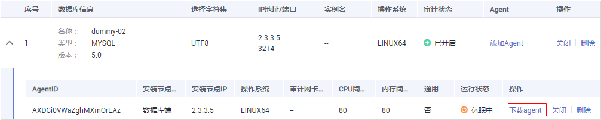

# 下载Agent

安全组规则添加完成后，您还需要下载Agent，并根据Agent的添加方式在数据库端或应用端安装Agent。

> **说明：** 
>每个Agent都有唯一的AgentID，是Agent连接数据库安全审计实例的重要密钥。若您将添加的Agent删除，在重新添加Agent后，请重新下载Agent。

## 前提条件

-   已成功购买数据库安全审计实例，且实例的状态为“运行中“。
-   数据库已成功添加Agent。

## 操作步骤

1.  [登录管理控制台](https://console.huaweicloud.com/?locale=zh-cn)。
2.  在页面上方选择“区域“后，单击页面左上方的，选择“安全与合规  \>  数据库安全服务“，进入数据库安全审计“总览“界面。
3.  在左侧导航树中，选择“数据库列表“，进入数据库列表界面。
4.  在“选择实例“下拉列表框中，选择需要下载Agent的数据库所属的实例。
5.  单击数据库左侧的展开Agent的详细信息，在Agent所在行的“操作“列，单击“下载agent“，如[图1](#fig1470611221310)所示。将Agent安装包下载到本地。

    **图 1**  下载Agent  
    

    请根据安装Agent节点的操作系统类型，选择下载相应的Agent安装包。

    -   Linux操作系统

        在“操作系统“为“LINUX64“的数据库中下载Agent安装包

    -   Windows操作系统

        在“操作系统“为“WINDOWS64“的数据库中下载Agent安装包

