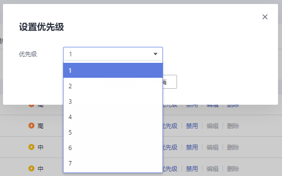
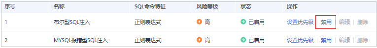
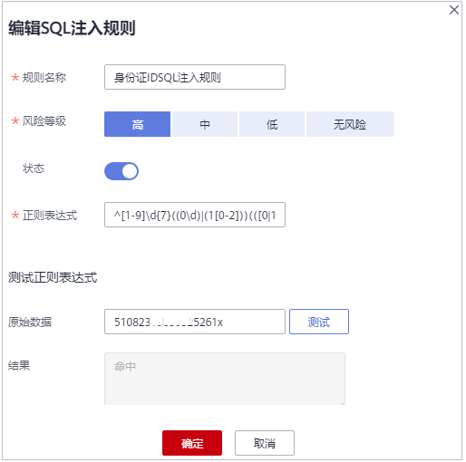
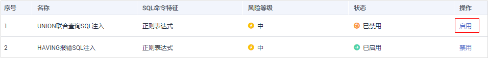

# 启用或禁用SQL注入检测

数据库安全审计的SQL注入检测默认开启，您可以禁用或启用SQL注入的检测规则。

> **须知：** 
>一条审计数据只能命中SQL注入检测中的一个规则。

## 前提条件

-   已成功购买数据库安全审计实例，且实例的状态为“运行中“。
-   SQL注入检测的状态为“已禁用“时，可以启用SQL注入检测。
-   SQL注入检测的状态为“已启用“时，可以禁用SQL注入检测。

## 禁用SQL注入检测

SQL注入检测默认开启，您可以根据使用需要禁用SQL注入检查规则。禁用SQL注入检测规则后，该审计规则在审计中将不生效。

1.  [登录管理控制台](https://console.huaweicloud.com/?locale=zh-cn)。
2.  在页面上方选择“区域“后，单击页面左上方的，选择“安全与合规  \>  数据库安全服务“，进入数据库安全审计“总览“界面。
3.  在左侧导航树中，选择“审计规则“。
4.  在“选择实例“下拉列表框中，选择需要禁用SQL注入检测的实例。
5.  选择“SQL注入“页签。
6.  在SQL注入检测规则所在行的“操作“列，单击“设置优先级“，在弹出的窗口中单击“优先级“的选框选择想要设置的优先等级，数字越小优先级越高，如[图1](#fig1937132125810)所示，选择完成，单击“确定”完成设置。

    **图 1**  设置优先级  
    

7.  在SQL注入检测规则所在行的“操作“列，单击“禁用“，如[图2](#fig148017166466)所示。

    **图 2**  禁用SQL注入检测规则  
    

    禁用SQL注入检测成功，该SQL注入检测规则的状态为“已禁用“。

8.  单击“操作“列的“编辑“，可对目标规则的参数进行编辑，如[图3](#fig1448418914912)所示；参数说明如[表1](#table14709144861013)所示，编辑完成，确认信息无误，单击“确认“，完成修改。

    **图 3**  编辑SQL注入规则  
    

    **表 1**  SQL注入规则参数说明

    
    <table><thead align="left"><tr id="row27104486104"><th class="cellrowborder" valign="top" width="14.431443144314432%" id="mcps1.2.4.1.1">
参数名称

    </th>
    <th class="cellrowborder" valign="top" width="52.235223522352236%" id="mcps1.2.4.1.2">
参数说明

    </th>
    <th class="cellrowborder" valign="top" width="33.33333333333333%" id="mcps1.2.4.1.3">
取值样例

    </th>
    </tr>
    </thead>
    <tbody><tr id="row1710748151012"><td class="cellrowborder" valign="top" width="14.431443144314432%" headers="mcps1.2.4.1.1 ">
规则名称

    </td>
    <td class="cellrowborder" valign="top" width="52.235223522352236%" headers="mcps1.2.4.1.2 ">
目标SQL规则的名称，可自定义输入。

    </td>
    <td class="cellrowborder" valign="top" width="33.33333333333333%" headers="mcps1.2.4.1.3 ">
邮编SQL注入规则

    </td>
    </tr>
    <tr id="row57101948191017"><td class="cellrowborder" valign="top" width="14.431443144314432%" headers="mcps1.2.4.1.1 ">
风险等级

    </td>
    <td class="cellrowborder" valign="top" width="52.235223522352236%" headers="mcps1.2.4.1.2 ">
目标SQL规则的风险级别，可以选择以下级别：

    <ul id="ul155751241152314"><li>高</li><li>中</li><li>低</li><li>无风险</li></ul>
    </td>
    <td class="cellrowborder" valign="top" width="33.33333333333333%" headers="mcps1.2.4.1.3 ">
中

    </td>
    </tr>
    <tr id="row371084871016"><td class="cellrowborder" valign="top" width="14.431443144314432%" headers="mcps1.2.4.1.1 ">
状态

    </td>
    <td class="cellrowborder" valign="top" width="52.235223522352236%" headers="mcps1.2.4.1.2 ">
开启或关闭当前SQL注入规则。

    <ul id="ul934875119443"><li>：开启</li><li>：关闭</li></ul>
    </td>
    <td class="cellrowborder" valign="top" width="33.33333333333333%" headers="mcps1.2.4.1.3 ">

    </td>
    </tr>
    <tr id="row1771094861019"><td class="cellrowborder" valign="top" width="14.431443144314432%" headers="mcps1.2.4.1.1 ">
正则表达式

    </td>
    <td class="cellrowborder" valign="top" width="52.235223522352236%" headers="mcps1.2.4.1.2 ">
目标SQL规则采用正则表达式检测的公式，需要您根据需要检测的内容来输入确定。

    </td>
    <td class="cellrowborder" valign="top" width="33.33333333333333%" headers="mcps1.2.4.1.3 ">
^\d{6}$

    </td>
    </tr>
    <tr id="row1271011485107"><td class="cellrowborder" valign="top" width="14.431443144314432%" headers="mcps1.2.4.1.1 ">
原始数据

    </td>
    <td class="cellrowborder" valign="top" width="52.235223522352236%" headers="mcps1.2.4.1.2 ">
正则表达式能检测的正确数据。

    
输入正则表达式能检测的正确数据，单击“测试”对正则表达式进行检测。

    </td>
    <td class="cellrowborder" valign="top" width="33.33333333333333%" headers="mcps1.2.4.1.3 ">
628307

    </td>
    </tr>
    <tr id="row1710164871010"><td class="cellrowborder" valign="top" width="14.431443144314432%" headers="mcps1.2.4.1.1 ">
结果

    </td>
    <td class="cellrowborder" valign="top" width="52.235223522352236%" headers="mcps1.2.4.1.2 ">
显示测试的结果：

    <ul id="ul12565111265512"><li>命中</li><li>未命中
 说明： 

测试结果为“命中”：表示正则表达式无误；

    
测试结果为“未命中”：表示正则表达式有误。

    

    </li></ul>
    </td>
    <td class="cellrowborder" valign="top" width="33.33333333333333%" headers="mcps1.2.4.1.3 ">
命中

    </td>
    </tr>
    </tbody>
    </table>

9.  单击“操作“列的“删除“，对目标规则进行删除。

## 后续处理

禁用SQL注入检测规则后，如果您需要启动该规则，请在SQL注入检测规则所在行的“操作“列，单击“启用“，如[图4](#fig185497132517)所示，启用该规则。

**图 4**  启用SQL注入检测规则  

启用SQL注入检测成功，该SQL注入检测规则的状态为“已启用“。

