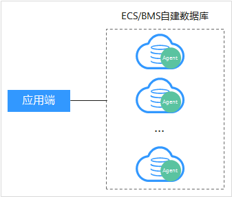
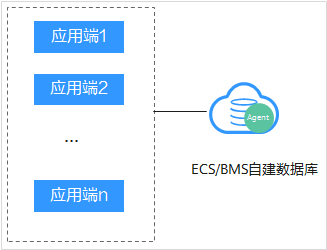
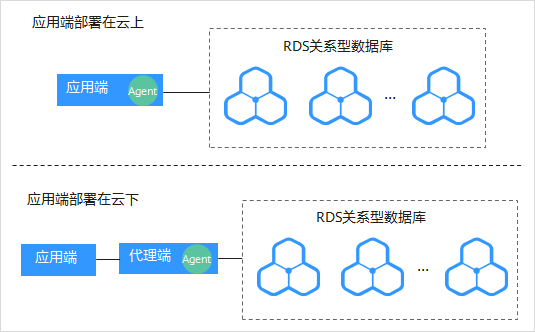
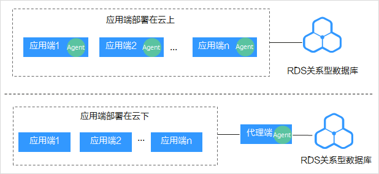

# 安装Agent（Linux操作系统）<a name="dbss_01_0254"></a>

安装Agent后，你才能开启数据库安全审计。通过本节介绍，您将了解如何在Linux操作系统的节点上安装Agent。Windows操作系统的Agent安装请参见[安装Agent（Windows操作系统）](安装Agent（Windows操作系统）.md)。

## 前提条件<a name="section070891116319"></a>

-   已成功购买数据库安全审计实例，且实例的状态为“运行中“。
-   数据库已成功添加Agent。
-   已获取Linux操作系统Agent安装包。
-   安装Agent节点的运行系统满足Linux系统版本要求。有关Linux系统版本的要求，请参见[Agent可以安装在哪些Linux操作系统上？](https://support.huaweicloud.com/dbss_faq/dbss_01_0319.html)。

## 常见安装场景<a name="section984415120154"></a>

请您根据数据库的类型以及部署场景，在数据库端或应用端安装Agent。数据库常见的部署场景说明如下：

-   ECS/BMS自建数据库的常见部署场景如[图1](#fig0617131314411)和[图2](#fig1131385013914)所示。

    **图 1**  一个应用端连接多个ECS/BMS自建数据库<a name="fig0617131314411"></a>  
    

    **图 2**  多个应用端连接同一个ECS/BMS自建数据库<a name="fig1131385013914"></a>  
    

-   RDS关系型数据库的常见部署场景如[图3](#fig76418538416)和[图4](#fig766123541110)所示。

    **图 3**  一个应用端连接多个RDS<a name="fig76418538416"></a>  
    

    **图 4**  多个应用端连接同一个RDS<a name="fig766123541110"></a>  
    


安装Agent节点的详细说明如[表1](#zh-cn_topic_0110856029_table4295843716304)所示。

> **须知：** 
>当您的应用和数据库（ECS/BMS自建数据库）都部署在同一个节点上时，Agent需在数据库端安装。

**表 1**  安装Agent场景说明

<a name="zh-cn_topic_0110856029_table4295843716304"></a>
<table><thead align="left"><tr id="zh-cn_topic_0110856029_row4338993216304"><th class="cellrowborder" valign="top" width="16.91%" id="mcps1.2.5.1.1"><p id="p242511529611"><a name="p242511529611"></a><a name="p242511529611"></a>使用场景</p>
</th>
<th class="cellrowborder" valign="top" width="15.61%" id="mcps1.2.5.1.2"><p id="p669218115912"><a name="p669218115912"></a><a name="p669218115912"></a>Agent安装节点</p>
</th>
<th class="cellrowborder" valign="top" width="29.21%" id="mcps1.2.5.1.3"><p id="zh-cn_topic_0110856029_p554697916304"><a name="zh-cn_topic_0110856029_p554697916304"></a><a name="zh-cn_topic_0110856029_p554697916304"></a>审计功能说明</p>
</th>
<th class="cellrowborder" valign="top" width="38.269999999999996%" id="mcps1.2.5.1.4"><p id="p1457555517420"><a name="p1457555517420"></a><a name="p1457555517420"></a>注意事项</p>
</th>
</tr>
</thead>
<tbody><tr id="zh-cn_topic_0110856029_row3896937416304"><td class="cellrowborder" valign="top" width="16.91%" headers="mcps1.2.5.1.1 "><p id="p1742645217615"><a name="p1742645217615"></a><a name="p1742645217615"></a>ECS/BMS自建数据库</p>
</td>
<td class="cellrowborder" valign="top" width="15.61%" headers="mcps1.2.5.1.2 "><p id="p96937116596"><a name="p96937116596"></a><a name="p96937116596"></a>数据库端</p>
</td>
<td class="cellrowborder" valign="top" width="29.21%" headers="mcps1.2.5.1.3 "><p id="p163512146517"><a name="p163512146517"></a><a name="p163512146517"></a>可以审计所有访问该数据库的应用端的所有访问记录。</p>
</td>
<td class="cellrowborder" valign="top" width="38.269999999999996%" headers="mcps1.2.5.1.4 "><a name="ul1434325082513"></a><a name="ul1434325082513"></a><ul id="ul1434325082513"><li>在数据库端安装Agent。</li><li>当某个应用端连接多个ECS/BMS自建数据库时，需要在所有连接该应用端的数据库端安装Agent。</li></ul>
</td>
</tr>
<tr id="zh-cn_topic_0110856029_row1319658616304"><td class="cellrowborder" valign="top" width="16.91%" headers="mcps1.2.5.1.1 "><p id="p10426195218611"><a name="p10426195218611"></a><a name="p10426195218611"></a>RDS关系型数据库</p>
</td>
<td class="cellrowborder" valign="top" width="15.61%" headers="mcps1.2.5.1.2 "><p id="p1669315145912"><a name="p1669315145912"></a><a name="p1669315145912"></a>应用端（应用端部署在云上）</p>
</td>
<td class="cellrowborder" valign="top" width="29.21%" headers="mcps1.2.5.1.3 "><p id="p137861430175114"><a name="p137861430175114"></a><a name="p137861430175114"></a>可以审计该应用端与其连接的所有数据库的访问记录。</p>
</td>
<td class="cellrowborder" valign="top" width="38.269999999999996%" headers="mcps1.2.5.1.4 "><a name="ul832714025916"></a><a name="ul832714025916"></a><ul id="ul832714025916"><li>在应用端安装Agent。</li><li>当多个应用端连接同一个RDS时，所有连接该RDS的应用端都需要安装Agent。</li></ul>
</td>
</tr>
<tr id="row673153818506"><td class="cellrowborder" valign="top" width="16.91%" headers="mcps1.2.5.1.1 "><p id="p19307124313503"><a name="p19307124313503"></a><a name="p19307124313503"></a>RDS关系型数据库</p>
</td>
<td class="cellrowborder" valign="top" width="15.61%" headers="mcps1.2.5.1.2 "><p id="p57321338145019"><a name="p57321338145019"></a><a name="p57321338145019"></a>代理端（应用端部署在云下）</p>
</td>
<td class="cellrowborder" valign="top" width="29.21%" headers="mcps1.2.5.1.3 "><p id="p07324384506"><a name="p07324384506"></a><a name="p07324384506"></a>只能审计代理端与后端数据库之间的访问记录，无法审计应用端与后端数据库的访问记录。</p>
</td>
<td class="cellrowborder" valign="top" width="38.269999999999996%" headers="mcps1.2.5.1.4 "><p id="p31819567512"><a name="p31819567512"></a><a name="p31819567512"></a>在代理端安装Agent。</p>
</td>
</tr>
</tbody>
</table>

## 安装Agent<a name="section16540958125719"></a>

请您根据数据库类型以及数据库的部署环境，在相应节点上安装Agent。

1.  将下载的Agent安装包“xxx.tar.gz“上传到待安装Agent的节点（例如使用WinSCP工具）。
2.  使用跨平台远程访问工具（例如PuTTY）以**root**用户通过SSH方式，登录该节点。
3.  执行以下命令，进入Agent安装包“xxx.tar.gz“所在目录。

    **cd** _Agent安装包所在目录_

4.  执行以下命令，解压缩“xxx.tar.gz“安装包。

    **tar** **-xvf** _xxx.tar.gz_

5.  执行以下命令，进入解压后的目录。

    **cd** _解压后的目录_

6.  执行以下命令，查看是否有安装脚本“install.sh“的执行权限。

    **ll**

    -   如果有安装脚本的执行权限，请执行[7](#li144058161155)。
    -   如果没有安装脚本的执行权限，请执行以下操作：
        1.  执行以下命令，添加安装脚本执行权限。

            **chmod +x install.sh**

        2.  确认有安装脚本执行权限后，请执行[7](#li144058161155)。

7.  <a name="li144058161155"></a>执行以下命令，安装Agent。

    **sh** **install.sh**

    如果界面回显以下信息，说明安装成功。否则，说明Agent安装失败。

    ```
    start agent
    starting audit agent
    audit agent started
    start success
    install dbss audit agent done!
    ```

    > **须知：** 
    >如果Agent安装失败，请您确认安装节点的运行系统是否满足Linux操作系统要求，并重新安装Agent。

8.  执行以下命令，查看Agent程序的运行状态。

    **service** **audit\_agent status**

    如果界面回显以下信息，说明Agent程序运行正常。

    ```
    audit agent is running.
    ```


## 相关操作<a name="section3657198173220"></a>

-   有关添加Agent的详细操作，请参见[步骤二：添加Agent](步骤二-添加Agent.md)。
-   数据库开启SSL时，将不能使用数据库安全审计功能。如果您需要使用数据库安全审计功能，请关闭数据库的SSL。关闭数据库SSL的详细操作，请参见[如何关闭数据库SSL？](https://support.huaweicloud.com/dbss_faq/dbss_01_0283.html)。
-   有关卸载Agent的详细操作，请参见[卸载Agent](卸载Agent.md)。

