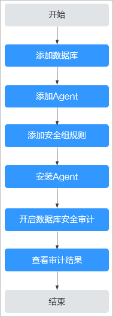

# 快速使用流程

购买数据库安全审计实例后，您需要将待审计的数据库添加到数据库安全审计实例中，并在数据库对应的数据库端或应用端安装Agent。当待审计的数据库连接到数据库安全审计实例后，数据库安全审计才能对待审计的数据库进行审计。

## 背景信息

数据库安全审计支持对华为云上的ECS/BMS自建数据库和RDS关系型数据库进行审计。

> **须知：** 
>-   数据库安全审计不支持跨区域（Region）使用。待审计的数据库必须和购买申请的数据库安全审计实例在同一区域。
>-   数据库开启SSL时，将不能使用数据库安全审计功能。如果您需要使用数据库安全审计功能，请关闭数据库的SSL。关闭数据库SSL的详细操作，请参见[如何关闭数据库SSL？](https://support.huaweicloud.com/dbss_faq/dbss_01_0283.html)。
>-   有关审计数据的保存说明，请参见[数据库安全审计的审计数据可以保存多久？](https://support.huaweicloud.com/dbss_faq/dbss_01_0225.html)。

## 快速配置流程

购买数据库安全审计后，您可以参照[图1](#fig120888149)所示的配置流程，快速使用数据库安全审计。操作步骤的详细说明如[表1](#table443217583618)所示。

数据库安全审计还支持批量部署流量采集Agent，针对大规模业务场景（容器化部署应用、数据库（RDS关系型数据库）数量大），能够显著提升产品配置的效率，降低配置的复杂度，减少运维人员的日常维护压力。详细操作步骤，请参见[容器化部署数据库安全审计Agent](https://support.huaweicloud.com/bestpractice-dbss/dbss_06_0007.html)。

**图 1**  快速使用数据库安全审计流程图  

**表 1**  快速使用数据库安全审计操作步骤

<table><thead align="left"><tr id="row143210517368"><th class="cellrowborder" valign="top" width="10.7010701070107%" id="mcps1.2.4.1.1">
步骤

</th>
<th class="cellrowborder" valign="top" width="30.26302630263026%" id="mcps1.2.4.1.2">
配置操作

</th>
<th class="cellrowborder" valign="top" width="59.03590359035904%" id="mcps1.2.4.1.3">
说明

</th>
</tr>
</thead>
<tbody><tr id="row1943217515366"><td class="cellrowborder" valign="top" width="10.7010701070107%" headers="mcps1.2.4.1.1 ">
1

</td>
<td class="cellrowborder" valign="top" width="30.26302630263026%" headers="mcps1.2.4.1.2 ">
<a href="步骤一-添加数据库.md">添加数据库</a>

</td>
<td class="cellrowborder" valign="top" width="59.03590359035904%" headers="mcps1.2.4.1.3 ">
购买数据库安全审计后，您需要将待审计的数据库添加到数据库安全审计实例。

</td>
</tr>
<tr id="row14423186183810"><td class="cellrowborder" valign="top" width="10.7010701070107%" headers="mcps1.2.4.1.1 ">
2

</td>
<td class="cellrowborder" valign="top" width="30.26302630263026%" headers="mcps1.2.4.1.2 ">
<a href="步骤二-添加Agent.md">添加Agent</a>

</td>
<td class="cellrowborder" valign="top" width="59.03590359035904%" headers="mcps1.2.4.1.3 ">
添加的数据库开启审计功能后，您需要为添加的数据库选择Agent的添加方式。

数据库安全审计支持对华为云上的ECS/BMS自建数据库和RDS关系型数据库进行审计，请根据您在华为云上实际部署的数据库选择Agent添加方式。

</td>
</tr>
<tr id="row118072413560"><td class="cellrowborder" valign="top" width="10.7010701070107%" headers="mcps1.2.4.1.1 ">
3

</td>
<td class="cellrowborder" valign="top" width="30.26302630263026%" headers="mcps1.2.4.1.2 ">
<a href="步骤三-添加安全组规则.md">添加安全组规则</a>

</td>
<td class="cellrowborder" valign="top" width="59.03590359035904%" headers="mcps1.2.4.1.3 ">
Agent添加完成后，您还需要为数据库安全审计实例所在的安全组添加入方向规则TCP协议（8000端口）和UDP协议（7000-7100端口），使Agent与审计实例之间的网络连通，数据库安全审计才能对添加的数据库进行审计。

</td>
</tr>
<tr id="row2083153011513"><td class="cellrowborder" valign="top" width="10.7010701070107%" headers="mcps1.2.4.1.1 ">
4

</td>
<td class="cellrowborder" valign="top" width="30.26302630263026%" headers="mcps1.2.4.1.2 ">
<a href="安装Agent（Linux操作系统）.md">安装Agent（Linux操作系统）</a>

</td>
<td class="cellrowborder" valign="top" width="59.03590359035904%" headers="mcps1.2.4.1.3 ">
安全组规则添加完成后，您还需要下载Agent，并根据Agent的添加方式在数据库端或应用端安装Agent。

</td>
</tr>
<tr id="row1692017362140"><td class="cellrowborder" valign="top" width="10.7010701070107%" headers="mcps1.2.4.1.1 ">
5

</td>
<td class="cellrowborder" valign="top" width="30.26302630263026%" headers="mcps1.2.4.1.2 ">
<a href="步骤五-开启数据库安全审计.md">开启数据库安全审计</a>

</td>
<td class="cellrowborder" valign="top" width="59.03590359035904%" headers="mcps1.2.4.1.3 ">
Agent安装成功后，您还需要开启数据库安全审计功能，将添加的数据库连接到数据库安全审计实例，才能使用数据库安全审计功能。

</td>
</tr>
<tr id="row695902133817"><td class="cellrowborder" valign="top" width="10.7010701070107%" headers="mcps1.2.4.1.1 ">
6

</td>
<td class="cellrowborder" valign="top" width="30.26302630263026%" headers="mcps1.2.4.1.2 ">
<a href="查看审计总览信息.md">查看审计结果</a>

</td>
<td class="cellrowborder" valign="top" width="59.03590359035904%" headers="mcps1.2.4.1.3 ">
数据库安全审计默认提供一条“全审计规则”的审计范围，可以对连接数据库安全审计实例的所有数据库进行审计。开启数据库安全审计后，您可以在数据库安全审计界面查看被添加的数据库的审计结果。

 须知： 

您可以根据业务需求设置数据库审计规则。有关配置审计规则的详细操作，请参见<a href="添加审计范围.md">配置审计规则</a>。

</td>
</tr>
</tbody>
</table>

## 相关操作

-   如何选择Agent添加方式以及安装Agent的节点的详细介绍，请参见[如何选择数据库安全审计的Agent安装节点？](https://support.huaweicloud.com/dbss_faq/dbss_01_0282.html)。
-   如果审计功能无法正常使用，请参照[无法使用数据库安全审计](https://support.huaweicloud.com/dbss_faq/dbss_01_0235.html)章节进行处理。

## 效果验证

当您将添加的数据库连接到数据库安全审计实例后，数据库安全审计将记录被添加的数据库的操作行为。您可以在数据库安全审计界面查看被添加的数据库的审计结果。

