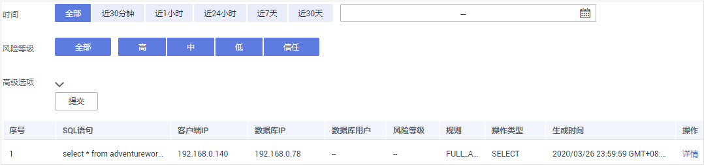
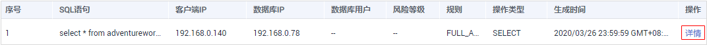
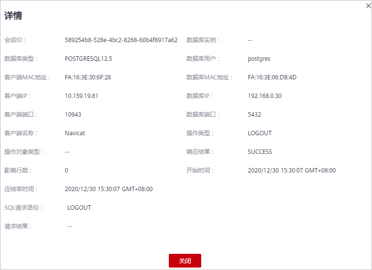

# 查看SQL语句详细信息

添加的数据库连接到数据库安全审计实例后，您可以查看该数据库详细的SQL语句信息。

## 前提条件

-   已成功购买数据库安全审计实例，且实例的状态为“运行中“。
-   已成功开启数据库安全审计功能。

-   数据库安全审计实例已成功添加安全组规则。

## 操作步骤

1.  [登录管理控制台](https://console.huaweicloud.com/?locale=zh-cn)。
2.  在页面上方选择“区域“后，单击页面左上方的，选择“安全与合规  \>  数据库安全服务“，进入数据库安全审计“总览“界面。
3.  在“选择实例“下拉列表框中，选择需要查看SQL语句信息的实例。
4.  选择“语句“页签。
5.  查询SQL语句信息，如[图1](#fig78811126122218)所示。

    **图 1**  查询SQL语句  
    

    您可以按照以下方法，查询指定的SQL语句。

    -   选择“时间“（“全部“、“近30分钟“、“近1小时“、“近24小时“、“近7天“或“近30天“），或者单击，选择开始时间和结束时间，单击“提交“，列表显示该时间段的SQL语句。
    -   选择“风险等级“（“全部“、“高“、“中“、“低“或“信任“），单击“提交“，列表显示该级别的SQL语句。
    -   单击“高级选项“后的，输入相关信息，如[图2](#fig588352620222)所示，单击“提交“，列表显示该选项的SQL语句。

        > **说明：** 
        >一次查询最多可查询10,000条记录。

        **图 2**  高级选项信息  
        

6.  在需要查看详情的SQL语句所在行的“操作“列，单击“详情“，如[图3](#fig999564692815)所示。

    **图 3**  查看SQL语句详情  
    

7.  在“详情“提示框中，查看SQL语句的详细信息，如[图4](#fig138071753181812)所示，相关参数说明如[表1](#table14884152602217)所示。

    > **须知：** 
    >审计语句和结果集的长度限制为10,240字节。超出部分，系统将不记录在审计日志中。

    **图 4** “详情“提示框  
    

    **表 1**  SQL语句详情参数说明

    
    <table><thead align="left"><tr id="row118840263228"><th class="cellrowborder" valign="top" width="25.61%" id="mcps1.2.3.1.1">
参数名称

    </th>
    <th class="cellrowborder" valign="top" width="74.39%" id="mcps1.2.3.1.2">
说明

    </th>
    </tr>
    </thead>
    <tbody><tr id="row0884182672210"><td class="cellrowborder" valign="top" width="25.61%" headers="mcps1.2.3.1.1 ">
会话ID

    </td>
    <td class="cellrowborder" valign="top" width="74.39%" headers="mcps1.2.3.1.2 ">
SQL语句的ID，由系统自动生成。

    </td>
    </tr>
    <tr id="row96754582306"><td class="cellrowborder" valign="top" width="25.61%" headers="mcps1.2.3.1.1 ">
数据库实例

    </td>
    <td class="cellrowborder" valign="top" width="74.39%" headers="mcps1.2.3.1.2 ">
SQL语句所在的数据库实例。

    </td>
    </tr>
    <tr id="row59360241310"><td class="cellrowborder" valign="top" width="25.61%" headers="mcps1.2.3.1.1 ">
数据库类型

    </td>
    <td class="cellrowborder" valign="top" width="74.39%" headers="mcps1.2.3.1.2 ">
执行SQL语句所在的数据库的类型。

    </td>
    </tr>
    <tr id="row21351542319"><td class="cellrowborder" valign="top" width="25.61%" headers="mcps1.2.3.1.1 ">
数据库用户

    </td>
    <td class="cellrowborder" valign="top" width="74.39%" headers="mcps1.2.3.1.2 ">
执行SQL语句的数据库用户。

    </td>
    </tr>
    <tr id="row1026112617449"><td class="cellrowborder" valign="top" width="25.61%" headers="mcps1.2.3.1.1 ">
客户端MAC地址

    </td>
    <td class="cellrowborder" valign="top" width="74.39%" headers="mcps1.2.3.1.2 ">
执行SQL语句所在客户端MAC地址。

    </td>
    </tr>
    <tr id="row20490164511449"><td class="cellrowborder" valign="top" width="25.61%" headers="mcps1.2.3.1.1 ">
数据库MAC地址

    </td>
    <td class="cellrowborder" valign="top" width="74.39%" headers="mcps1.2.3.1.2 ">
执行SQL语句所在数据库MAC地址。

    </td>
    </tr>
    <tr id="row16434161344511"><td class="cellrowborder" valign="top" width="25.61%" headers="mcps1.2.3.1.1 ">
客户端IP

    </td>
    <td class="cellrowborder" valign="top" width="74.39%" headers="mcps1.2.3.1.2 ">
执行SQL语句所在客户端的IP地址。

    </td>
    </tr>
    <tr id="row877152318326"><td class="cellrowborder" valign="top" width="25.61%" headers="mcps1.2.3.1.1 ">
数据库IP

    </td>
    <td class="cellrowborder" valign="top" width="74.39%" headers="mcps1.2.3.1.2 ">
执行SQL语句所在的数据库的IP地址。

    </td>
    </tr>
    <tr id="row58101733173213"><td class="cellrowborder" valign="top" width="25.61%" headers="mcps1.2.3.1.1 ">
客户端端口

    </td>
    <td class="cellrowborder" valign="top" width="74.39%" headers="mcps1.2.3.1.2 ">
执行SQL语句所在的客户端的端口。

    </td>
    </tr>
    <tr id="row8884172642219"><td class="cellrowborder" valign="top" width="25.61%" headers="mcps1.2.3.1.1 ">
数据库端口

    </td>
    <td class="cellrowborder" valign="top" width="74.39%" headers="mcps1.2.3.1.2 ">
执行SQL语句所在的数据库的端口。

    </td>
    </tr>
    <tr id="row1285510419334"><td class="cellrowborder" valign="top" width="25.61%" headers="mcps1.2.3.1.1 ">
客户端名称

    </td>
    <td class="cellrowborder" valign="top" width="74.39%" headers="mcps1.2.3.1.2 ">
执行SQL语句所在客户端名称。

    </td>
    </tr>
    <tr id="row16682142517336"><td class="cellrowborder" valign="top" width="25.61%" headers="mcps1.2.3.1.1 ">
操作类型

    </td>
    <td class="cellrowborder" valign="top" width="74.39%" headers="mcps1.2.3.1.2 ">
SQL语句的操作类型。

    </td>
    </tr>
    <tr id="row107280370331"><td class="cellrowborder" valign="top" width="25.61%" headers="mcps1.2.3.1.1 ">
操作对象类型

    </td>
    <td class="cellrowborder" valign="top" width="74.39%" headers="mcps1.2.3.1.2 ">
SQL语句的操作对象的类型。

    </td>
    </tr>
    <tr id="row18524553143310"><td class="cellrowborder" valign="top" width="25.61%" headers="mcps1.2.3.1.1 ">
响应结果

    </td>
    <td class="cellrowborder" valign="top" width="74.39%" headers="mcps1.2.3.1.2 ">
执行SQL语句的响应结果。

    </td>
    </tr>
    <tr id="row183011125343"><td class="cellrowborder" valign="top" width="25.61%" headers="mcps1.2.3.1.1 ">
影响行数

    </td>
    <td class="cellrowborder" valign="top" width="74.39%" headers="mcps1.2.3.1.2 ">
执行SQL语句的影响行数。

    </td>
    </tr>
    <tr id="row1292602815344"><td class="cellrowborder" valign="top" width="25.61%" headers="mcps1.2.3.1.1 ">
开始时间

    </td>
    <td class="cellrowborder" valign="top" width="74.39%" headers="mcps1.2.3.1.2 ">
SQL语句开始执行的时间。

    </td>
    </tr>
    <tr id="row19482153613412"><td class="cellrowborder" valign="top" width="25.61%" headers="mcps1.2.3.1.1 ">
应结束时间

    </td>
    <td class="cellrowborder" valign="top" width="74.39%" headers="mcps1.2.3.1.2 ">
SQL语句结束的时间。

    </td>
    </tr>
    <tr id="row1199125143518"><td class="cellrowborder" valign="top" width="25.61%" headers="mcps1.2.3.1.1 ">
SQL请求语句

    </td>
    <td class="cellrowborder" valign="top" width="74.39%" headers="mcps1.2.3.1.2 ">
SQL语句的名称。

    </td>
    </tr>
    <tr id="row96020195358"><td class="cellrowborder" valign="top" width="25.61%" headers="mcps1.2.3.1.1 ">
请求结果

    </td>
    <td class="cellrowborder" valign="top" width="74.39%" headers="mcps1.2.3.1.2 ">
SQL语句请求执行的结果。

    </td>
    </tr>
    </tbody>
    </table>

## 相关操作

-   如果SQL语句列表中未显示输入的SQL语句，说明Agent与数据库安全审计实例之间网络通信异常，请参照[如何处理Agent与数据库安全审计实例之间通信异常？](https://support.huaweicloud.com/dbss_faq/dbss_01_0246.html)处理。

-   数据库开启SSL时，将不能使用数据库安全审计功能。如果您需要使用数据库安全审计功能，请关闭数据库的SSL。关闭数据库SSL的详细操作，请参见[如何关闭数据库SSL？](https://support.huaweicloud.com/dbss_faq/dbss_01_0283.html)。

