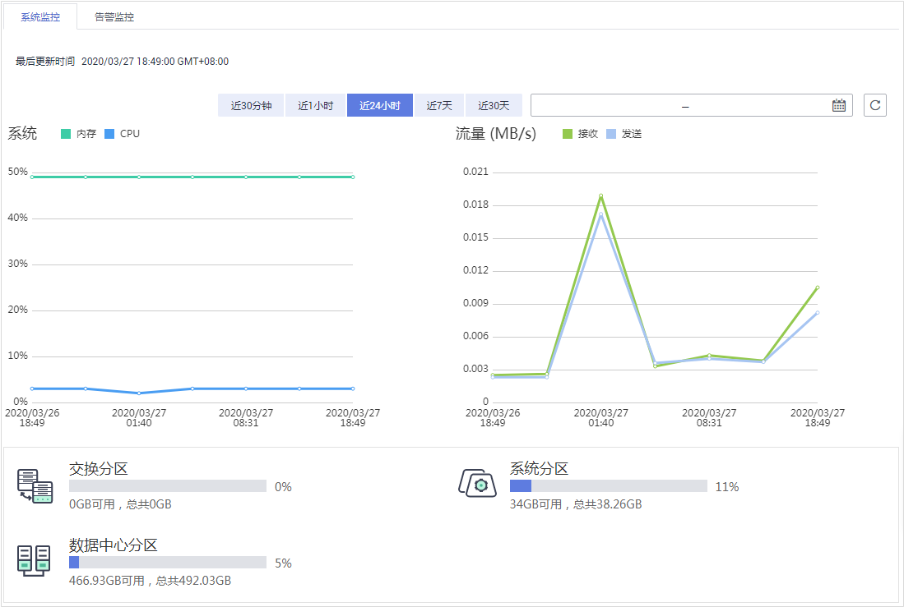

# 查看系统监控信息

通过查看数据库安全审计的系统监控信息，您可以了解系统资源和流量使用情况等信息。

## 前提条件

-   已成功购买数据库安全审计实例，且实例的状态为“运行中“。
-   已成功开启数据库安全审计功能。

## 操作步骤

1.  [登录管理控制台](https://console.huaweicloud.com/?locale=zh-cn)。
2.  在页面上方选择“区域“后，单击页面左上方的，选择“安全与合规  \>  数据库安全服务“，进入数据库安全审计“总览“界面。
3.  在左侧导航树中，选择“实例列表“，进入“实例列表“界面。
4.  单击需要查看系统监控信息的实例名称，选择“监控“页签，进入系统监控页面。
5.  查看系统监控信息，如[图1](#fig75451433958)所示。

    选择审计的时间（“近30分钟“、“近1小时“、“近24小时“、“近7天“或“近30天“）；或者单击，选择开始时间和结束时间，查看指定的时间段的系统监控信息。

    **图 1**  查看系统监控信息  
    

