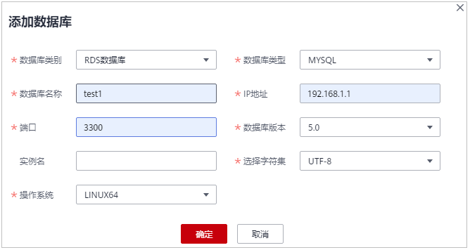
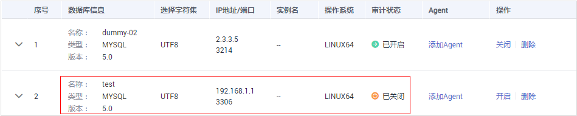

# 步骤一：添加数据库

数据库安全审计支持对华为云上的RDS关系型数据库、ECS/BMS自建数据库进行审计。购买数据库安全审计实例后，您需要将待审计的数据库添加至数据库安全审计实例中。

数据库安全审计支持审计的数据库类型及版本，请参见[支持的数据库类型及版本](https://support.huaweicloud.com/productdesc-dbss/dbss_01_0313.html#section1)。

## 前提条件

已成功购买数据库安全审计实例，且实例的状态为“运行中“。

## 添加数据库

1.  [登录管理控制台](https://console.huaweicloud.com/?locale=zh-cn)。
2.  在页面上方选择“区域“后，单击页面左上方的，选择“安全与合规  \>  数据库安全服务“，进入数据库安全审计“总览“界面。
3.  在左侧导航树中，选择“数据库列表“，进入数据库列表界面。
4.  在“选择实例“下拉列表框中，选择需要添加数据库的实例。
5.  在数据库列表框左上方，单击“添加数据库“。
6.  在弹出的对话框中，设置数据库的信息，如[图1](#fig425613335010)所示，相关参数说明如[表1](#table4295843716304)所示。

    **图 1** “添加数据库“对话框  
    

    **表 1**  数据库参数说明

    
    <table><thead align="left"><tr id="row4338993216304"><th class="cellrowborder" valign="top" width="21.02%" id="mcps1.2.4.1.1">
参数名称

    </th>
    <th class="cellrowborder" valign="top" width="60.78%" id="mcps1.2.4.1.2">
说明

    </th>
    <th class="cellrowborder" valign="top" width="18.2%" id="mcps1.2.4.1.3">
取值样例

    </th>
    </tr>
    </thead>
    <tbody><tr id="row3896937416304"><td class="cellrowborder" valign="top" width="21.02%" headers="mcps1.2.4.1.1 ">
数据库名称

    </td>
    <td class="cellrowborder" valign="top" width="60.78%" headers="mcps1.2.4.1.2 ">
您可以自定义添加的数据库的名称。

    </td>
    <td class="cellrowborder" valign="top" width="18.2%" headers="mcps1.2.4.1.3 ">
test1

    </td>
    </tr>
    <tr id="row1332204111319"><td class="cellrowborder" valign="top" width="21.02%" headers="mcps1.2.4.1.1 ">
IP地址

    </td>
    <td class="cellrowborder" valign="top" width="60.78%" headers="mcps1.2.4.1.2 ">
添加的数据库的IP地址。

    
IP地址支持IPv4（例如，192.168.1.1）和IPv6（例如，1050:0:0:0:5:600:300c:326b）格式。

    </td>
    <td class="cellrowborder" valign="top" width="18.2%" headers="mcps1.2.4.1.3 ">
192.168.1.1

    </td>
    </tr>
    <tr id="row0860165713317"><td class="cellrowborder" valign="top" width="21.02%" headers="mcps1.2.4.1.1 ">
数据库类型

    </td>
    <td class="cellrowborder" valign="top" width="60.78%" headers="mcps1.2.4.1.2 ">
支持的数据库类型，您可以选择以下类型：<ul id="ul82801415184513"><li>MYSQL</li><li>ORACLE</li><li>POSTGRESQL</li><li>SQLSERVER</li><li>DWS</li><li>GaussDB(for Mysql)</li><li>GaussDB(for openGauss)</li><li>DAMENG</li><li>KINGBASE</li></ul>
    

    </td>
    <td class="cellrowborder" valign="top" width="18.2%" headers="mcps1.2.4.1.3 ">
MYSQL

    </td>
    </tr>
    <tr id="row1319658616304"><td class="cellrowborder" valign="top" width="21.02%" headers="mcps1.2.4.1.1 ">
端口

    </td>
    <td class="cellrowborder" valign="top" width="60.78%" headers="mcps1.2.4.1.2 ">
添加的数据库的端口。

    </td>
    <td class="cellrowborder" valign="top" width="18.2%" headers="mcps1.2.4.1.3 ">
3306

    </td>
    </tr>
    <tr id="row16837105815489"><td class="cellrowborder" valign="top" width="21.02%" headers="mcps1.2.4.1.1 ">
数据库版本

    </td>
    <td class="cellrowborder" valign="top" width="60.78%" headers="mcps1.2.4.1.2 ">
支持的数据库版本。

    <ul id="ul10467113114715"><li>当“数据库类型”选择“MYSQL”时，您可以选择以下版本：<ul id="ul177551201424"><li>5.0、5.1、5.5、5.6、5.7</li><li>8.0</li></ul>
    </li><li>当“数据库类型”选择“ORACLE”时，您可以选择以下版本：<ul id="ul215135319476"><li>11g</li><li>12c</li><li>19c</li></ul>
    </li><li>当“数据库类型”选择“POSTGRESQL”时，您可以选择以下版本：<ul id="ul214119711011"><li>7.4</li><li>8.0、8.1、8.2、8.3、8.4</li><li>9.0、9.1、9.2、9.3、9.4、9.5、9.6</li><li>10.0、10.1、10.2、10.3、10.4、10.5</li><li>11</li></ul>
    </li><li>当“数据库类型”选择“SQLSERVER”时，您可以选择以下版本：<ul id="ul1875113219515"><li>2008</li><li>2012</li><li>2014</li><li>2016</li><li>2017</li></ul>
    </li><li>当“数据库类型”选择“DWS”时，您可以选择以下版本：<ul id="ul174651351173"><li>1.5</li></ul>
    </li><li>当“数据库类型”选择“GaussDB(for Mysql)”时，您可以选择以下版本：<ul id="ul1075615518272"><li>当“数据库类别”为“自建数据库”时，可选择“Mysql 8.0”</li><li>当“数据库类别”为“RDS数据库”时，直接在页面选择需要添加的实例即可。</li></ul>
    
 须知： 

当“数据库类别”选择“RDS数据库”，且“数据库类型”选择“GaussDB(for Mysql)”时，才会自动关联获取数据库列表，按需选择实例即可。

    

    </li><li>当“数据库类型”选择“GaussDB(for openGauss)”时，您可以选择以下版本：<ul id="ul5370164218239"><li>2020企业版</li></ul>
    </li><li>当“数据库类型”选择“DAMENG”时，您可以选择以下版本：<ul id="ul6392444202312"><li>DM8</li></ul>
    </li><li>当“数据库类型”选择“KINGBASE”时，您可以选择以下版本：<ul id="ul11639347202315"><li>V8</li></ul>
    </li></ul>
    </td>
    <td class="cellrowborder" valign="top" width="18.2%" headers="mcps1.2.4.1.3 ">
5.0

    </td>
    </tr>
    <tr id="row879719219418"><td class="cellrowborder" valign="top" width="21.02%" headers="mcps1.2.4.1.1 ">
实例名

    </td>
    <td class="cellrowborder" valign="top" width="60.78%" headers="mcps1.2.4.1.2 ">
您可以指定需要审计的数据库的实例名称。

    
 说明： 
<ul id="ul7132124225315"><li>如果实例名为空，数据库安全审计将审计数据库中所有的实例。</li><li>如果填写实例名，数据库安全审计将审计填写的实例，最多可填写5个实例名，且实例名以“;”分隔。</li></ul>
    

    </td>
    <td class="cellrowborder" valign="top" width="18.2%" headers="mcps1.2.4.1.3 ">
-

    </td>
    </tr>
    <tr id="row2550998316304"><td class="cellrowborder" valign="top" width="21.02%" headers="mcps1.2.4.1.1 ">
选择字符集

    </td>
    <td class="cellrowborder" valign="top" width="60.78%" headers="mcps1.2.4.1.2 ">
支持的数据库字符集的编码格式，您可以选择以下编码格式：

    <ul id="ul889605712313"><li>UTF-8</li><li>GBK</li></ul>
    </td>
    <td class="cellrowborder" valign="top" width="18.2%" headers="mcps1.2.4.1.3 ">
UTF-8

    </td>
    </tr>
    <tr id="row2795329327"><td class="cellrowborder" valign="top" width="21.02%" headers="mcps1.2.4.1.1 ">
操作系统

    </td>
    <td class="cellrowborder" valign="top" width="60.78%" headers="mcps1.2.4.1.2 ">
添加的数据库运行的操作系统，您可以选择以下操作系统：<ul id="ul522785945218"><li>LINUX64</li><li>WINDOWS64</li></ul>
    

    </td>
    <td class="cellrowborder" valign="top" width="18.2%" headers="mcps1.2.4.1.3 ">
LINUX64

    </td>
    </tr>
    <tr id="row1947434711537"><td class="cellrowborder" valign="top" width="21.02%" headers="mcps1.2.4.1.1 ">
数据库类别

    </td>
    <td class="cellrowborder" valign="top" width="60.78%" headers="mcps1.2.4.1.2 ">
选择添加的数据库类别，“RDS数据库”或“自建数据库”。

    </td>
    <td class="cellrowborder" valign="top" width="18.2%" headers="mcps1.2.4.1.3 ">
RDS数据库

    </td>
    </tr>
    </tbody>
    </table>

7.  单击“确定“，数据库列表中将新增一条“审计状态“为“已关闭“的数据库，如[图2](#fig977312338295)所示。

    **图 2**  数据库添加完成  
    

    > **说明：** 
    >数据库添加完成后，请您确认添加的数据库信息正确。如果数据库信息不正确，请您在数据库所在行单击“删除“，删除数据库后，再重新添加数据库。

