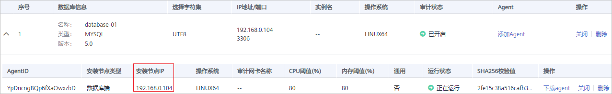
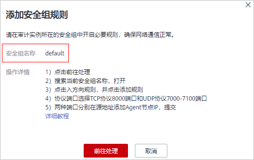
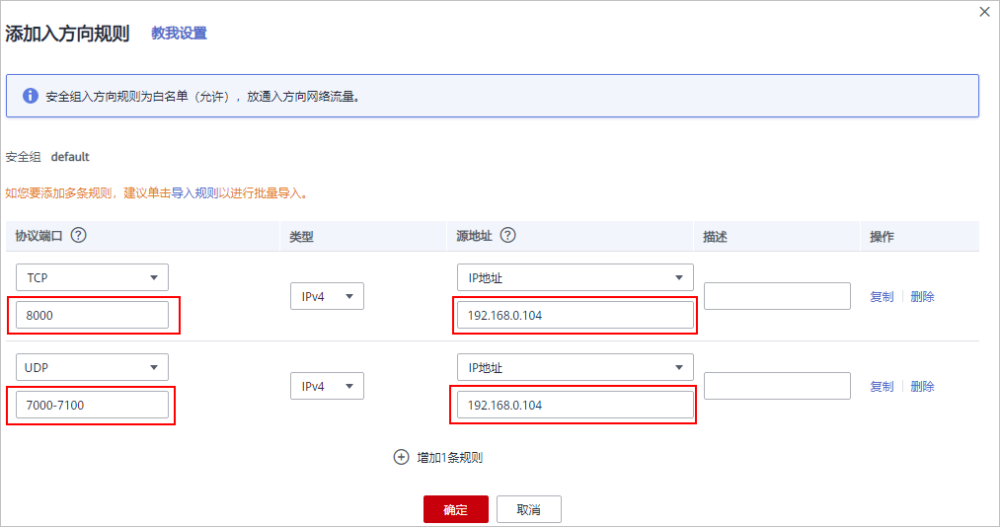

# 步骤三：添加安全组规则

Agent添加完成后，您需要为数据库安全审计实例所在的安全组添加入方向规则TCP协议（8000端口）和UDP协议（7000-7100端口），使Agent与审计实例之间的网络连通，数据库安全审计才能对添加的数据库进行审计。

本章节介绍如何为数据库安全审计实例所在的安全组添加TCP协议（8000端口）和UDP协议（7000-7100端口）。

> **说明：** 
>安全组规则也可以在成功安装Agent后进行添加。

## 前提条件

-   已成功购买数据库安全审计实例，且实例的状态为“运行中“。
-   数据库已成功添加Agent。

## 添加安全组规则

1.  [登录管理控制台](https://console.huaweicloud.com/?locale=zh-cn)。
2.  在页面上方选择“区域“后，单击页面左上方的，选择“安全与合规  \>  数据库安全服务“，进入数据库安全审计“总览“界面。
3.  在左侧导航树中，选择“数据库安全审计  \>  数据库列表“，进入“数据库列表“界面。
4.  在“选择实例“下拉列表框中，选择需要添加安全组规则的数据库所属的实例。
5.  记录**Agent安装节点IP信息。**

    单击数据库左侧的展开Agent的详细信息，并记录“安装节点IP“，如[图1](#fig133221637175316)所示。

    **图 1**  安装节点IP  
    

6.  在数据库列表的上方，单击“添加安全组“。
7.  在弹出的弹框中，记录数据库安全审计实例的“安全组名称“（例如default），如[图2](#fig174162359446)所示。

    **图 2**  添加安全组规则  
    

8.  单击“前往处理“，进入“安全组“列表界面。
9.  在列表右上方的搜索框中输入安全组“default“后，单击或按“Enter“，列表显示“default“安全组信息。
10. 单击“default“，进入“基本信息“页面。
11. 选择“入方向规则“，检查安全组的入方向规则。

    请检查该安全组的入方向规则是否已为[5](#li0918135319384)的安装节点IP配置了TCP协议（端口为8000）和UDP协议（端口为7000-7100）规则。

    -   如果该安全组已配置安装节点的入方向规则，请执行[下载Agent](下载Agent.md)。
    -   如果该安全组未配置安装节点的入方向规则，请执行[12](#li17406142715380)。

12. 为安装节点添加入方向安全规则。
    1.  在入方向规则页面，单击“添加规则“，如[图3](#fig177671059302)所示。

        **图 3**  添加规则  
        

    2.  在“添加入方向规则“对话框中，为[图1](#fig133221637175316)中的安装节点IP添加TCP协议（端口为8000）和UDP协议（端口为7000-7100）规则，如[图4](#fig10722192914315)所示。

        **图 4** “添加入方向规则“对话框  
        

    3.  单击“确定“，完成添加入方向规则。

        安全组规则添加完成后，您还需要下载Agent，并根据Agent的添加方式在数据库端或应用端安装Agent，将添加的数据库连接到数据库安全审计实例，才能开启数据库安全审计功能。

