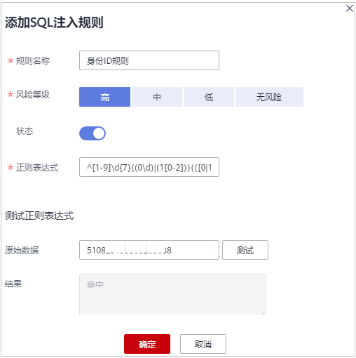

# 添加SQL注入规则

数据库安全审计提供“添加SQL注入规则“，您可根据需要自定义添加对应的SQL规则，添加后可以对成功连接数据库安全审计的所有数据进行安全审计。

## 前提条件

-   已成功购买数据库安全审计实例，且实例的状态为“运行中“。
-   已成功添加数据库并开启审计功能。
-   已成功添加数据库。

## 操作步骤

1.  [登录管理控制台](https://auth.huaweicloud.com/authui/login.html?service=https%3A%2F%2Fconsole.huaweicloud.com%2Fconsole%2F#/login)。
2.  在页面上方选择“区域“后，单击页面左上方的，选择“安全与合规  \>  数据库安全服务“，进入数据库安全审计“总览“界面。
3.  在左侧导航树中，选择“审计规则“。
4.  在“选择实例“下拉列表框中，选择需要添加审计范围的实例。
5.  选择“SQL注入“页签。
6.  单击“添加SQL注入规则“，在弹窗中填写相关信息，如[图1](#fig348598171219)所示，参数说明如[表1](#table448716810124)所示。

    **图 1**  添加SQL注入规则  
    

    **表 1**  SQL注入规则参数说明

    
    <table><thead align="left"><tr id="dbss_01_0191_row27104486104"><th class="cellrowborder" valign="top" width="14.431443144314432%" id="mcps1.2.4.1.1">
参数名称

    </th>
    <th class="cellrowborder" valign="top" width="52.235223522352236%" id="mcps1.2.4.1.2">
参数说明

    </th>
    <th class="cellrowborder" valign="top" width="33.33333333333333%" id="mcps1.2.4.1.3">
取值样例

    </th>
    </tr>
    </thead>
    <tbody><tr id="dbss_01_0191_row1710748151012"><td class="cellrowborder" valign="top" width="14.431443144314432%" headers="mcps1.2.4.1.1 ">
规则名称

    </td>
    <td class="cellrowborder" valign="top" width="52.235223522352236%" headers="mcps1.2.4.1.2 ">
目标SQL规则的名称，可自定义输入。

    </td>
    <td class="cellrowborder" valign="top" width="33.33333333333333%" headers="mcps1.2.4.1.3 ">
邮编SQL注入规则

    </td>
    </tr>
    <tr id="dbss_01_0191_row57101948191017"><td class="cellrowborder" valign="top" width="14.431443144314432%" headers="mcps1.2.4.1.1 ">
风险等级

    </td>
    <td class="cellrowborder" valign="top" width="52.235223522352236%" headers="mcps1.2.4.1.2 ">
目标SQL规则的风险级别，可以选择以下级别：

    <ul id="dbss_01_0191_ul155751241152314"><li>高</li><li>中</li><li>低</li><li>无风险</li></ul>
    </td>
    <td class="cellrowborder" valign="top" width="33.33333333333333%" headers="mcps1.2.4.1.3 ">
中

    </td>
    </tr>
    <tr id="dbss_01_0191_row371084871016"><td class="cellrowborder" valign="top" width="14.431443144314432%" headers="mcps1.2.4.1.1 ">
状态

    </td>
    <td class="cellrowborder" valign="top" width="52.235223522352236%" headers="mcps1.2.4.1.2 ">
开启或关闭当前SQL注入规则。

    <ul id="dbss_01_0191_ul934875119443"><li>：开启</li><li>：关闭</li></ul>
    </td>
    <td class="cellrowborder" valign="top" width="33.33333333333333%" headers="mcps1.2.4.1.3 ">

    </td>
    </tr>
    <tr id="dbss_01_0191_row1771094861019"><td class="cellrowborder" valign="top" width="14.431443144314432%" headers="mcps1.2.4.1.1 ">
正则表达式

    </td>
    <td class="cellrowborder" valign="top" width="52.235223522352236%" headers="mcps1.2.4.1.2 ">
目标SQL规则采用正则表达式检测的公式，需要您根据需要检测的内容来输入确定。

    </td>
    <td class="cellrowborder" valign="top" width="33.33333333333333%" headers="mcps1.2.4.1.3 ">
^\d{6}$

    </td>
    </tr>
    <tr id="dbss_01_0191_row1271011485107"><td class="cellrowborder" valign="top" width="14.431443144314432%" headers="mcps1.2.4.1.1 ">
原始数据

    </td>
    <td class="cellrowborder" valign="top" width="52.235223522352236%" headers="mcps1.2.4.1.2 ">
正则表达式能检测的正确数据。

    
输入正则表达式能检测的正确数据，单击“测试”对正则表达式进行检测。

    </td>
    <td class="cellrowborder" valign="top" width="33.33333333333333%" headers="mcps1.2.4.1.3 ">
628307

    </td>
    </tr>
    <tr id="dbss_01_0191_row1710164871010"><td class="cellrowborder" valign="top" width="14.431443144314432%" headers="mcps1.2.4.1.1 ">
结果

    </td>
    <td class="cellrowborder" valign="top" width="52.235223522352236%" headers="mcps1.2.4.1.2 ">
显示测试的结果：

    <ul id="dbss_01_0191_ul12565111265512"><li>命中</li><li>未命中
 说明： 

测试结果为“命中”：表示正则表达式无误；

    
测试结果为“未命中”：表示正则表达式有误。

    

    </li></ul>
    </td>
    <td class="cellrowborder" valign="top" width="33.33333333333333%" headers="mcps1.2.4.1.3 ">
命中

    </td>
    </tr>
    </tbody>
    </table>

7.  填写完成，确认信息无误，单击“确认“，添加完成，新增的SQL注入规则默认为SQL注入列表第一条。

