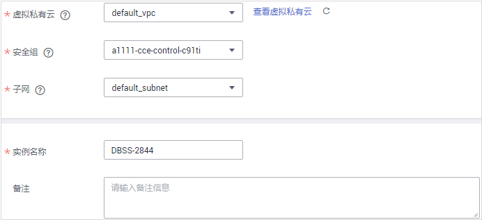
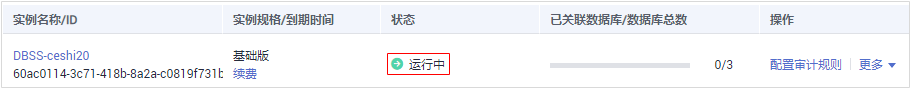
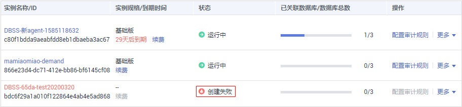

# 购买数据库安全审计

使用数据库安全审计功能前，您需要购买数据库安全审计。数据库安全审计提供包年/包月计费方式。

## 约束与限制

-   数据库安全审计不支持跨区域（Region）使用。待审计的数据库必须和购买的数据库安全审计实例在同一区域。
-   购买数据库安全审计实例配置VPC参数，必须与Agent安装节点（应用端或数据库端）所在的VPC保持一致。否则，将导致Agent与审计实例之间的网络不通，无法使用数据库安全审计。

    数据库安全审计的Agent安装节点，请参见：[如何选择数据库安全审计的Agent安装节点？](https://support.huaweicloud.com/dbss_faq/dbss_01_0282.html)。

## 前提条件

已获取管理控制台的登录帐号与密码。

> **须知：** 
>请确认购买实例的帐号具有“DBSS System Administrator“、“VPC Administrator“、“ECS Administrator“和“BSS Administrator“角色。
>-   VPC Administrator：对虚拟私有云的所有执行权限。项目级角色，在同项目中勾选。
>-   BSS Administrator：对帐号中心、费用中心、资源中心中的所有菜单项执行任意操作。项目级角色，在同项目中勾选。
>-   ECS Administrator：对弹性云服务器的所有执行权限。项目级角色，在同项目中勾选。

## 操作步骤

1.  进入[数据库安全审计购买页面](https://console.huaweicloud.com/dbss/?locale=zh-cn#/audit/purchase)。
2.  单击页面左上方的，选择“安全与合规  \>  数据库安全服务“，进入数据库安全审计“总览“界面。
3.  在界面右上角，单击“购买数据库安全审计“。
4.  选择“区域“、“可用区“和“性能规格“，如[图1](#zh-cn_topic_0161005736_fig5399172212414)所示。

    **图 1**  选择可用区和性能规格  
    

    数据库安全审计各版本的性能规格说明如[表1](#zh-cn_topic_0182403334_zh-cn_topic_0110856029_table8767123235)所示。

    **表 1**  数据库安全审计版本性能规格说明

    
    <table><thead align="left"><tr id="zh-cn_topic_0182403334_zh-cn_topic_0110856029_row376723137"><th class="cellrowborder" valign="top" width="11.83%" id="mcps1.2.5.1.1">
版本

    </th>
    <th class="cellrowborder" valign="top" width="23.34%" id="mcps1.2.5.1.2">
支持的数据库实例

    </th>
    <th class="cellrowborder" valign="top" width="19.869999999999997%" id="mcps1.2.5.1.3">
系统资源要求

    </th>
    <th class="cellrowborder" valign="top" width="44.96%" id="mcps1.2.5.1.4">
性能参数

    </th>
    </tr>
    </thead>
    <tbody><tr id="zh-cn_topic_0182403334_zh-cn_topic_0110856029_row137671535310"><td class="cellrowborder" valign="top" width="11.83%" headers="mcps1.2.5.1.1 ">
基础版

    </td>
    <td class="cellrowborder" valign="top" width="23.34%" headers="mcps1.2.5.1.2 ">
最多支持3个数据库实例

    </td>
    <td class="cellrowborder" valign="top" width="19.869999999999997%" headers="mcps1.2.5.1.3 "><ul id="zh-cn_topic_0182403334_zh-cn_topic_0110856029_ul59204115131"><li>CPU：4U</li><li>内存：16GB</li><li>硬盘：560GB</li><li>硬盘：500GB</li></ul>
    </td>
    <td class="cellrowborder" valign="top" width="44.96%" headers="mcps1.2.5.1.4 "><ul id="zh-cn_topic_0182403334_zh-cn_topic_0110856029_ul863917718128"><li>吞吐量峰值：3,000条/秒</li><li>入库速率：360万条/小时</li><li>4亿条在线SQL语句存储</li><li>50亿条归档SQL语句存储</li></ul>
    </td>
    </tr>
    <tr id="zh-cn_topic_0182403334_zh-cn_topic_0110856029_row17687317314"><td class="cellrowborder" valign="top" width="11.83%" headers="mcps1.2.5.1.1 ">
专业版

    </td>
    <td class="cellrowborder" valign="top" width="23.34%" headers="mcps1.2.5.1.2 ">
最多支持6个数据库实例

    </td>
    <td class="cellrowborder" valign="top" width="19.869999999999997%" headers="mcps1.2.5.1.3 "><ul id="zh-cn_topic_0182403334_zh-cn_topic_0110856029_ul18269153517136"><li>CPU：8U</li><li>内存：32GB</li><li>硬盘：1084GB</li></ul>
    </td>
    <td class="cellrowborder" valign="top" width="44.96%" headers="mcps1.2.5.1.4 "><ul id="zh-cn_topic_0182403334_zh-cn_topic_0110856029_ul1131881116125"><li>吞吐量峰值：6,000条/秒</li><li>入库速率：720万条/小时</li><li>6亿条在线SQL语句存储</li><li>100亿条归档SQL语句存储</li></ul>
    </td>
    </tr>
    <tr id="zh-cn_topic_0182403334_zh-cn_topic_0110856029_row127687318315"><td class="cellrowborder" valign="top" width="11.83%" headers="mcps1.2.5.1.1 ">
高级版

    </td>
    <td class="cellrowborder" valign="top" width="23.34%" headers="mcps1.2.5.1.2 ">
最多支持30个数据库实例

    </td>
    <td class="cellrowborder" valign="top" width="19.869999999999997%" headers="mcps1.2.5.1.3 "><ul id="zh-cn_topic_0182403334_zh-cn_topic_0110856029_ul15153546134"><li>CPU：16U</li><li>内存：64GB</li><li>硬盘：2108GB</li></ul>
    </td>
    <td class="cellrowborder" valign="top" width="44.96%" headers="mcps1.2.5.1.4 "><ul id="zh-cn_topic_0182403334_zh-cn_topic_0110856029_ul857521512121"><li>吞吐量峰值：30,000条/秒</li><li>入库速率：1080万条/小时</li><li>15亿条在线SQL语句存储</li><li>600亿条归档SQL语句存储</li></ul>
    </td>
    </tr>
    </tbody>
    </table>

    > **说明：** 
    >-   数据库实例通过**数据库IP+数据库端口**计量。
    >    如果同一数据库IP具有多个数据库端口，数据库实例数为数据库端口数。1个数据库IP只有1个数据库端口，即为一个数据库实例；1个数据库IP具有N个数据库端口，即为N个数据库实例。
    >    例如：用户有2个数据库资产分别为IP1和IP2，IP1有一个数据库端口，则为1个数据库实例；IP2有3个数据库端口，则为3个数据库实例。IP1和IP2合计为4个数据库实例，选择服务版本规格时需要大于或等于4个数据库实例，即选用专业版（最多支持审计6个数据库实例）。
    >-   本表中的系统资源要求，是指购买数据库安全审计实例时会消耗的系统资源。购买时，用户的系统需要满足审计版本对应的系统资源要求。
    >-   本表中在线SQL语句的条数，是按照每条SQL语句的容量为1KB来计算的。

5.  设置数据库安全审计参数，如[图2](#zh-cn_topic_0161005736_fig141093558265)所示，相关参数说明如[表2](#zh-cn_topic_0161005736_table4295843716304)所示。

    **图 2**  设置数据库安全审计参数  
    

    **表 2**  数据库安全审计实例参数说明

    
    <table><thead align="left"><tr id="zh-cn_topic_0161005736_row4338993216304"><th class="cellrowborder" valign="top" width="25.609756097560975%" id="mcps1.2.3.1.1">
参数名称

    </th>
    <th class="cellrowborder" valign="top" width="74.39024390243902%" id="mcps1.2.3.1.2">
说明

    </th>
    </tr>
    </thead>
    <tbody><tr id="zh-cn_topic_0161005736_row3896937416304"><td class="cellrowborder" valign="top" width="25.609756097560975%" headers="mcps1.2.3.1.1 ">
虚拟私有云

    </td>
    <td class="cellrowborder" valign="top" width="74.39024390243902%" headers="mcps1.2.3.1.2 ">
您可以选择使用区域中已有的虚拟私有云（Virtual Private Cloud，VPC）网络，或者单击“查看虚拟私有云”，跳转到VPC管理控制台创建新的虚拟私有云。

    
 说明： 

请选择Agent安装节点（应用端或数据库端）所在的VPC。数据库安全审计的Agent安装节点，请参见：<a href="https://support.huaweicloud.com/dbss_faq/dbss_01_0282.html" target="_blank" rel="noopener noreferrer">如何选择数据库安全审计的Agent安装节点？</a>

    

    
更多有关虚拟私有云的信息，请参见《虚拟私有云用户指南》。

    </td>
    </tr>
    <tr id="zh-cn_topic_0161005736_row1319658616304"><td class="cellrowborder" valign="top" width="25.609756097560975%" headers="mcps1.2.3.1.1 ">
安全组

    </td>
    <td class="cellrowborder" valign="top" width="74.39024390243902%" headers="mcps1.2.3.1.2 ">
您可以选择区域中已有的安全组，或者在VPC管理控制台创建新的安全组。选择实例的安全组后，该实例将受到该安全组访问规则的保护。

    
更多有关安全组的信息，请参见《虚拟私有云用户指南》。

    </td>
    </tr>
    <tr id="zh-cn_topic_0161005736_row16837105815489"><td class="cellrowborder" valign="top" width="25.609756097560975%" headers="mcps1.2.3.1.1 ">
子网

    </td>
    <td class="cellrowborder" valign="top" width="74.39024390243902%" headers="mcps1.2.3.1.2 ">
您可以选择VPC中已配置的子网，或者在VPC管理控制台为VPC创建新的子网。

    </td>
    </tr>
    <tr id="zh-cn_topic_0161005736_row2550998316304"><td class="cellrowborder" valign="top" width="25.609756097560975%" headers="mcps1.2.3.1.1 ">
实例名称

    </td>
    <td class="cellrowborder" valign="top" width="74.39024390243902%" headers="mcps1.2.3.1.2 ">
您可以自定义实例的名称。

    </td>
    </tr>
    </tbody>
    </table>

6.  选择“购买时长“，如[图3](#zh-cn_topic_0161005736_fig16802356463)所示。

    **图 3**  选择实例购买时长  
    

    勾选“自动续费“后，当购买的数据库安全审计实例到期时，如果帐号余额充足，DBSS将自动为该实例续费，您可以继续使用该实例。自动续费的周期说明如[表3](#zh-cn_topic_0161005736_table826301613614)所示。

    **表 3**  自动续费周期说明

    
    <table><thead align="left"><tr id="zh-cn_topic_0161005736_zh-cn_topic_0110855920_row826418166366"><th class="cellrowborder" valign="top" width="50%" id="mcps1.2.3.1.1">
购买时长

    </th>
    <th class="cellrowborder" valign="top" width="50%" id="mcps1.2.3.1.2">
自动续费周期

    </th>
    </tr>
    </thead>
    <tbody><tr id="zh-cn_topic_0161005736_zh-cn_topic_0110855920_row32642163361"><td class="cellrowborder" valign="top" width="50%" headers="mcps1.2.3.1.1 ">
1/2/3/4/5/6/7/8/9个月

    </td>
    <td class="cellrowborder" valign="top" width="50%" headers="mcps1.2.3.1.2 ">
1个月

    </td>
    </tr>
    <tr id="zh-cn_topic_0161005736_zh-cn_topic_0110855920_row6317519183615"><td class="cellrowborder" valign="top" width="50%" headers="mcps1.2.3.1.1 ">
1年

    </td>
    <td class="cellrowborder" valign="top" width="50%" headers="mcps1.2.3.1.2 ">
1年

    </td>
    </tr>
    </tbody>
    </table>

7.  确认当前配置无误后，单击“立即购买“。

    如果您对价格有疑问，可以单击“了解计费详情“，了解产品价格。

8.  在“详情“页面，阅读《数据库安全审计安全免责声明》后，勾选“我已阅读并同意《数据库安全审计安全免责声明》“  ，单击“提交“。
9.  在购买页面，请选择付款方式进行付款。
    -   余额支付

        您可以通过账户的余额进行支付，余额不足时，单击“充值“进行充值。

        1.  选择“余额支付“。
        2.  单击“确认付款“，完成购买操作。

    -   申请线上合同请款后支付
        1.  选择“申请线上合同请款后支付“，单击“生成合同“。
        2.  在页面中填写合同信息后，单击“创建正式合同“，完成购买操作。

10. 成功付款后，在数据库安全审计实例列表界面，可以查看数据库安全审计实例的创建情况。

## 后续处理

-   当实例的“状态“为“运行中“时，如[图4](#fig5815753115916)所示，说明实例购买成功。

    **图 4**  数据库安全审计购买成功  
    

-   当实例的“状态“为“创建失败“时，如[图5](#fig019165483717)所示，系统已自动退款。您可单击“操作“列的“更多  \>  查看详情“，在弹出的“创建失败实例“对话框中查看失败原因和删除失败实例。

    **图 5**  数据库安全审计创建失败  
    

